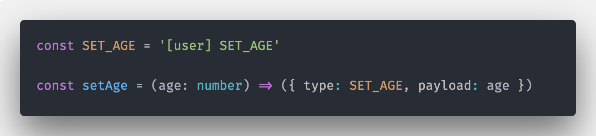
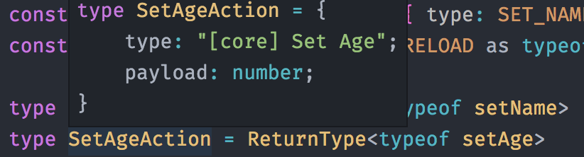
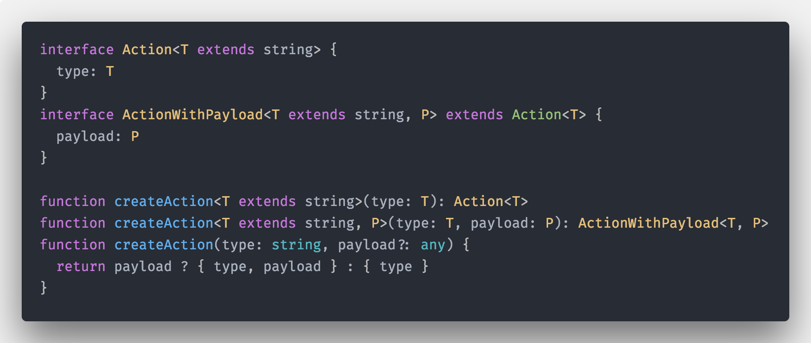

# Improved Redux type safety with TypeScript 2.8

Disclaimer:

This post was created in the sky, when I was returning from awesome Japan and yes that guy in the title picture is me, ridding the best powder on the planet in Japan :D ( sorry I just had to do this, you can hate me later ok? )

Some time ago [I wrote about how to effectively leverage TypeScript to write type-safe action creators and reducers](https://medium.com/@martin_hotell/redux-typescript-typed-actions-with-less-keystrokes-d984063901d).

At that time ( pre TS 2.8 era ) there wasn't a clean solution how to get the return type of an function without some hacks.

**Before Typescript 2.8:**

You had to do it like this:

* define type definition first,
* then implement action creator with return type annotated with your defined type
* when you changed one thing, you needed to manually update other and vice-versa, bleh...

```ts
// you need to define the shape first
type SetAgeAction = { type: typeof SET_AGE; payload: number }

// then implement the shape
const setAge = (age: number): SetAgeAction => ({ type: SET_AGE, payload: age })
```

Thanks god that is now past...

---

With latest additions to TypeScript 2.8, we can get return type of any particular function definition! Let's see how and why is it important for our action creators et all... shall we ?

## Predefined conditional mapped types within standard library (lib.d.ts)

TypeScript 2.8 supports conditional types, which is a huge addition to the type checker! ( kudos to Mr. Anders Hejlsberg ).

> I won't get into details about them in this post as it deserves post on it's own for sure. ( you can read more [here](https://github.com/Microsoft/TypeScript/pull/21316) )

Thanks to this addition, we can create new powerfull mapped types, let's say, for getting return type of a function, which we desperately need for our action creators.

> What are mapped types? Read more [here](https://blog.mariusschulz.com/2017/01/20/typescript-2-1-mapped-types)

Wait a second! It turns out we don't have to create anything at all, 'cause they are already a part of TS 2.8! We've got following new mapped types at our disposal:

* `Exclude<T, U>` -- Exclude from T those types that are assignable to U.
* `Extract<T, U>` -- Extract from T those types that are assignable to U.
* `NonNullable<T>` -- Exclude null and undefined from T.
* `ReturnType<T>` -- Obtain the return type of a function type.
* `InstanceType<T>` -- Obtain the instance type of a constructor function type.

> for more info (check out this PR)[https://github.com/Microsoft/TypeScript/pull/21847]

We will focus only on `ReturnType<T>` mapped type, which will get us return type of an action creator(a javascript function) which we have been all looking for! Let's see how.

## ReturnType<T>

Let's define our action type and action creator for setting a user age

```ts
const SET_AGE = '[user] SET_AGE'

const setAge = (age: number) => ({ type: SET_AGE, payload: age })
```



Now we need to get somehow the return type of our FSA creator.

> FSA = Flux Standard Action

> **Why we need the return type of action creator?**
>
> We wanna leverage [discriminant unions](https://basarat.gitbooks.io/typescript/docs/types/discriminated-unions.html) for 100% type safe reducers and for handling side effects via epics ([redux-observable](https://github.com/redux-observable/redux-observable/blob/master/docs/Troubleshooting.md#typescript-oftype-operator-wont-narrow-to-proper-observable-type)) or effects (@ngrx/store)

So as I've already mentioned bilion times until now ( sorry :D ), we can leverage new mapped type -> `ReturnType<T>`:

```ts
type SetAgeAction = ReturnType<typeof setAge>
```


> **Why `typeof setAge` ?**
>
> We need to provide a type annotation as a generic argument to ReturnType mapped type.
>
> We can actually use a variable in a type annotation using the `typeof` operator. This allows you to tell the compiler that one variable is the same type as another.
>
> In our case we are capturing the type annotation of our `setAge` function

That's it! Is it!?

...well when we look at the inferred implementation of `SetAgeAction`, we will see following type definition

```ts
{
  type: string
  payload: number
}
```

Oh no, where did our `const type literal` go? TypeScript flattened it to a string literal base type, which is `string`. We need to be explicit within our action creator, to make the proper type annotation flow correctly.

> Fix is easy enough - we need to explicitly cast it to our `SET_AGE` literal type, again with the help of `typeof` operator:

```ts
const setAge = (age: number) => ({ type: SET_AGE as typeof SET_AGE, payload: age })
```


Now our inferred type is correct

```ts
{
  type: '[user] SET_AGE'
  payload: number
}
```



**PROS:**

* action type is inferred from implementation and because of that stays in sync!

**CONS:**

* explicitly casting `type` property within action creator

## Reducing the action boilerplate

I don't know about how you, but I don't like to cast `type` property explicitly within every action creator! Bah! Huh!

Let's write a super tiny utility function for creating our FSA action object:

```ts
interface Action<T extends string> {
  type: T
}
interface ActionWithPayload<T extends string, P> extends Action<T> {
  payload: P
}

function createAction<T extends string>(type: T): Action<T>
function createAction<T extends string, P>(type: T, payload: P): ActionWithPayload<T, P>
function createAction(type: string, payload?: any) {
  return payload ? { type, payload } : { type }
}
```



> We are using typescript function overloading so we get proper types by argument arity

Now we can define our action creator like this:

```ts
const setAge = (age: number) => createAction(SET_AGE, age)
```


And our inferred action type remains the same

```ts
type SetAgeAction = ReturnType<typeof setAge>

// type
{
  type: '[user] SET_AGE'
  payload: number
}
```

**PROS:**

* ( as before ) action type is inferred from implementation and because of that, it stays in sync!
* we don't have to cast our type
* more concise than before

**CONS:**

* none I guess ? :)

## Reducing the action boilerplate further

We can push it even further by creating custom `action` helper.

Eeeeh action helper ?

```ts
type ActionFn<T extends string> = () => Action<T>
type ActionWithPayloadFn<T extends string, P> = (payload: P) => ActionWithPayload<T, P>

function action<T extends string>(type: T): ActionFn<T>
function action<T extends string, P>(type: T): ActionWithPayloadFn<T, P>
function action(type: string) {
  return (payload?: any) => (payload ? { type, payload } : { type })
}
```


> again we are using function overloads to get proper action types

Which we can use like this:

```ts
const setAge = action<typeof SET_AGE, number>(SET_AGE)
```


with getting our inferred action type as before

```ts
type SetAgeAction = ReturnType<typeof setAge>

// type
{
  type: '[user] SET_AGE'
  payload: number
}
```

or if our action doesn't contains any payload, TypeScript can properly infer the type literal from it's source:

```ts
const DO_SOMETHING_MUNDANE = '[misc] do something'

const doSomethingMundane = action(DO_SOMETHING_MUNDANE)

type DoSomethingAction = ReturnType<typeof doSomethingMundane>
```


With that our `DoSomethingAction` will have following type:

```ts
{
  type: '[misc] do something'
}
```

**PROS:**

* ( as before ) action type is inferred from implementation and because of that, it stays in sync!
* ( as before ) we don't have to cast our type
* even more concise than `createAction`

**CONS:**

* if we wanna provide payload, we have to explicitly declare `typeof SET_AGE` as 1st generic argument, because TS isn't able to do that for us properly ( it will flatten string literal to just simple `string`)

## Reducing the action boilerplate by using classes

As I've mentioned in my previous article, you can create action creators via classes, which is, even after the `ReturnType<T>` conditional mapped type addition, IMHO the most concise way to create actions.

Eat this:

```ts
class SetAgeAction {
  readonly type = SET_AGE
  constructor(public payload: number) {}
}
```


Everything is defined once -> implementaion and action type definition. Elegant don't you think ?!

> only "downside" is that traditional redux won't allow you this approach as actions need to be POJOs = objects with no prototype chain
>
> This can be mitigated via custom middleware, which shalow copies created instance to pure Object
>
> ```ts
> export const actionToPlainObject: MiddlewareFn<{}, Action> = store => next => action =>
>   next({ ...action })
> ```
>
> If you're using @ngrx/store you don't need to do this, because it's only restriction is to be an serializable object

**PROS:**

* implementation is also type definition because structural origin of TypeScript Classes
* concise and elegant

**CONS:**

* constructor parameter named genericaly `payload`, which may not be very descriptive if payload is a primitive type
* (if you're using redux ) you need to provide custom middleware for flattening custom class instance to pure object
* using `new SetAgeAction(18)` may feel strange or just wrong to some functional purists, I don't mind personaly 😎, it makes it even more visible within component code that I'm creating a FSA

## Summary

TypeScript 2.8 comes with very important new features:

* conditional types
* new default conditional mapped types, from which we can leverage `ReturnType<T>` to get return types of a function

Thanks to these new features, TypeScript is able to infer action type of our action creator implementation,
so we don't have to duplicate our work and keep type definition and implementaion in sync.

**Instead of telling the program what types it should use, types are inferred from the implementation, so type checker gets out of our way!**

That's it!

As always, don't hesitate to ping me if you have any questions here or on twitter (my handle [@martin_hotell](https://twitter.com/martin_hotell)) and besides that, happy type checking folks and 'till next time! Cheers!
