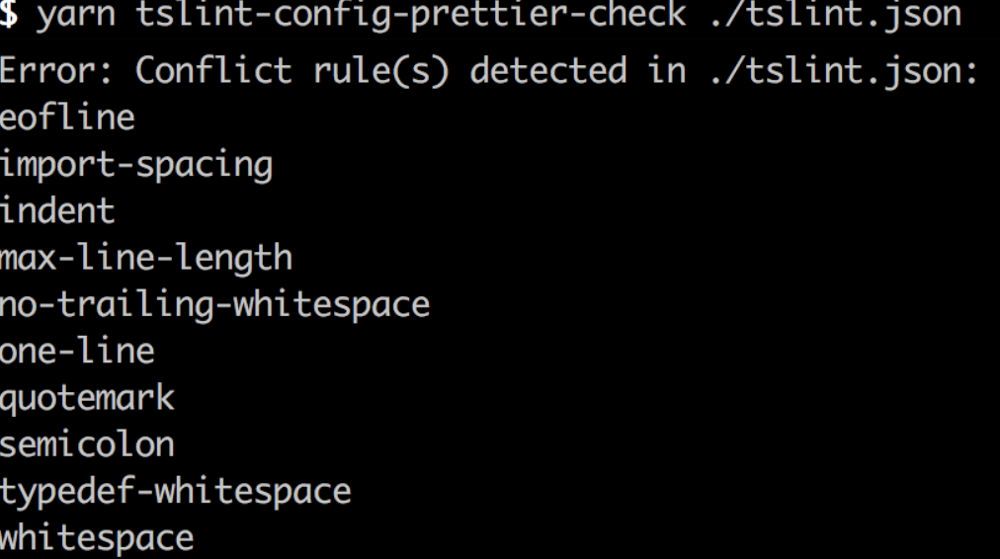
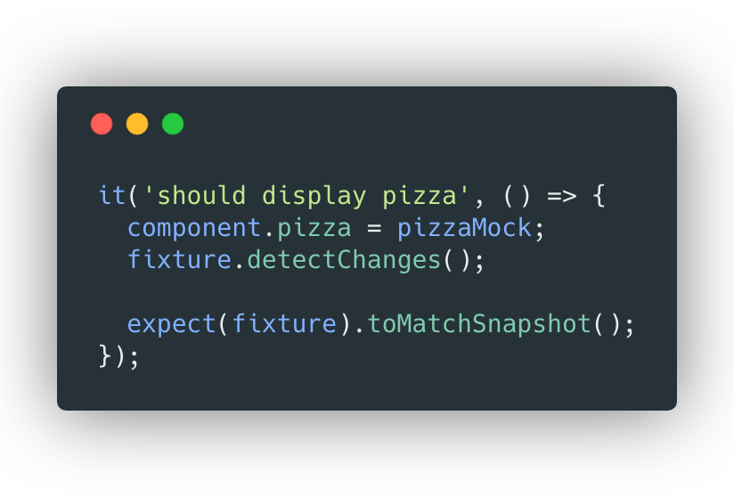
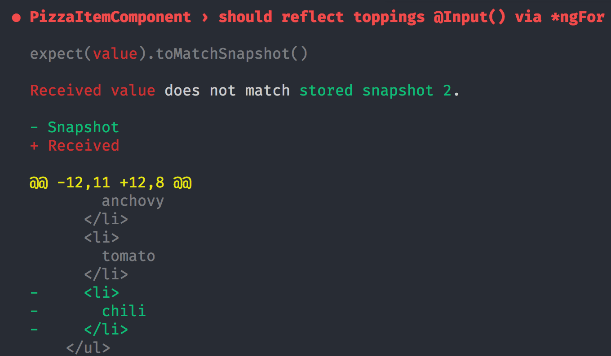
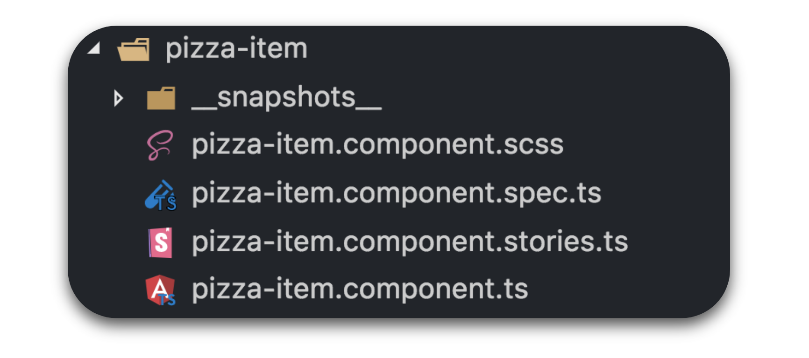
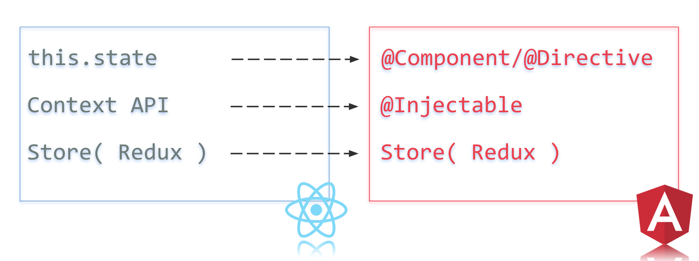

# Use React Tools for better Angular Apps

> How to leverage the best from React ecosystem and beyond to make our daily task easier and more effective within Angular apps and in the end become the best friends ever !

After seeing that cover image of this article, your first impression must be like: OMG! another clickbait article about why X sucks and Y is the silver bullet. Well, I have to disappoint you. This article is about the complete opposite :)

---

Instead of wasting our time by participating on twitter rants and so on, we will leverage the best that other ecosystems ( React ) have to offer and thanks to that we will get better/faster/stronger tools for our achieving our daily development tasks with Angular.

Question is where to start? or How to achieve that goal, or even why should I bother with other ecosystems and tools. Great questions indeed! Let's get some answers, shall we?

## Why

Angular Framework is a great piece of technolgy on it's own indeed, so why should you look somewhere else?

Well, there is a very tiny(or huge) problem. Everything Angular is **tightly coupled to Angular and its ecosystem**, and I don't know how about you, but **I really hate to have boundaries for achieving my goals**.

Angular framework is also kinda "huge beast" (kudos to Angular team and OSS contributors for their efforts, thank you folks! ), but it's just unreal to cover all the corners of day to day development with a top notch solution.

By looking outside Angular "ecosystem isolation", we can learn a lot from others and leverage that for our own benefit and better Angular apps with excellent DX along it's way, which in the end saves money and time for our employers and clients.

## How

To answer the question "How to leverage other ecosystems" we need to to introduce and take a look at 3 categories that are an integral part of software development:

* Tools
* Architecture
* Libraries

As a baseline we will use "Industry standard" for booting up new Angular apps - **Angular CLI**


We can boot new Angular app in matter of seconds, with all "recommended/required tooling and setup", by executing simple command:

```sh
npx @angular/cli new my-app
```

> **NOTE:** never user a `-g` flag when installing packages! Global things are bad for your machine/life and thanks to **npx** you don't need them anyway :)

Let’s take a look what CLI gives us by default from perspective of our 3 defined categories:

* Libraries - all @angular/\* packages and RxJs

* Architecture - Component driven architecture with Service layer, but no restrictions on this front ( use what you want )

* Tools:

  * we’ve got webpack as a module bundler
  * Protractor/Selenium for e2e testing
  * Jasmine with Karma for unit testing
  * and last but not least, the best thing that ever happened to JavaScript - Typescript with solid static analysis extensions for adhering to proper styleguides and - TSLint and Codelyzer

So far so good right ?!

## Tools

Tooling is indeed crucial for our productivity. Let's see what can be done on this front.

Let's start with package manager...

### Package Manager/Task Runner

Most of you are probably using npm, which was super annoying to use and slow untill version 5. While npm is constantly improving, you don't have to wait and instead you can switch to a better tool -> [yarn](https://yarnpkg.com/en/)

I'm not going to enumerate all the benefits, just a few time savers that you can leverage on daily basis.

How would you execute locally installed TypeScript from CLI with npm, or execute custom npm-script or pass additional arguments to your custom npm-script ? You're smart and sure know how to do those, but with yarn it's much easier. Comparison is on following image:


How are you bumping you dependencies ? By hand ? Seriously ? We can do better with yarn:


> Just to not be biased against npm, you can achieve the same via 3rd party package(npm-update) and npx via `npx npm-update -u` just sayin...

### Formatting

CLI comes with pre-configured TSLint supported by Codelyzer, which helps us lint our code and adhere to strictly set style guides within our project. TSLint takes also care of consistent spaces at various places ( functions, module imports, etc... ), empty lines, single/double quotes, semicolons/no-semicolons... But if you think that this is the right way to do formating, you are fundamentaly wrong. Anyway Lint is for Linting not for formatting !

So how to use consistent formatting within our codebase isntead of linter(TSlint) ?

Please welcome [Prettier](https://prettier.io/)


**Prettier**

is an opinionated formatter created by Facebook and OSS community. You can read more about it on prettier website.

We can add it to our CLI very easily:

Install

```sh
yarn add -D prettier
```

and define a new npm script:

```json
{
  "scripts": {
    "format": "prettier {src/e2e}/**/* --write"
  }
}
```

By executing `yarn format` our whole codebase is formatted in matter of seconds and it's super fast!

That's it? Not entirely! Because TSlint contains formatting rules, which has nothing to do with linting, we need to turn off these rules... Uff looks like lot of manual work ! Thanks to OSS we can leverage [tslint-config-prettier](https://github.com/alexjoverm/tslint-config-prettier) package, which handles everything for us!

Install:

```sh
yarn add -D tslint-config-prettier
```

and extend `tslint.json` rules with it:

```json
{
  "extends": [
    "tslint-config-prettier"
  ],
  "rulesDirectory": [
    "node_modules/codelyzer"
  ],
  "rules": {...}
}
```

There are still issues though. CLI defines lot's of rules within `tslint.json` which are overriding anything that extends our config. Again, **tslint-config-prettier** comes with a handy CLI tool, that detects those rules in conflict, which need to be removed:

By Executing local binary

```sh
yarn tslint-config-prettier-check ./tslint.json
```

We will get output like this:


I see a great PR opportunity here to automate the removal of those conflicting lint rules ;)

Formatting/Linting Done! Although there is a room for improvement. I don't know how about you? but I'm lazy and don't want to execute formatting/linting everytime.

#### Hey Robot! Do your work!

We can handle robots to do that for us. This can be achieved thanks to git-hooks and 2 node libraries:

* [lint-staged](https://github.com/okonet/lint-staged) 🚫💩 — Run linters/formatters on git staged files
* [husky](https://github.com/typicode/husky) 🐶 Git hooks made easy

Install those:

```sh
yarn add -D lint-staged husky
```

Configure lint-staged:

```json
{
  "lint-staged": {
    "{src,e2e}/**/*.{js,jsx,ts,tsx}": ["yarn lint", "git add"],
    "{src,e2e}/**/*.{js,jsx,ts,tsx,css,scss,md}": ["prettier --write", "git add"]
  }
}
```


And add commit hook via custom npm script, which will be recognised by `husky` and executed on particular git-hook. In our case we want to hook into pre-commit git life cycle and execute lint-staged binary with our configuration:

```json
{
  "scripts": {
    "precommit": "lint-staged"
  }
}
```

Now everytime we will commit to the repo, our staged files will be formatted and linting violations fixed by TSLint, if they are autofixable, otherwise our commit will fail ! Excellent, you will never ever argue with your PR reviewer about semicolons vs no-semicolons 👌.

With that said, let's switch to more serious stuff...

### Unit Testing

> If you're not testing your codebase I will find you and I will... :D

Angular CLI comes with Karma test runner and Jasmine expectation/spy library. Those tests are run usually against browser.

Karma is indeed an old tool ( levorutionary at one point some years ago ) but let's be honest, it's slow, debugging test is cumbersome and it needs extensive configuration. We can look outside our Angular boundaries and we will discover the "ultimate salvation".

Everyone please welcome:

[**Jest**](https://facebook.github.io/jest/)


Jest is a complete testing solution that includes both test runner and assertion/spy library.

It's super easy to setup, it’s blazingly fast and introduces a brand new type of testing - snapshot testing ( which can be leveraged to anything that is serializable - component snapshots, state snapshots, image snapshots ...)

To integrate Jest with Angular CLI we need to install jest and [jest-preset-angular](https://github.com/thymikee/jest-preset-angular), which handles everything for test environment setup specific to Angular ( zones and stuff ya know ? )

```sh
yarn add -D jest jest-preset-angular
```

Now we need to configure jest, to consume our preset:

```js
// jest.config.js
module.exports = {
  preset: 'jest-preset-angular',
  setupTestFrameworkScriptFile: '<rootDir>/src/setupJest.ts',
}
```

> [For more info see the docs](https://github.com/thymikee/jest-preset-angular#exposed-configuration)

Now we can add new npm-scripts for testing:

```json
{
  "scripts": {
    "test": "jest --watch",
    "test:ci": "jest --runInBand",
    "test:coverage": "jest --coverage"
  }
}
```

**Jest speed**

I briefly mentioned, that Jest is fast. How fast ?


Why is it so fast ? Well it runs against Node and [JSDOM](https://github.com/jsdom/jsdom), tests are executed in parallel and efficiently cached.

**Jest snapshot testing**

Jest comes with snapshot testing, you just need to use `toMatchSnapshot` matcher within your test expectation on component fixture:



This will save physically on disk a snapshot footprint of your component in that particular moment(state)
and, when something has changed in the component implementation, you’ll get following failing test with DIFF about what changed:



I love this !

**Jest interactive mode**

Jest comes with advanced watch mode - a CLI like tool with lot of perks, like filtering, running only tests that changed and various other features:

Behold - Jest interactive watch mode:


Beautiful isn’t it ?!

**Other Jest features**

There are moar things that comes with Jest, I will name just few:

* Powerful mocking features ( ES2015 modules, assets )
* Code coverage - 0CJS `jest --coverage`
* Pluggable ( run Puppeteer with Jest )
* Huge ecosystem: [jest-axe](https://github.com/nickcolley/jest-axe) ( a11y ), [jest-images-snapshots](https://github.com/americanexpress/jest-image-snapshot)

### E2E Testing

End to End testing is equally or even more important than unit testing. Let's see what we get by default with CLI.

* Protractor with Selenium

Uh?! what did you just said? Selenium ? I dunno about you but everytime I hear “SELENIUM” I wanna fight someone...

Selenium was indeed useful at some point in our development carrer history, but it's 2018 and there are much better tools for this job.

Please welcome

[**TestCafe**](https://devexpress.github.io/testcafe/)

TestCafe is pure NodeJS, non framework specific, open source tool for all our E2E scenario needs !

It's 100% reliable, fast, zero config solution, works cross platform, cross browser( even works on custom environments like Windows Subsystem Linux or custom browsers ). Last but not least I forgot to mention that Typescript is 1st class citizen for writing e2e scenarios, so yay for type safety within your E2E tests!

Install

```sh
yarn add -D testcafe testcafe-live
```

Now we can add new npm-scripts for testing:

```json
{
  "scripts": {
    "e2e": "testcafe-live chrome e2e/**/*.e2e-spec.ts",
    "e2e:ci": "testcafe all e2e/**/*.e2e-spec.ts --app 'yarn start' --app-init-delay 5000"
  }
}
```

On CI, we wanna run our suite against all browsers and by providing `--app` flag, we are telling testcafe to boot UI for us and then execute the scenarios on it, so for those purposes we will execute `yarn e2e:ci`

For development we will use `yarn e2e` which runs e2e tests in watch mode in chrome, so after every change our tests are re-run. Dx experience at it's best !

Let's see it in action

**TestCafe example**

In following scenario we are testing the creation of new pizza, and after it's created,
we delete it to clean up after ourselves.

What might not be visible from the demo is, that when you wanna delete a pizza, browser native confirm dialog is shown, TestCafe handles all of this with ease.

After initial runs, we are also adding toppings to the pizza, just to showcase complex UI entities selection within our test.

Whole test scenario is powered by traditional **PageObject pattern** with custom helpers for our particular needs.


### Components Development

Angular CLI doesn't come with anything related to developing Components in isolation or for building a Demo project with components showcased in various state. Thanks to React community we can leverage [**Storybook**](https://github.com/storybooks/storybook) !

**Storybook**

Storybook is powered by React under the hood and generates whole UI catalague of your component demos, called stories. In terms of Angular it supports much more than just components. You can write stories for Services, Modules etc...

This is how the UI looks like:


Storybook is also capable to build our stories app, so we can deploy it on server, and with that to provide a documentation for our component consumers. You can see it deployed with various [Angular stories examples here](https://storybooks-angular.netlify.com/)

**Storybook CLI integration**

To add Storybook to Angular CLI, we will leverage storybook CLI:

```sh
npx @storybook/cli@alpha getstorybook
```

While we are enjoying our morning quick shot of espresso, everything is setup for us. Amazing!


Then we can just execute

```sh
yarn storybook
```

and our local storybook app is ready to use!

**Storybook Addons**

Storybook comes also with various plugins, although framework support varies. [You can learn more here](https://github.com/storybooks/storybook/blob/master/ADDONS_SUPPORT.md)

**Storybook: write a story**

Let's look very quickly how to write a story for simple button component:

```ts
storiesOf('Button', module).add('with some emoji', () => ({
  template: `
    <my-button
      [text]="text"
      (onClick)="onClick($event)"
    ></my-button>`,
  props: {
    text: '',
    onClick: (event: Event) => {
      console.log(event)
    },
  },
}))
```


**Storybook: Component folder srtucture**

With storybook covered, our final component folder structure should look like this:



* implementation
* unit test with snapshots
* external styles
* story

### Tooling summary

Thanks to other communities and ecosystems, we are able to leverage better exisitng tools for our Angular toolkit.

We replaced Karma/Jasmine with Jest, Protractor/Selenium with TestCafe, TSlint with Prettier for formatting and added husky with lint-staged for adhering to styleguides automatically and as last step we added Storybook for developing components in isolation.


## Architecture

Let's talk briefly about architecture which is the 2nd category we mentioned in the beginning.

We can use similar patterns that are effectively used within other libraries ( in our case with React ), to re-use same design patterns and principles in Angular and beyond.

Those common patterns can be applied in 2 most important parts of every app:

* Components
* State management

### Architecture: Components

Following image compares both Angular and React in terms of Component creation patterns, and as we can see those are almost identical.


* React.Component/@Component
* HOC/@Directive ( HOC just decorates behaviour in immutable way, Directive can do the same in Angular )
* render JSX/Inline template ( Always use Inline templates to have everything in one file, logic + rendering )
* Inline/External CSS
* Immutable props/@Input with CDS.OnPush ( React triggers re-render only when reference changes, Angular allows the same via OnPush strategy )

Also very important pattern to for building components [Stateful<->Stateless component pattern](https://medium.com/@dan_abramov/smart-and-dumb-components-7ca2f9a7c7d0).

### Architecture: State management

How to handle state ?

It can be handled similarly in both React and Angular:



* Local Component state ( this.state ) / @Component|@Directive instance state => suitable for private state ( mostly UI state)
* Hierarchical Context API supported by SOA / Hierarchical DI in Angular => suitable for whole app state
* FLUX architecture powered by Redux => **most suitable for app state, and universal for both Angular and React**

So as we can see, **Redux is the ultimate solution for both React and Angular** in terms of true State separation. Thanks to this separation we can write Redux boilerplate once and literally reuse it in both Angular or React. With FLUX architecture, only feature that we're leveraging in any UI framework is hydratation of data to our view ( components ) and rendering.

That's it !

> **NOTE:** This pattern is definitely not suitable for some weekend pet project, I'm talking about enterprise level or similar

## Libraries

Ok we are almost done. Let's talk about what libraries can be used in both React and Angular so we can reuse our knowledge.

We know now, that only true separation of state/logic can be achieved via Redux. So yup, you guess it, we can use pure Redux library in both Angular in React, altough in Angular world `ngrx/store` is the "industry solution" with one important "problem" for our use-case: it's tightly coupled to Angular, which is a no go in terms of our reusable patterns methodology. Also when we're using pure Redux, we can leverage all existing ecosystem around it ( mostly middleware and tooling ).

> **NOTE:** don't get me wrong ngrx/store is great, if you're using solely Angular, probably stick to it, again principles/patterns are very similar for both Epics/Effects

So let's install redux and redux bindings for Angular:

```sh
yarn add redux @angular-redux/store
```

To abstract our state shape we also need to use Selectors, and to make them performant we should reach for [reselect](https://github.com/reactjs/reselect)

```sh
yarn add reselect
```

**Handling Side Effects**

What about handling side effects? Well again, in Angular world, there is another package from ngrx -> `@ngrx/effects`, which is unfortunatelly for us, again, coupled to Angular.

Have no fear a have universal solution is here:

[Redux-observable](redux-observable.js.org) - RxJS 5 - based middleware for Redux which uses Epics.

```
yarn add redux-observable rxjs
```

**What is an Epic?**

It's similar to Effects with 2 important distinctions:

* Epics are executed after all reducers
* Epic needs to always return an Action Stream ( Actions in, Actions out - thanks to that, it prevents us to introduce anti-patterns, that can be observed within ngrx/effects, for instance using `tap` and similar noop operators, for triggering side effects within effects )

> **NOTE:** If you have absolutely no other option and need to execute side effect like within Effects, you can do that and comlplete the current stream so nothing get's emitted futher via [`ignoreElements` Rx operator](https://www.learnrxjs.io/operators/filtering/ignoreelements.html).

> **NOTE 2:** Redux-observable provides currently no "default" lazy loading mechanism (ngrx/effects does!), it needs to be implemented on your own as there is no "official" solution yet. We have our own custom solution, which will be open sourced soon.


**Http Client**

Last thing to cover. How to communicate with our API. Angular has build in solution `HttpClient` which is great! But...
This may be quite controversial but do you really need that Observable lazyness for executing GET/POST request? Especially when those are executed via Epics which use Observables, so you get all that lazyness and composition over there?
_So yeah, probably not, at least I didn't found use for it during last year..._

My services for REST endpoints look something like this ( in both Angular/React):

```ts
const base = 'users'
class HeroService {
  constructor(private httpClient: HttpClient) {}
  getOne(id: number): Promise<User> {
    return this.httpClient.get<User>(`${users}/${id}`).then(normalize)
  }
  getAll(): Promise<User[]> {
    return this.httpClient.get<User[]>(base).then(normalize)
  }
  create(payload: NewUser): Promise<User> {
    return this.httpClient.post(base, payload).then(normalize)
  }
  update(payload: User): Promise<User> {
    return this.httpClient.put(base, payload).then(normalize)
  }
  remove(id: number): Promise<boolean> {
    return this.httpClient.delete(base, payload).then(normalize)
  }
}
```

Where `httpClient` is axios instance injected via Angular DI in case of React a custom DI mechanism is applied.

So yup you can definitely ditch `@angular/common/http` and use [`axios`](https://github.com/axios/axios).

With promise based Service calls, your Epics will contain also less boilerplate, like can be seen on this diff:


And with that covered, we are at the end!

---

## Summary

In this article we covered what tools, architecture and libraries from React ecosystem can be used for Angular app development and for reusing existing solutions, so in the end we leverage the same tools and knowledge, no matter what rendering solution/Component framework are we using.

With that we destroyed boundaries that you might encounter when using Angular and it's ecosystem and in the end instead of fighting, we embraced the knowledge provided by outside world ( React etc ) and we became best friends and will live in piece forever :)


Our final Angular CLI solution looks like this:


You can find everything that I've covered in this article open sourced on my GitHub repo:

* [Better Angular CLI defaults](https://github.com/Hotell/react-tools-for-better-angular-apps)
* [Example app](https://github.com/Hotell/react-tools-for-better-angular-apps/tree/example-app)

---

As always, don't hesitate to ping me if you have any questions here or on twitter (my handle [@martin_hotell](https://twitter.com/martin_hotell)) and besides that, happy type checking folks and 'till next time! Cheers!
