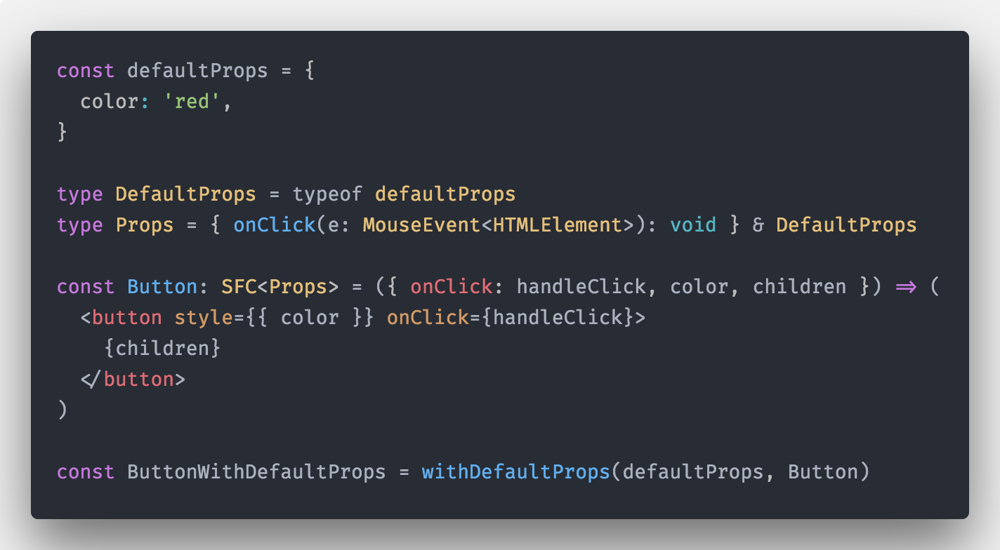
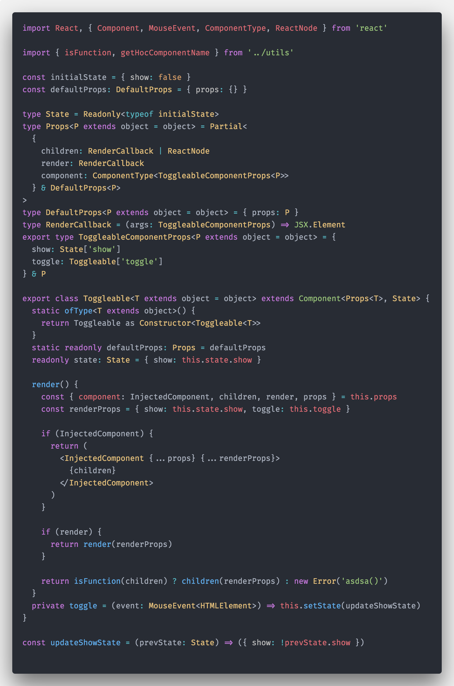
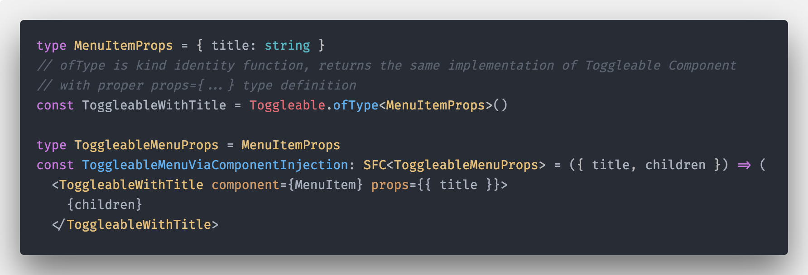
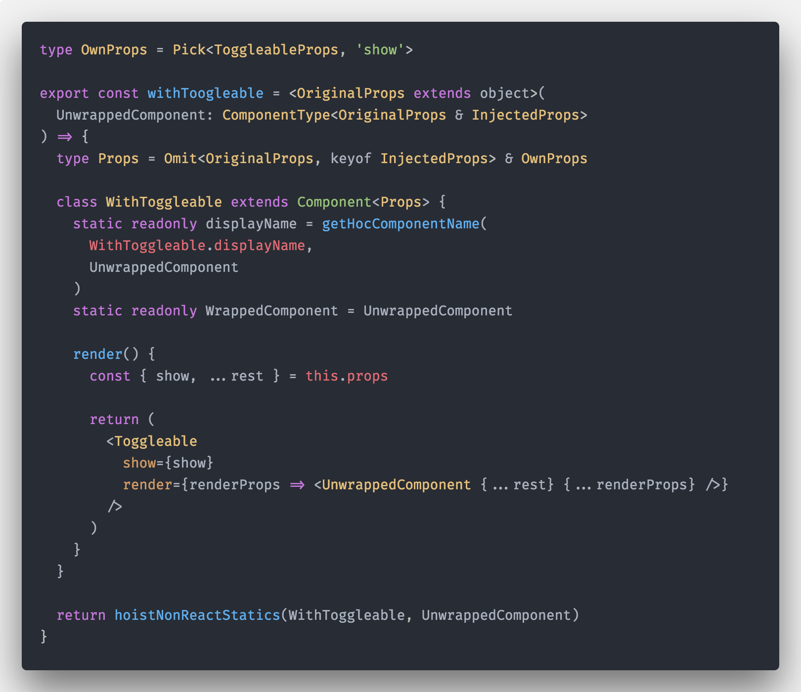

# Ultimate React Component Patterns with TypeScript 2.8

> Stateful x Stateless, Default Props, Render Callbacks, Component Injection, Generic Components, High Order Components, Controlled Components

> This blogpost is inspired by [React Component Patterns post](https://levelup.gitconnected.com/react-component-patterns-ab1f09be2c82)

> [live Demo ](https://codesandbox.io/s/7k236m64w6)

If you know me, you already know that I don't write javascript without types, so yeah I'm really into TypeScript, since version 0.9. Beside typed JS I really love React, and when React + TypeScript are combined, I just feel like in heaven :D. Full type safety within whole app and VDOM templates it's just marvelous and joy to work with.

So what is this post all about? Well, there are various articles about React Component patterns on the internet, but none describes how to apply those patterns with TypeScript. Also upcoming version of TS 2.8 brings new exciting features to the table, like conditional types, new predefined conditional types within standard library, homomorphic mapped types modifiers..., which allows us to create easily common react patterns in type safe way...

This post is gonna be quite long, so please just sit back and relax, while you master Ultimate React Component Patterns with TypeScript!

> all patterns/examples use typeScript 2.8 and strict mode

## Start

First off we need to install typeScript and tslib helpers so our emitted code is smaller

```sh
yarn add -D typeScript@next
# tslib will be leveraged only for features that are not natively supported by your compile target
yarn add tslib
```

With that we can initialize our typeScript config:

```sh
# this will create tsconfig.json within our project with sane compiler defaults
yarn tsc --init
```

Now let's install react, react-dom and their type definitions.

```sh
yarn add react react-dom
yarn add -D @types/{react,react-dom}
```

Great! Now let's hop into those component patterns, shall we ?

## Stateless Component

You guess it, those are components without **state** ( they are also called presentational ). Most of the time they are just pure functions. Let's create contrived Button stateless compoennt with TypeScript.

Like in vanilla JS we need to import React which allows us to use JSX

```tsx
import React from 'react'

const Button = ({ onClick: handleClick, children }) => (
  <button onClick={handleClick}>{children}</button>
)
```

Although tsc compiler will now emit errors! We need to be explicit and tell the component/function what is the type of our **props**. Let's define our props:

```tsx
import React, { MouseEvent, ReactNode } from 'react'
type Props = { onClick(e: MouseEvent<HTMLElement>): void; children?: ReactNode }

const Button = ({ onClick: handleClick, children }: Props) => (
  <button onClick={handleClick}>{children}</button>
)
```

We get rid of all errors! great! But we can do even better!

There is a predefined type within `@types/react` => `type SFC<P>` which is just an alias of `interface StatelessComponent<P>` and it has pre-defined `children` and other things (defaultProps,displayName...), so we don't have to write it everytime on our own!

So the finall stateless component looks like this:

```tsx
import React, { MouseEvent, SFC } from 'react'

type Props = { onClick(e: MouseEvent<HTMLElement>): void }

const Button: SFC<Props> = ({ onClick: handleClick, children }) => (
  <button onClick={handleClick}>{children}</button>
)
```


## Stateful Component

Let's create stateful counter component which will leverage our `Button`

First of we need define `initialState`

```ts
const initialState = { clicksCount: 0 }
```

Now we will use TypeScript to infer State type from our implementation.

> By doing this we don't have to maintain types and implementation separately, we have only source of thruth, which is the implementation. nice !

```ts
type State = Readonly<typeof initialState>
```

> Also note that type is explicitly mapped to have all properties read-only.
> We need to be explicit again and define use our State type to define state property on the class
>
> ```tsx
>   readonly state: State = initialState
> ```
>
> Why is this useful/needed ?
>
> We know that we cannot update `state` direclty within React like following:
>
> ```tsx
> this.state.clicksCount = 2
> this.state = { clicksCount: 2 }
> ```
>
> This will throw runtime time, but not during compile time. By explicitly mapping our `type State` to readonly via Readonly and settting readonly state within our class component, TS will let us know that we are doing something wrong immediately.

**Live example:**


**Whole Container/Stateful component implementation:**

Our Container doesn't have any Props API so we need to type 1st generic argument of `Component` as `object` ( because `props` is always an object `{}` in React) and use `State` type as a 2nd generic argument.

```tsx
import React, { Component } from 'react'

const initialState = { clicksCount: 0 }
type State = Readonly<typeof initialState>

class ButtonCounter extends Component<object, State> {
  readonly state: State = initialState
  render() {
    const { clicksCount } = this.state
    return (
      <>
        <Button onClick={this.handleIncrement}>Increment</Button>
        <Button onClick={this.handleDecrement}>Decrement</Button>
        You've clicked me {clicksCount} times!
      </>
    )
  }

  private handleIncrement = () => this.setState(incrementClicksCount)
  private handleDecrement = () => this.setState(decrementClicksCount)
}

const incrementClicksCount = (prevState: State) => ({ clicksCount: prevState.clicksCount + 1 })
const decrementClicksCount = (prevState: State) => ({ clicksCount: prevState.clicksCount - 1 })
```


You've may noticed that we've extracted state update functions to pure functions outside the class. This is a common pattern, as we can test those with ease, without any knowledge of renderer layer. Also because we are using typeScript and we mapped State to be explicitly read-only, it will prevent us to do any mutations within those functions as well

```ts
const decrementClicksCount = (prevState: State) => ({ clicksCount: prevState.clicksCount-- })

// Will throw following complile error:
//
// [ts]
// Cannot assign to 'clicksCount' because it is a constant or a read-only property.
```

Cool right ? ;)

## Default Props

Let’s extend our Button component with an color prop of type string.

```tsx
type Props = { onClick(e: MouseEvent<HTMLElement>): void; color: string }
```

If we wanna define defaultProps we can do it via `Button.defaultProps = {...}` on our component.

By doing that we need to change our Props type definition to mark props that are default as optional.

So something like this ( notice the `?` operator )

```tsx
type Props = { onClick(e: MouseEvent<HTMLElement>): void; color?: string }
```

and our Component looks like this:

```tsx
const Button: SFC<Props> = ({ onClick: handleClick, color, children }) => (
  <button style={{ color }} onClick={handleClick}>
    {children}
  </button>
)
```

While this works for this simple example, there is one gotcha. Because we are in strict mode, optional props are union of type `undefined | string` for our `color`.

Let's say we would like to do something with that particular prop, TS would throw an error because it doesn't know,
that it is defined by `Component.defaultProps` React construct.


To satisfy TS compiler we can use 3 techniques:

- use **Bang** operator to explicitly tell compiler that this won't be `undefined` within our render, although it is optional, like this: `<button onClick={handleClick!}>{children}</button>`
- use **conditional statements/ternary operator** to make compiler understand that some particular prop is not undefined: `<button onClick={handleClick ? handleClick: undefined}>{children}</button>`
- create reusable `withDefaultProps` High order function, which will update our props type definition and will set our default props. This is the most clean solution, IMHO

```ts
export const withDefaultProps = <P extends object, DP extends Partial<P> = Partial<P>>(
  defaultProps: DP,
  Cmp: ComponentType<P>
) => {
  // we are extracting props that need to be required
  type RequiredProps = Omit<P, keyof DP>
  // we are re-creating our props definition by creating and intersection type
  // between all original props mapped to be optional and required to be required
  type Props = Partial<DP> & Required<RequiredProps>

  // here we set our defaultProps
  Cmp.defaultProps = defaultProps

  // we override return type definition by turning type checker off
  // for original props  and setting the correct return type
  return (Cmp as ComponentType<any>) as ComponentType<Props>
}
```


Now we can use our `withDefaultProps` High order function to define our default props:

```tsx
const defaultProps = {
  color: 'red',
}

type DefaultProps = typeof defaultProps
type Props = { onClick(e: MouseEvent<HTMLElement>): void } & DefaultProps

const Button: SFC<Props> = ({ onClick: handleClick, color, children }) => (
  <button style={{ color }} onClick={handleClick}>
    {children}
  </button>
)

const ButtonWithDefaultProps = withDefaultProps(defaultProps, Button)
```



Or directly inline ( note that we need to explicitly provide original Button Props type, as TS is not able to infer argument types from function):

```tsx
const ButtonWithDefaultProps = withDefaultProps<Props>(
  defaultProps,
  ({ onClick: handleClick, color, children }) => (
    <button style={{ color }} onClick={handleClick}>
      {children}
    </button>
  )
)
```


Now Button props are defined correctly, default Props are reflected and marked as optional!

```tsx
{
  onClick(e: MouseEvent<HTMLElement>): void
  color?: string
}
```


And usage remains the same:

```tsx
render(){
  return <ButtonWithDefaultProps onClick={this.handleIncrement}>Increment</ButtonWithDefaultProps>
}
```

And yes this works also for Components defined via `class` ( also note, that thanks to structural origin of classes in TS, we don't have to specify excplicitly our `Prop` generic type)

It looks like this:

```tsx
const ButtonViaClass = withDefaultProps(
  defaultProps,
  class Button extends Component<Props> {
    render() {
      const { onClick: handleClick, children, color } = this.props
      return (
        <button style={{ color }} onClick={handleClick}>
          {children}
        </button>
      )
    }
  }
)
```


And usage remains the same:

```tsx
render(){
  return <ButtonViaClass onClick={this.handleIncrement}>Increment</ButtonViaClass>
}
```

---

Let’s say you need to build an expandable menu component that shows some children content when user clicks on it. We will implement this behaviour via various React Component Patterns.

## Render Callbacks

The best way to make a component logic reusable is by turning your component children into a function  or leveraging `render` prop API —  that’s why Render Callbacks are also called Function as Child Components.

Let's implement a `Toggleable` component with render props functionality:

```tsx
import React, { Component, MouseEvent } from 'react'
import { isFunction } from '../utils'

const initialState = { show: false }

type State = Readonly<typeof initialState>
type Props = Partial<{
  children: RenderCallback
  render: RenderCallback
}>

type RenderCallback = (args: ToggleableComponentProps) => JSX.Element
type ToggleableComponentProps = { show: State['show']; toggle: Toggleable['toggle'] }

export class Toggleable extends Component<Props, State> {
  readonly state: State = initialState

  render() {
    const { children, render } = this.props
    const renderProps = { show: this.state.show, toggle: this.toggle }

    if (render) {
      return render(renderProps)
    }

    return isFunction(children) ? children(renderProps) : null
  }

  private toggle = (event: MouseEvent<HTMLElement>) => this.setState(updateShowState)
}

const updateShowState = (prevState: State) => ({ show: !prevState.show })
```


Huh quite loot is happening in ther right? Let's take a closer look to each important part of our implementation:

```ts
const initialState = { show: false }
type State = Readonly<typeof initialState>
```

- here we are declaring our state as in previous examples, nothing new

Now we need to define our component props ( note that we are using Partial mapped type, as we know that all props are gonna be optional, instead of annotating every prop manually by `?` operator ):

```ts
type Props = Partial<{
  children: RenderCallback
  render: RenderCallback
}>

type RenderCallback = (args: ToggleableComponentProps) => JSX.Element
type ToggleableComponentProps = { show: State['show']; toggle: Toggleable['toggle'] }
```

We wanna support both function as a child and render prop function, so both need to be optional. To makes things DRY, we're creating `RenderCallback` type alias of our render function definition: `type RenderCallback = (args: ToggleableComponentProps) => JSX.Element`

What may look strange to readers eye, is our last type alias, the `type ToggleableComponentProps`!

```ts
type ToggleableComponentProps = { show: State['show']; toggle: Toggleable['toggle'] }
```

Again we are using the power of typeScript and **lookup types**, so we don't have to repeat ourselves when defining types:

- `show: State['show']` we are creating our `show` prop type by leveraging existing type definition within our state
- `toggle: Toggleable['toggle']` we are leveraging type inference and structural nature of classes within TS by getting the type from our method implementation! nice and indeed powerful!

The rest of the implementation is straightforward, standard _render props/children as function_ pattern:

```tsx
export class Toggleable extends Component<Props, State> {
  // ...
  render() {
    const { children, render } = this.props
    const renderProps = { show: this.state.show, toggle: this.toggle }

    if (render) {
      return render(renderProps)
    }

    return isFunction(children) ? children(renderProps) : null
  }
  // ...
}
```

Now we can pass a function as children to Toggleable component:

```tsx
<Toggleable>
  {({ show, toggle }) => (
    <>
      <div onClick={toggle}>
        <h1>Some title</h1>
      </div>
      {show ? <p>some content</p> : null}
    </>
  )}
</Toggleable>
```


or we can pass a function to render prop:

```tsx
<Toggleable
  render={({ show, toggle }) => (
    <>
      <div onClick={toggle}>
        <h1>Some title</h1>
      </div>
      {show ? <p>some content</p> : null}
    </>
  )}
/>
```


Thanks to TypeScript we got also intellisense at our disposal and proper type checking of our render prop arguments


If we want to reuse it (for multiple menus or so), we could simply create a new component that uses Toggleable logic:

```tsx
type Props = { title: string }
const ToggleableMenu: SFC<Props> = ({ title, children }) => (
  <Toggleable
    render={({ show, toggle }) => (
      <>
        <div onClick={toggle}>
          <h1>{title}</h1>
        </div>
        {show ? children : null}
      </>
    )}
  />
)
```


Our brand new ToggleableMenu component is ready to be used:

```tsx
export class Menu extends Component {
  render() {
    return (
      <>
        <ToggleableMenu title="First Menu">Some content</ToggleableMenu>
        <ToggleableMenu title="Second Menu">Another content</ToggleableMenu>
        <ToggleableMenu title="Third Menu">More content</ToggleableMenu>
      </>
    )
  }
}
```


And it works as expected:


This approach is really useful when we want to change the rendered content itself regardless of state manipulation: as you can see, we’ve moved our render logic to our ToggleableMenu children function, but kept the state logic to our Toggleable component!

## Component Injection

To make our component even more flexible, we can introduce Component Injection pattern.

What is Component Injection pattern? If you're familiar with React-Router, you are using this pattern when defining route definition via :

```tsx
<Route path="/foo" component={MyView}>
```

So instead of passing a function via render/children props, we are "injecting" Component via `component` prop. For this to work, we can refactor our inline render prop function to a reusable stateless component:

```tsx
import { ToggleableComponentProps } from './toggleable'

type MenuItemProps = { title: string }
const MenuItem: SFC<MenuItemProps & ToggleableComponentProps> = ({
  title,
  toggle,
  show,
  children,
}) => (
  <>
    <div onClick={toggle}>
      <h1>{title}</h1>
    </div>
    {show ? children : null}
  </>
)
```

With that we can refactor our `ToggleableMenu` with render prop to:

```tsx
type Props = { title: string }
const ToggleableMenu: SFC<Props> = ({ title, children }) => (
  <Toggleable
    render={({ show, toggle }) => (
      <MenuItem show={show} toggle={toggle} title={title}>
        {children}
      </MenuItem>
    )}
  />
)
```

Now with that done, let's define our new API - `component` prop.

We need update our props API.

- `children` can be now function or ReactNode ( when component prop is used)
- `component` is our new API which accepts component that needs to implement `ToggleableComponentProps` on it's props and it needs to be generic and set to `any`, so if arbitrary component that implements other properties than `ToggleableComponentProps` will pass TS validaion
- `props` we are introducing props property for passing down arbitrary props, this is a common pattern. It is defined as index type with any type, so we are loosing here strict type safety...

```tsx
// We need create defaultProps with our arbitrary prop type -> props which is gonna be empty object by default
const defaultProps = { props: {} as { [name: string]: any } }
type Props = Partial<
  {
    children: RenderCallback | ReactNode
    render: RenderCallback
    component: ComponentType<ToggleableComponentProps<any>>
  } & DefaultProps
>
type DefaultProps = typeof defaultProps
```

Next we need to add new props API to our `ToggleableComponentProps`, so consumer will be allowed to use `props` prop on `<Toggleable props={...}/>`:

```tsx
export type ToggleableComponentProps<P extends object = object> = {
  show: State['show']
  toggle: Toggleable['toggle']
} & P
```

Now we need to update our `render` method

```tsx
render() {
    const { component: InjectedComponent, children, render, props } = this.props
    const renderProps = { show: this.state.show, toggle: this.toggle }

    // when component prop api is used children is ReactNode not a function
    if (InjectedComponent) {
      return (
        <InjectedComponent {...props} {...renderProps}>
          {children}
        </InjectedComponent>
      )
    }

    if (render) {
      return render(renderProps)
    }

    // children as a function comes last
    return isFunction(children) ? children(renderProps) : null
  }
```

**Whole implementation of Toogleable component with Render Props, Children as a Function, Component Injection with arbitrary props support:**


Our final `ToggleableMenuViaComponentInjection` component which leverages `component` prop looks like this:

```tsx
type ToggleableMenuProps = MenuItemProps
const ToggleableMenuViaComponentInjection: SFC<ToggleableMenuProps> = ({ title, children }) => (
  <Toggleable component={MenuItem} props={{ title }}>
    {children}
  </Toggleable>
)
```


Note though, that we have no type safety within our arbitrary custom `props` prop, because it's defined as indexed object map `{ [name: string]: any }`


We can now use our `ToggleableMenuViaComponentInjection` for menu rendering as before

```tsx
export class Menu extends Component {
  render() {
    return (
      <>
        <ToggleableMenuViaComponentInjection title="First Menu">
          Some content
        </ToggleableMenuViaComponentInjection>
        <ToggleableMenuViaComponentInjection title="Second Menu">
          Another content
        </ToggleableMenuViaComponentInjection>
        <ToggleableMenuViaComponentInjection title="Third Menu">
          More content
        </ToggleableMenuViaComponentInjection>
      </>
    )
  }
}
```

## Generic Components

When we implemented "component injection pattern" we lost strict type safety on arbitrary props handled via `props`. How can we fixes this? You guess it right! We can write our `Toggleable` component as a generic Components!

First we need to make our props generic. We are using default generic parameters so we don't have to provide it explicitly when we don't want to ( for render props/children as a function).

```ts
type Props<P extends object = object> = Partial<
  {
    children: RenderCallback | ReactNode
    render: RenderCallback
    component: ComponentType<ToggleableComponentProps<P>>
  } & DefaultProps<P>
>
```

We also need to update our `ToggleableComponentProps` to be generic. Oh wait it already is ;). So no changes on this front.

What needs to be changed though is definition of `type DefaultProps` as it is impossible to get generic type definition from implementation, we need to refactor it to old fashioned way **type definition -> implementaion**

```tsx
type DefaultProps<P extends object = object> = { props: P }
const defaultProps: DefaultProps = { props: {} }
```

Almost done!

Now let's make our component class generic. Again we are using default props so we don't have to specify generic arguments when component injection is not used!

```tsx
export class Toggleable<T = {}> extends Component<Props<T>, State> {}
```

That's it ! That's it??? Hmm, how can we leverage this generic type within our JSX?

Bad news, we can't ...

We need to introduce `ofType` generic component factory pattern

```tsx
export class Toggleable<T extends object = object> extends Component<Props<T>, State> {
  static ofType<T extends object>() {
    return Toggleable as Constructor<Toggleable<T>>
  }
}
```

**Whole implementation of Toogleable component with Render Props, Children as a Function, Component Injection with genenric props support:**



Now with `static ofType` factory method, we can create our properly typed generic component

```tsx
type MenuItemProps = { title: string }
// ofType is kind identity function, returns the same implementation of Toggleable Component
// with proper props={...} type definition
const ToggleableWithTitle = Toggleable.ofType<MenuItemProps>()

type ToggleableMenuProps = MenuItemProps
const ToggleableMenuViaComponentInjection: SFC<ToggleableMenuProps> = ({ title, children }) => (
  <ToggleableWithTitle component={MenuItem} props={{ title }}>
    {children}
  </ToggleableWithTitle>
```



And everything will work as before, this time with proper type safety for our `props={}` prop. High five !


## High Order Components

Because we already created our `Toggleable` component with render callback functionality, implementing HOC will be easy peasy. ( That's also one of the great advantages of render callback pattern, we can leverage it for HOC implementation)

Let's implement our HOC:

We need to create:

- displayName ( so we get nice debugging within devtools)
- WrappedComponent ( so we can access original component - useful for testing )
- leverage `hoistNonReactStatics` from `hoist-non-react-statics` npm package

```tsx
import React, { ComponentType, Component } from 'react'
import hoistNonReactStatics from 'hoist-non-react-statics'

import { getHocComponentName } from '../utils'

import { Toggleable, Props as ToggleableProps, ToggleableComponentProps } from './toggleable'

// OwnProps is for any public props that should be available on internal Component.props
// and for WrappedComponent
type OwnProps = object
type InjectedProps = ToggleableComponentProps

export const withToogleable = <OriginalProps extends object>(
  UnwrappedComponent: ComponentType<OriginalProps & InjectedProps>
) => {
  // we are leveraging TS 2.8 conditional mapped types to get proper final prop types
  type Props = Omit<OriginalProps, keyof InjectedProps> & OwnProps

  class WithToggleable extends Component<Props> {
    static readonly displayName = getHocComponentName(
      WithToggleable.displayName,
      UnwrappedComponent
    )
    static readonly WrappedComponent = UnwrappedComponent
    render() {
      const { ...rest } = this.props

      return (
        <Toggleable render={(renderProps) => <UnwrappedComponent {...rest} {...renderProps} />} />
      )
    }
  }

  return hoistNonReactStatics(WithToggleable, UnwrappedComponent)
}
```


Now we can create our Toogleable menu item via HOC as well, with correct type safety of props!

```tsx
const ToggleableMenuViaHOC = withToogleable(MenuItem)
```


```tsx
export class Menu extends Component {
  render() {
    return (
      <>
        <ToggleableMenuViaHOC title="First Menu">Some content</ToggleableMenuViaHOC>
        <ToggleableMenuViaHOC title="Second Menu">Another content</ToggleableMenuViaHOC>
        <ToggleableMenuViaHOC title="Third Menu">More content</ToggleableMenuViaHOC>
      </>
    )
  }
}
```

And everything works and is covered by types as well ! yay!


## Controlled Components

We are in the finale ! Let's say we wanna make our `Toggleable` highly configurable by controlling it from parent. This is very powerful pattern indeed. Let's do this.

What I mean by Controlled Component ? I wanna controll if content is shown directly for all my `ToggleableMenu` components from within `Menu` component.


**Implementation of our ToggleableMenus via various patterns:**

```tsx
// Update our props so we can controll show from parent via props
type Props = MenuItemProps & { show?: boolean }

// NOTE:
// we are creating variable aliases via desctructuring, to not shadow render callback 'show' argument
// -> {show: showContent}

// Render Props
export const ToggleableMenu: SFC<ToggleableMenuItemProps> = ({ title, children, show: showContent }) => (
  <Toggleable show={showContent}>
    {({ show, toggle }) => (
      <MenuItem title={title} toggle={toggle} show={show}>
        {children}
      </MenuItem>
    )}
  </Toggleable>
)

// Component Injection
const ToggleableWithTitle = Toggleable.ofType<MenuItemProps>()

export const ToggleableMenuViaComponentInjection: SFC<Props> = ({ title, children, show: showContent }) => (
  <ToggleableWithTitle component={MenuItem} props={{ title }} show={showContent}>
    {children}
  </ToggleableWithTitle>

// HOC without changes
export const ToggleableMenuViaHOC = withToogleable(MenuItem)
```


Now our **Menu component** will look like this:

```tsx
const initialState = { showContents: false }
type State = Readonly<typeof initialState>

export class Menu extends Component<object, State> {
  readonly state: State = initialState
  render() {
    const { showContents } = this.state

    return (
      <>
        <button onClick={this.toggleShowContents}>toggle showContent</button>
        <hr />
        <ToggleableMenu title="First Menu" show={showContents}>
          Some content
        </ToggleableMenu>
        <ToggleableMenuViaComponentInjection title="Second Menu" show={showContents}>
          Another content
        </ToggleableMenuViaComponentInjection>
        <ToggleableMenuViaHOC title="Third Menu" show={showContents}>
          More content
        </ToggleableMenuViaHOC>
      </>
    )
  }
```


Let's update our `Toggleable` one last time for ultimate power and flexibility

To make our Toggleable controlled component we need to do following:

1.  add `show` to our `Props` API
2.  update default props ( because show is optional)
3.  update initial Component.state to be set from Props.show, because now the source of truth for setting our state may come via props from parent.
4.  componentWillReceiveProps Life cycle hook to properly update state from public props

**1 & 2:**

```tsx
const initialState = { show: false }
const defaultProps: DefaultProps = { ...initialState, props: {} }

type State = Readonly<typeof initialState>
type DefaultProps<P extends object = object> = { props: P } & Pick<State, 'show'>
```

**3 & 4:**

```tsx
export class Toggleable<T = {}> extends Component<Props<T>, State> {
  static readonly defaultProps: Props = defaultProps
  // Bang operator used, I know I know ...
  state: State = { show: this.props.show! }

  componentWillReceiveProps(nextProps: Props<T>) {
    const currentProps = this.props

    if (nextProps.show !== currentProps.show) {
      this.setState({ show: Boolean(nextProps.show) })
    }
  }
}
```

**Final Toggleable**


**Final withToggleable HoC via Toggleable**

We need to propagate `show` prop value within our HoC and update our `OwnProps` API

```tsx
type OwnProps = Pick<ToggleableProps, 'show'>

export const withToogleable = <OriginalProps extends object>(
  UnwrappedComponent: ComponentType<OriginalProps & InjectedProps>
) => {
  type Props = Omit<OriginalProps, keyof InjectedProps> & OwnProps

  class WithToggleable extends Component<Props> {
    static readonly displayName = getHocComponentName(
      WithToggleable.displayName,
      UnwrappedComponent
    )
    static readonly WrappedComponent = UnwrappedComponent

    render() {
      const { show, ...rest } = this.props

      return (
        <Toggleable
          show={show}
          render={(renderProps) => <UnwrappedComponent {...rest} {...renderProps} />}
        />
      )
    }
  }

  return hoistNonReactStatics(WithToggleable, UnwrappedComponent)
}
```



## Summary

Implementing proper type safe components with React and TypeScript can be tricky. With new functionality added to TypeScript 2.8, we have almost everything at our disposal to write type safe components by adhering to common React component patterns.

In this super long post ( sorry about that !) we learned how to implement components with various patterns in strict type safe way thanks to TypeScript.

Most powerfull pattern overall is indeed Render Props, which allows us to implement other common patterns like **Component Injection** or **HOC** without much additional churn.

All demos can be found at [my Github repo](https://github.com/Hotell/blogposts/tree/master/2017-02-16_ts-2.8/src/ultimate-react-component-patterns) for this post.

Also it is very important to realise, that type safety within templates like demonstrated in this article, is possible only within libraries that use VDOM/JSX

- Angular templates with Language service provide type safety, but soundness fails on simple constructs like checking within ngFor etc...
- Vue has nothing like Angular implemented yet for templates, so their templates and data binding are just magical strings ( but this may change in the future. Although you can use VDOM for templates it's cumbersome to use because various types of props definition ( "snabdom takes the blame..." ) )

As always, don't hesitate to ping me if you have any questions here or on twitter (my handle [@martin_hotell](https://twitter.com/martin_hotell)) and besides that, happy type checking folks and 'till next time! Cheers!
