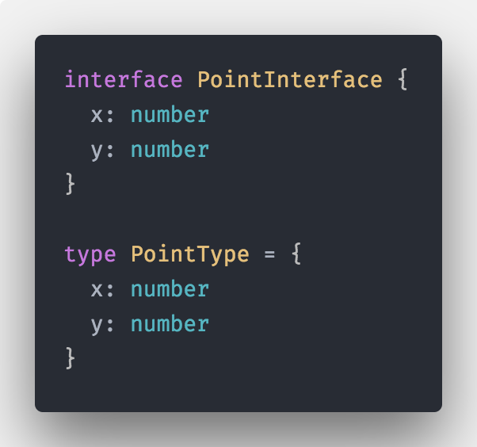
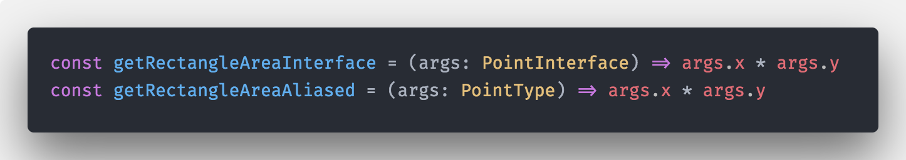
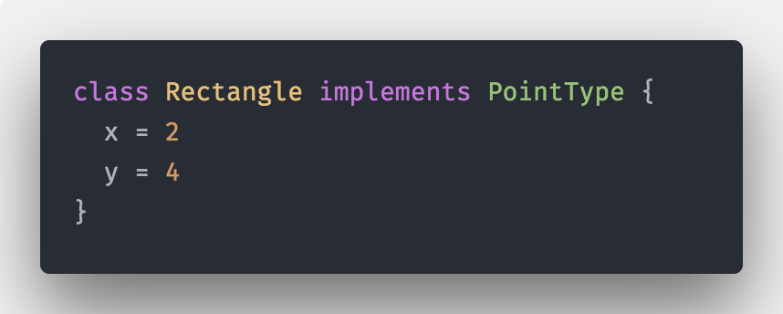
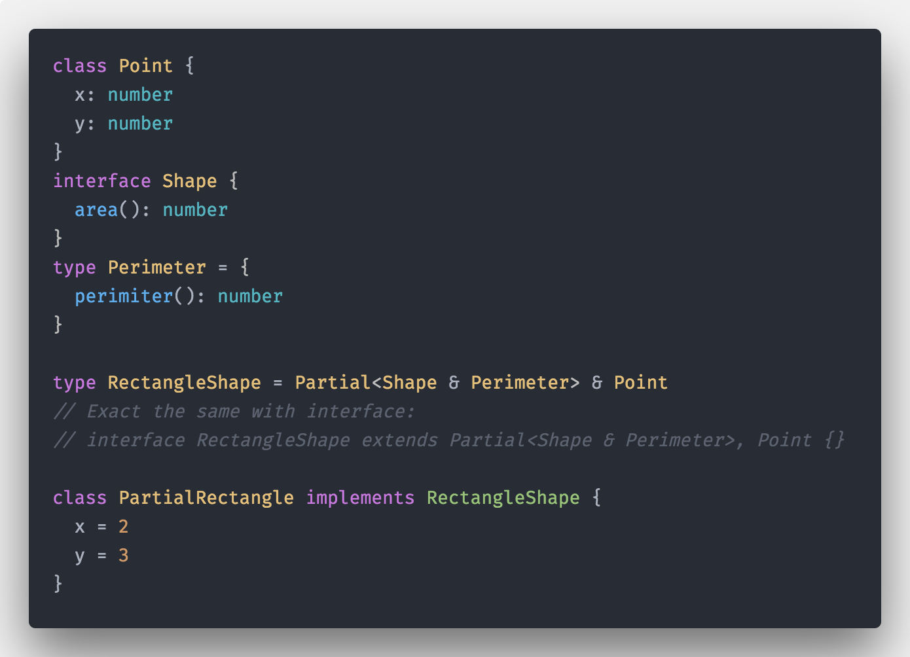
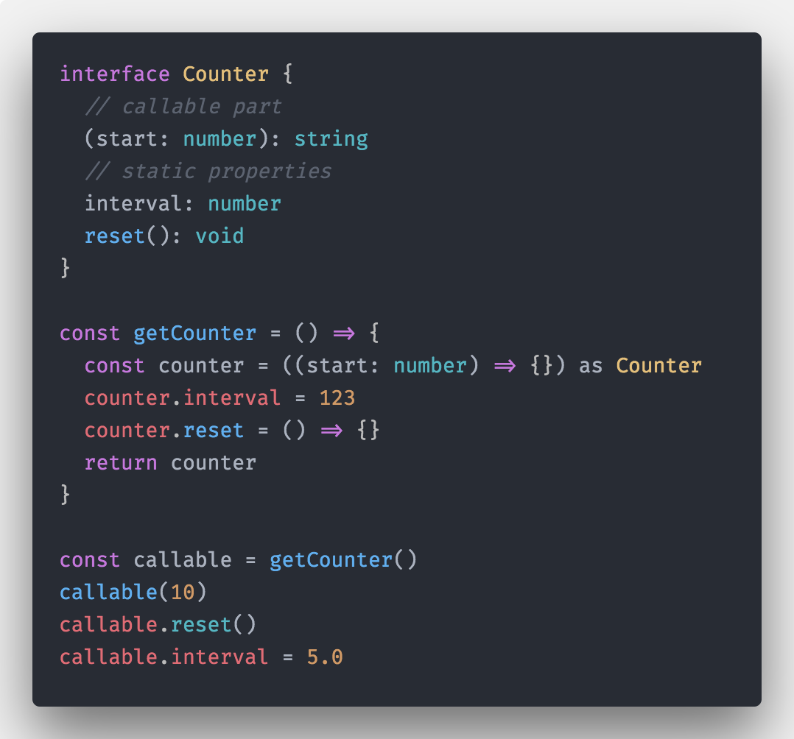
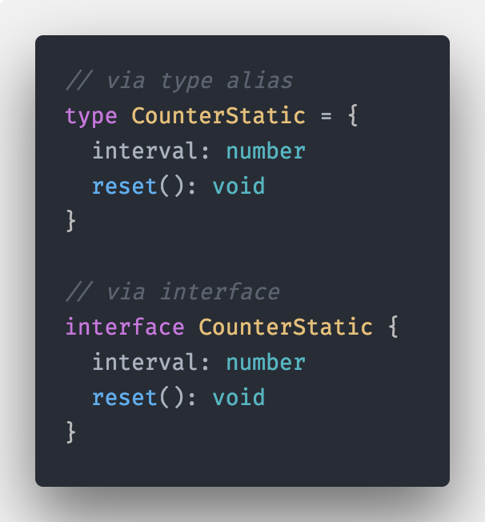
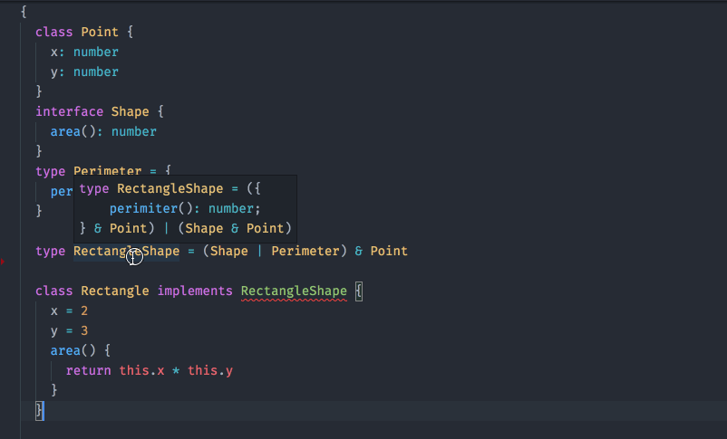
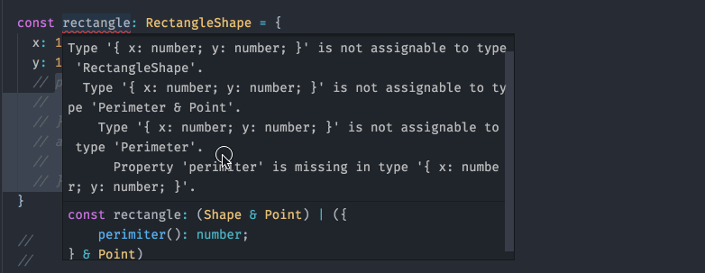
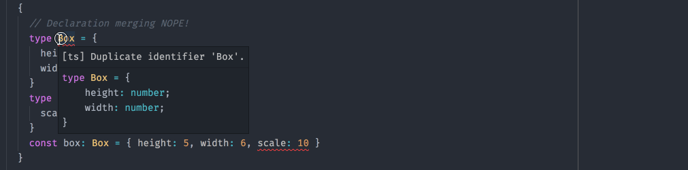

# Interface vs Type alias in Typescript 2.7

People often ask me ( online, at work, in skatepark (nope :D) ), what's the difference between using `type` and `interface`
for defining compile time types within TypeScript.

First thing I used to do, was pointing them to TypeScript handbook...

Unfortunately most of the time, they didn't find the droids that they were looking for ( [it's hidden within Advanced Types section](http://www.typescriptlang.org/docs/handbook/advanced-types.html#interfaces-vs-type-aliases)). Even if they found it, the information described there is very obsolete ( described behaviour is for typescript@2.0.x ).

Good news everyone! You don't have to look any further, This post is an up to date description/styleguide about when to use `interface` vs `type` alias.

## What official documentation says:

_"type aliases can act sort of like interfaces, however, there are some subtle differences."_

**that's correct !**

What differences?

_"One difference is, that interfaces create a new name that is used everywhere. Type aliases don’t create a new name — for instance, error messages won’t use the alias name."_

**that's incorect ! (since TypeScript 2.1)**

Let's define compile time types via interface and type and 2 implementation of `getRectangleSquare` function which will use both interface and type alias as parameter types.

```ts
interface PointInterface {
  x: number
  y: number
}

type PointType = {
  x: number
  y: number
}
```



```ts
const getRectangleAreaInterface = (args: PointInterface) => args.x * args.y
const getRectangleAreaAliased = (args: PointType) => args.x * args.y
```



```ts
// ERRORS:

// TS >=2.0.x
// Argument of type '{ x: number; }' is not assignable to parameter of type 'PointInterface'. Property 'y' is missing in type '{ x: number; }'.
getRectangleAreaInterface({ x: 12 })

// TS 2.0.x
// Argument of type '{ x: number; }' is not assignable to parameter of type '{ x: number; y: number; }'. Property 'y' is missing in type '{ x: number; }'.
// TS >=2.1
// Argument of type '{ x: number; }' is not assignable to parameter of type 'PointType'. Property 'y' is missing in type '{ x: number; }'.
getRectangleAreaAliased({ x: 12 })
```


_"A second more important difference is that type aliases cannot be extended or implemented from"_

**Again, that's incorect**

We can extend an interface with type alias:

```ts
interface ThreeDimesions extends PointType {
  z: number
}
```


Or use type for implementing a Class constraint

```ts
class Rectangle implements PointType {
  x = 2
  y = 4
}
```



Or use interface extended by an type for implementing a Class constraint

```ts
class RectanglePrism implements ThreeDimesions {
  x = 2
  y = 3
  z = 4
}
```


We can also combine both type alias and interface for implementing a Class constraint

```ts
interface Shape {
  area(): number
}
type Perimeter = {
  perimiter(): number
}

class Rectangle implements PointType, Shape, Perimeter {
  x = 2
  y = 3
  area() {
    return this.x * this.y
  }
  perimiter() {
    return 2 * (this.x + this.y)
  }
}
```


_type aliases canot extend/implement other types_

**Again, that's incorect**

Well it's partially correct but the formulation is missleading.

You can use interface or any other TypeScript valid type(which has shape of an Hash map/Dictionary/JS Object, so non primitive types etc...) for type alias extension via intersection operator `&`

```ts
class Point {
  x: number
  y: number
}
interface Shape {
  area(): number
}
type Perimeter = {
  perimiter(): number
}

type RectangleShape = Shape & Perimeter & Point

class Rectangle implements RectangleShape {
  x = 2
  y = 3
  area() {
    return this.x * this.y
  }
  perimiter() {
    return 2 * (this.x + this.y)
  }
}
```


We can also leverage mapped types for various transforms of both interface and type alias.

Let's make Shape and Perimiter optional via `Partial` mapped type:

```ts
class Point {
  x: number
  y: number
}
interface Shape {
  area(): number
}
type Perimeter = {
  perimiter(): number
}

type RectangleShape = Partial<Shape & Perimeter> & Point
// Exact the same with interface:
// interface RectangleShape extends Partial<Shape & Perimeter>, Point {}

class PartialRectangle implements RectangleShape {
  x = 2
  y = 3
}
```



Also weak type detection works correctly:

```ts
const rectangle: RectangleShape = {
  x: 12,
  y: 133,
  // ERROR:
  // Type '{ x: number; y: number; areaaaaaa(): void; }' is not assignable to type 'RectangleShape'.
  // Object literal may only specify known properties, and 'areaaaaaa' does not exist in type 'RectangleShape'.
  areaaaaaa() {
    // ...
  },
}
```


### Hybrid Types with both type alias and interface

You might occasionally want to define an object that that acts as both a function and an object, with additional properties.

What we are talking here about, is defining a type for a function ( callable object ) and static properties on that function.

> This pattern might be also seen, when interacting with 3rd-party JavaScript, to fully describe the shape of the type.

```ts
interface Counter {
  // callable part
  (start: number): string
  // static properties
  interval: number
  reset(): void
}

const getCounter = () => {
  const counter = ((start: number) => {}) as Counter
  counter.interval = 123
  counter.reset = () => {}
  return counter
}

const callable = getCounter()
callable(10)
callable.reset()
callable.interval = 5.0
```



It works equally with type alias!

```ts
type Counter = {
  // callable part
  (start: number): string
  // static properties
  interval: number
  reset(): void
}
```


There is a very suble difference though. You will get the particular shape type in IDE instead of refference to the `Counter` type.


What is usually a good idea/practice, is to disect our hybrid definition in two parts:

* callable object (function) type alias

```ts
// via type alias
type CounterFn = (start: number) => string

// via interface
interface CounterFn {
  (start: number): string
}
```


* static properties object shape

```ts
// via type alias
type CounterStatic = {
  interval: number
  reset(): void
}

// via interface
interface CounterStatic {
  interval: number
  reset(): void
}
```



and create result type:

```ts
// via type alias
type Counter = CounterFn & CounterStatic

// via interface
interface Counter extends CounterFn, CounterStatic {}
```


---

## So what's the difference between type alias and interface again?

### 1. you cannot use `implements` on an class with type alias if you use `union` operator within your type definition

This will trigger compile errors:

```ts
class Point {
  x: number
  y: number
}
interface Shape {
  area(): number
}
type Perimeter = {
  perimiter(): number
}

type RectangleShape = (Shape | Perimeter) & Point

// ERROR:
// A class may only implement another class or interface.
class Rectangle implements RectangleShape {
  x = 2
  y = 3
  area() {
    return this.x * this.y
  }
}
```



Which makes complete sense! A class blueprint, cannot implement one or another shape structure, so nothing surprising on this front.

Where union makes sense and also works, is for object definition via object literal, so following is valid and will produce compile error, because our object has to define on of `perimeter()` or `area()` method, or both:

```ts
// Type '{ x: number; y: number; }' is not assignable to type 'RectangleShape'.
//   Type '{ x: number; y: number; }' is not assignable to type 'Perimeter & Point'.
//    Type '{ x: number; y: number; }' is not assignable to type 'Perimeter'.
//      Property 'perimiter' is missing in type '{ x: number; y: number; }'.
const rectangle: RectangleShape = {
  x: 12,
  y: 133,
  // perimiter() {
  //   return 2 * (rectangle.x + rectangle.y)
  // },
  // area() {
  //   return rectangle.x * rectangle.y
  // },
}
```



### 2. you cannot use `extends` on an interface with type alias if you use `union` operator within your type definition

```ts
// ERROR:
// An interface can only extend an identifier/qualified-name with optional type arguments.
interface RectangleShape extends Shape | Perimeter, Point {}
```


Again, similarly to classes `implements`, interface is a "static" blueprint, it cannot exists in one or another shape, so cannot be `extended` by union type merge.

### 3. declaration merging doesn't work with type alias

While declaration merging works with interfaces, it fails short with type aliases.

What I mean by declaration mergin?:

You can define same interface multiple times, and its definitions will merge into one:

```ts
interface Box {
  height: number
  width: number
}

interface Box {
  scale: number
}

const box: Box = { height: 5, width: 6, scale: 10 }
```


This doesn't work with type aliases, because type is an unique type entity ( for both global or module scope ):

```ts
// This doesn't work
type Box = {
  height: number
  width: number
}
// ERROR:
// Duplicate identifier 'Box'.
type Box = {
  scale: number
}
// ERROR:
// Type '{ height: number; width: number; scale: number; }' is not assignable to type 'Box'.
// Object literal may only specify known properties, and 'scale' does not exist in type 'Box'.
const box: Box = { height: 5, width: 6, scale: 10 }
```



Declaration merging via interfaces is very important, when we are writing 3rd party ambient type definitions for libraries that are not authored with TypeScript, so consumer has option to extend them, if some definition are missing.

Same applies if our library is written in TypeScript and ambient type definitions are generated automatically.

This is the only use case, where you definitely should always use interface instead of type alias !

### What should I use for React `Props` and `State`

In general, use what you want ( type aliase / interface ) just be consistent, but personally, I recomend to use type aliases:

* it's shorter to write `type Props = {}`
* your syntax is consistent ( you are not mixin interfaces with type aliase for possible type intersections )
* your component Props/State implementation cannot be monkey patched and for that reason, consumer of your component should never need to leverage interface declaration merging. For extension there are clearly defined patterns like HOC and so on.

## Summary

In this article we learned what is the difference between `interface` and `type` alias in latest TypeScript.

With that covered, we came to an conclusion what method of defining compile time types should be used in a particular scenario.

Let's recap:

* type aliases can act sort of like interfaces, however, there are 3 important differences ( union types, declaration merging)
* use whatever suites you and your team, just be consistent
* always use `interface` for public API's definition when authoring a library or 3rd party ambient type definitions
* consider using `type` for your React Component Props and State

---

As always, don't hesitate to ping me if you have any questions here or on twitter (my handle [@martin_hotell](https://twitter.com/martin_hotell)) and besides that, happy type checking folks and 'till next time! Cheers!
