# React children composition patterns with TypeScript

> 🎒 this article uses following library versions:

```json
{
  "@types/react": "16.4.6",
  "@types/react-dom": "16.0.6",
  "typescript": "2.9.2",
  "react": "16.4.1",
  "react-dom": "16.4.1"
}
```

> 🎮 [source code can be found on my github profile](https://github.com/Hotell/blogposts/tree/master/2018-05/ts-react-children-composition)

---

React and declarative composition is my favourite couple for building UI. In this article we will cover various patterns how to leverage **children composition with TypeScript** to get excellent developer experience and type-safety along the process.

### So what do I mean by **children composition** ?

> I'm referring to `children` prop that might be used with every React Component.
>
> [children is a special prop](https://reactjs.org/docs/react-component.html#props), typically defined by the child tags in the JSX expression rather than in the tag itself.

### Why children props ?

Let's say that we have an application with a header and we want to place a navigation inside. We have three React components - App, Header and Navigation. They have to be nested into each other so we end up with the following dependencies:

```
<App> (render)-> <Header> (render)-> <Navigation>
```

While you may think, this is ok, it's not. This is tight coupling at it's worst 😥

Instead we should adhere to composition patterns, which we're already familiar with, from old good HTML.

So instead of previous example, we should provide composable API like this:

```
<App>
  <Header>
    <Navigation>...</Navigation>
  </Header>
</App>
```

This composition is possible via `children` React Component `props`. Also for those of you familiar with WebComponents, this is very similar to **slot projection API**, although much powerful as we have JavaScript at our disposal instead of static HTML 👌.

In this article we will examine all possible/useful React children composition patterns backed up by TypeScript 💪.

---

### 1. `props.children` (default slot projection)

Let's build a simple Material design like Card component, which should be used like this:

```tsx
const App = () => {
  return (
    <div>
      <Card>A simple card<Card>
    </div>
  )
}
```

So we will leverage `children` props to render anything that will be provided between `<Card>{PROJECTED CONTENT}</Card>` tags.

Implementation is following:

```tsx
export class Card extends Component {
  render() {
    return <div className="card">{this.props.children}</div>
  }
}
```

Which renders our card:


All good! But what if user forgets to provide children ?

```tsx
const App = () => {
  return (
    <div>
      <Card />
    </div>
  )
}
```

Well, we'll get no compile nor runtime errors and our app will render with empty Card ...


This is definitely not what we wanted. So how to prevent this? We can definitely write some runtime validation logic or we can leverage TypeScript and explicitly define `Card` component props API constraints. In this case, we need to define explicitly `children` prop, to make it required.

> Curious reader may ask, where did we get `this.props.children` in our Card component implementation when we haven't defined any props ?
>
> `props.children` are baked within `@types/react.d.ts` definition and are marked as optional which mirrors React API behaviour.
> 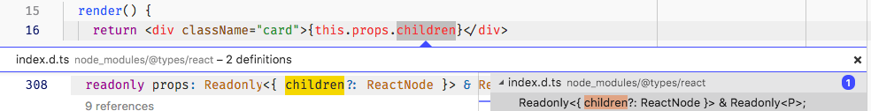

With that said here is our implementation:

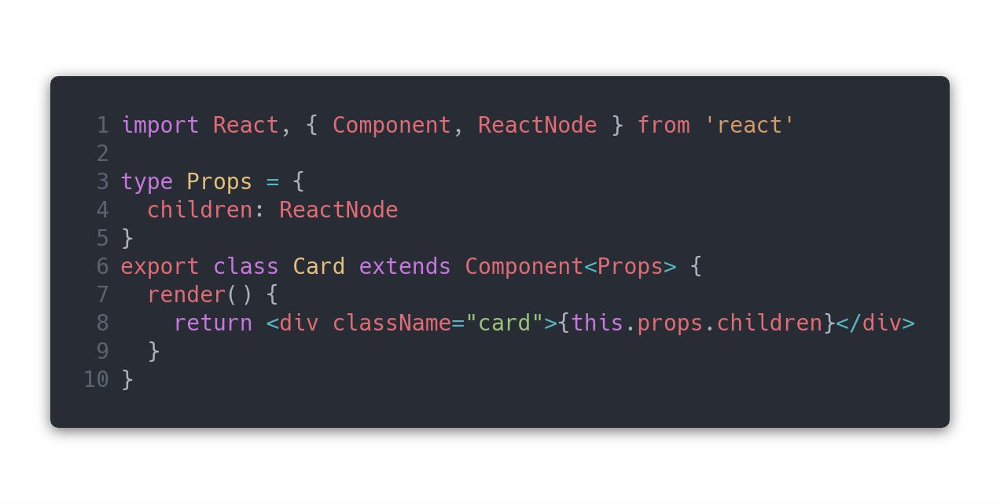

```tsx
import React, { Component, ReactNode } from 'react'

type Props = {
  children: ReactNode
}
export class Card extends Component<Props> {
  render() {
    return <div className="card">{this.props.children}</div>
  }
}
```

Now if consumer of our component forgets to define children, he will get compile time error 💪:

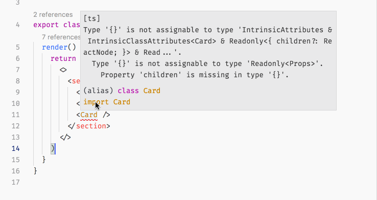

---

### 2. `props.children` - children as an object map (named slots projection)

Now let's extends our Card API, by providing additional API like:

- header
- media
- content
- actions

Your initial thoughts about this API might look like following:

```tsx
<Card>
  <CardHeader title="Shiba Inu">...</CardHeader>
  <CardMedia src="examples/shiba2.jpg"/>
  <CardContent>
    <p>
      The Shiba Inu is the smallest of the six original ... from Japan.
    </p>
  </CardContent>
  <CardActions>
    <Button>Like</Button>
    <Button>Share</Button>
  <CardActions>
</Card>
```

Which is old good compound components pattern, which of course works, but in my opinion this is too much churn which is nicely solved with so called `named slots projection` API provided natively within browser via [Shadow DOM (WebComponents)](https://developers.google.com/web/fundamentals/web-components/shadowdom#composition_slot). We can achieve similar pattern in React by passing an Object map as children prop ( That's the beauty of React, it's mostly "just JavaScript" ).

So instead our API for Card could look like following:

```tsx
<Card>
  {{
    header: 'Shiba Inu',
    media: ,
    content: (
      <p>The Shiba Inu is the smallest of the six original ... from Japan.</p>
    ),
    actions: (
      <>
        <button>Like</button>
        <button>Share</button>
      </>
    ),
  }}
</Card>
```

With Card implementation:

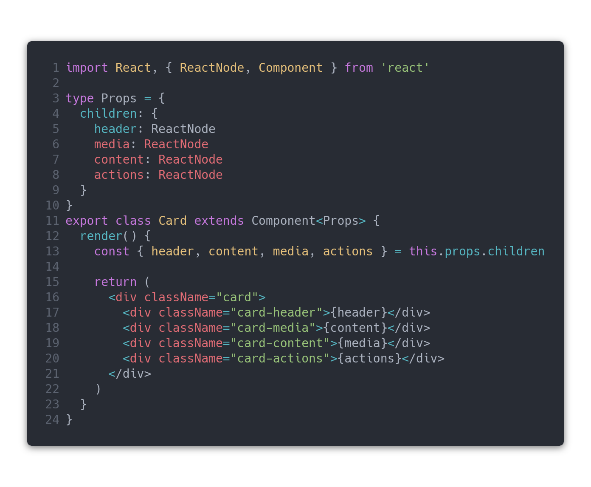

```tsx
import React, { ReactNode, Component } from 'react'

type Props = {
  children: {
    header: ReactNode
    media: ReactNode
    content: ReactNode
    actions: ReactNode
  }
}
export class Card extends Component<Props> {
  render() {
    const { header, content, media, actions } = this.props.children

    return (
      <div className="card">
        <div className="card-header">{header}</div>
        <div className="card-media">{content}</div>
        <div className="card-content">{media}</div>
        <div className="card-actions">{actions}</div>
      </div>
    )
  }
}
```

We're constraining **children prop to be required** and to have **shape of an object map**. Also TypeScript will give us nice intellisense and compile time errors if we missed something, without need to browse docs of `Card` component ❤️.

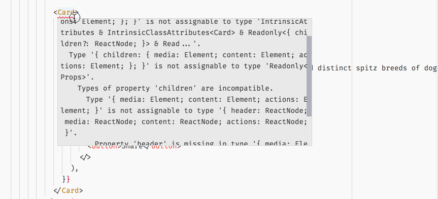

This is great indeed, but the API isn't very flexible as we have to always provide all props defined on children object map.

Fix is quite easy, we can just make our children map to be optional with only `content` being required ( we don't wanna get empty cards within our UI ).

```tsx
type Props = {
  children: {
    content: ReactNode
    header?: ReactNode
    media?: ReactNode
    actions?: ReactNode
  }
}
```

and also constraint our `render` method output within implementation, so we don't render things that aren't needed:

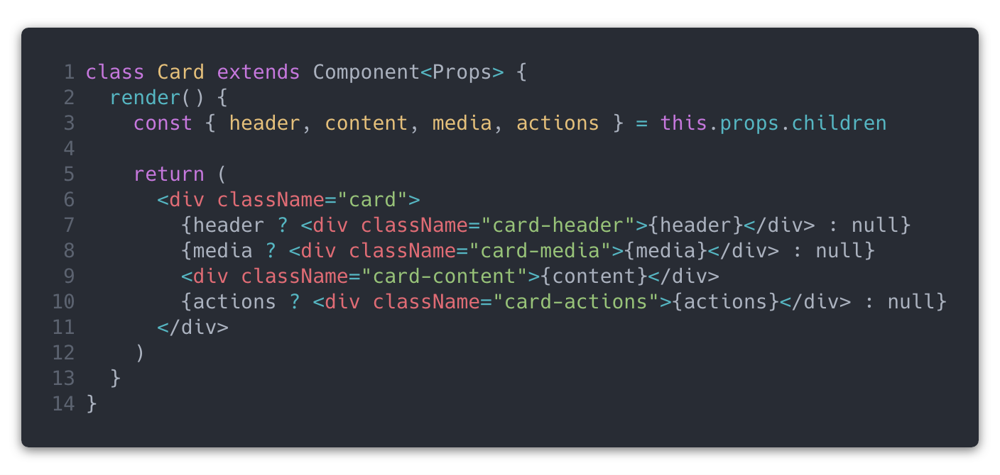

```tsx
class Card extends Component<Props> {
  render() {
    const { header, content, media, actions } = this.props.children

    return (
      <div className="card">
        {header ? <div className="card-header">{header}</div> : null}
        {media ? <div className="card-media">{media}</div> : null}
        <div className="card-content">{content}</div>
        {actions ? <div className="card-actions">{actions}</div> : null}
      </div>
    )
  }
}
```

### 3. combining default children and children as object ( default and named slot projection )

Now with our last implementation of Card component, if consumer wants to render just simple content, he needs to write a lot of unnecessary markup:

```tsx
<Card>
  {{
    content: <p>The Shiba Inu is the smallest of ...</p>,
  }}
</Card>
```

We can tweak our API to leverage both default children and children as an object map, so consumer would be able to use one or another.

Let's have a look at our final Card implementation:

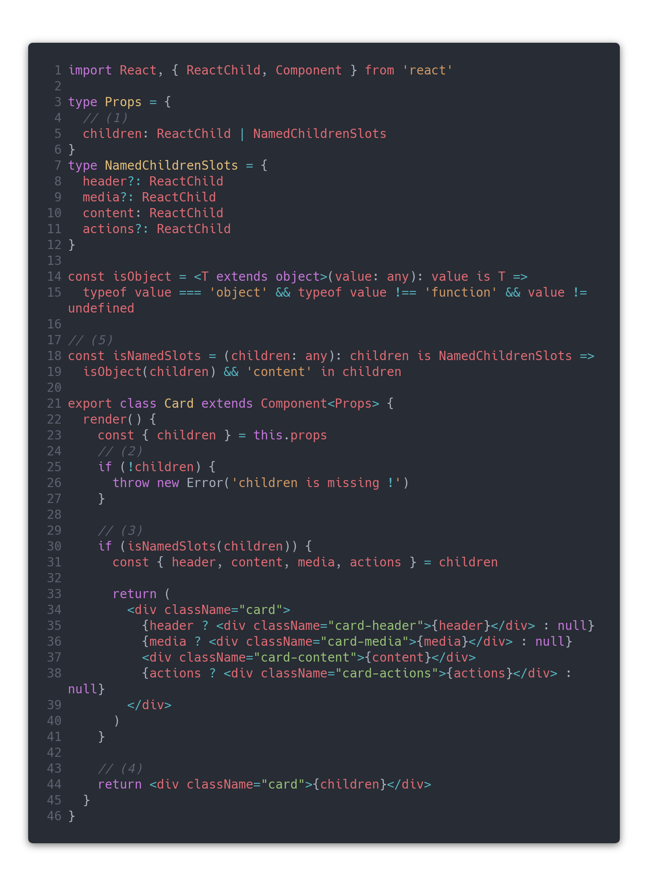

```tsx
import React, { ReactChild, Component } from 'react'

type Props = {
  // (1)
  children: ReactChild | NamedChildrenSlots
}
type NamedChildrenSlots = {
  header?: ReactChild
  media?: ReactChild
  content: ReactChild
  actions?: ReactChild
}

export class Card extends Component<Props> {
  render() {
    const { children } = this.props

    // (2)
    if (!children) {
      throw new Error('children is mandatory !')
    }

    // (3)
    if (isNamedSlots(children)) {
      const { header, content, media, actions } = children

      return (
        <div className="card">
          {header ? <div className="card-header">{header}</div> : null}
          {media ? <div className="card-media">{media}</div> : null}
          <div className="card-content">{content}</div>
          {actions ? <div className="card-actions">{actions}</div> : null}
        </div>
      )
    }

    // (4)
    return <div className="card">{children}</div>
  }
}

// (5)
const isObject = <T extends object>(value: any): value is T =>
  typeof value === 'object' && typeof value !== 'function' && value != undefined
const isNamedSlots = (children: any): children is NamedChildrenSlots =>
  isObject(children) && 'content' in children
```

Quite a lot is happening here, let's explain our code step by step:

1.  we're leveraging union types to define our Component props API. Also we had to change type from `ReactNode` to `ReactChild` because `ReactNode` contains within it's definition a **mixed type 👉 `{}`** which would narrow our children type restriction and wouldn't not properly type check our children as object.

> 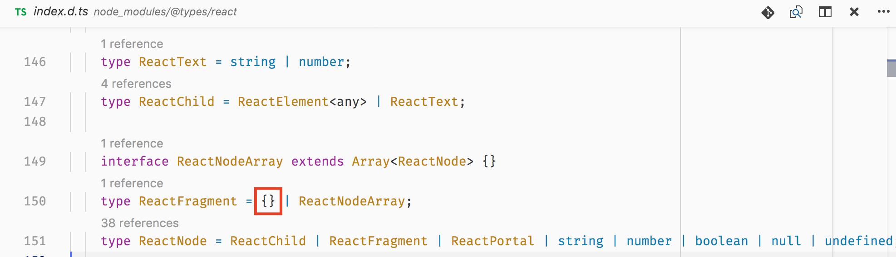

2.  we add runtime check so app will throw when consumer forgot to provide children
3.  if props.children is in shape of our `NamedChildrenSlots` we will tell type checker that and render properly our markup
4.  if props.children is not `NamedChildrenSlots` we just render default markup provided by consumer of our component
5.  here we are defining our children guards with TypeScript type guard capabilities

And now we can use both children patterns within our app:

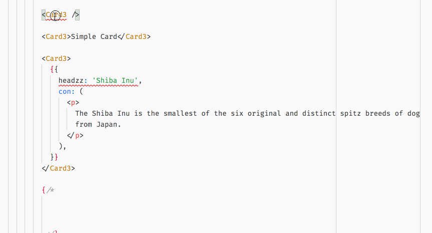

```tsx
const App = () => (
  <div>
    {/* this will throw compile and runtime error */}
    <Card />
    {/* this will throw compile and runtime error not valid object props */}
    <Card>
      {{
        headzz: 'Shiba Inu',
        con: (
          <p>
            The Shiba Inu is the smallest of the six original and distinct spitz
            breeds of dog from Japan.
          </p>
        ),
      }}
    </Card>

    {/* Simple Card */}
    <Card>Simple Card</Card>

    {/* Leveraging named children projection */}
    <Card>
      {{
        header: 'Shiba Inu',
        content: (
          <p>
            The Shiba Inu is the smallest of the six original and distinct spitz
            breeds of dog from Japan.
          </p>
        ),
      }}
    </Card>
  </div>
)
```

### 4. `props.children` as a function ( known also as render props pattern )

While previous patterns kinda mirror element projection that is available in HTML and with ShadowDOM via slot projection (of course not type-safe, in our case type safe 💪), we can go further and introduce more powerful patterns like **Render props / Children as a function** !

So consumer of our Toggle should be able to write following markup:

```tsx
<Toggle
  {/* (1) */}
  onToggle={(value) => console.log('onToggle', value)}
>
  {
    {/* (2) */}
    ({ toggle, on }) => <button onClick={toggle}>{on ? 'on' : 'off'}</button>
  }
</Toggle>
```

1.  Consumer defines what should happen onToggle which will get actual value via function argument. State handling and logic is encapsulated within our `Toggle`
2.  children is a function, which exposes public API of our component, which we can compose and render whatever UI we want 👌. When button will be clicked, internal state of Toggle will change, and our `onToggle` handler will be executed as well.

With "How the API and usage should look like" covered, let's implement our `Toggle` component which via children as a function pattern:

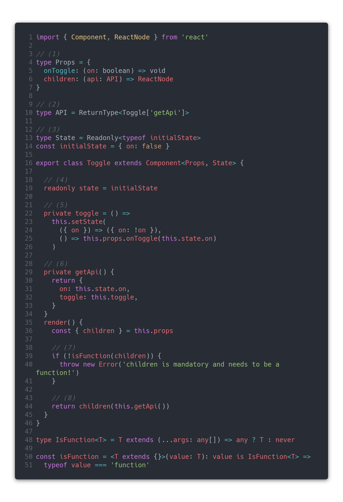

```tsx
import { Component, ReactNode } from 'react'

// (1)
type Props = {
  onToggle: (on: boolean) => void
  children: (api: API) => ReactNode
}

// (2)
type API = ReturnType<Toggle['getApi']>

// (3)
type State = Readonly<typeof initialState>
const initialState = { on: false }

export class Toggle extends Component<Props, State> {
  // (4)
  readonly state = initialState

  // (5)
  private toggle = () =>
    this.setState(
      ({ on }) => ({ on: !on }),
      () => this.props.onToggle(this.state.on)
    )

  // (6)
  private getApi() {
    return {
      on: this.state.on,
      toggle: this.toggle,
    }
  }

  render() {
    const { children } = this.props

    // (7)
    if (!isFunction(children)) {
      throw new Error('children is mandatory and needs to be a function!')
    }

    // (8)
    return children(this.getApi())
  }
}

type IsFunction<T> = T extends (...args: any[]) => any ? T : never

const isFunction = <T extends {}>(value: T): value is IsFunction<T> =>
  typeof value === 'function'
```

Again, quite a lot code over there. Let's examine various parts of the implementation:

1.  We define our `Props`, by making `children` required and defined as a function, which will get public `API` via argument and `onToggle` which should be a function that will receive actual `on` state when internal state changes.
2.  Here we define API type from implementation, which is a very powerful TS pattern (source of truth is implementation instead of manualy defined type. When we would refactor `getApi()` there is no need to refactor the type as it's automatically infered == less boilerplate FTW). Because Classes are resolved as structural types instead of nominal in TypeScript, we can access any class member via property lookup + leveraging conditional types via `ReturnType` mapped type provided by lib.d.ts.
3.  We use similar pattern for as we used in (2.) for defining state. We infer state type definition from implementation of initial state and we also map our state object to have all members readonly to avoid mutation on compile time.
4.  here we define state via class property and we mark it as readonly again ( with that if you do this.state = {} within your code you'll get compile errors as state is immutable )
5.  our private `toggle` that will change our internal state and calls `onToggle` callback provided by consumer of our component
6.  private method which defines our API exposed via arguments in children function call
7.  we double check if children is function, if not we throw ( runtime check )
8.  finally we don't render any custom markup, instead we're calling children with our public API

Again both implementation and usage is type safe with top notch DX, without looking up any docs 👀🖖💪.

Let's see it in action:


### 5. render props + children as a function

Ok, last thing that we might want to do is to give consumer API flexibility by leveraging `render` prop instead of `children`.

Easy. We just need to add `render` with same annotation as `children` prop to our `type Props` definition:

```tsx
type Props = {
  onToggle: (on: boolean) => void
  children: (api: API) => ReactNode
  render: (api: API) => ReactNode
}
```

This is not correct though, as consumer of our component will get compile errors because both children and render are required. First "fix" that may comes up my mind is to mark those as optional.

```tsx
type Props = {
  onToggle: (on: boolean) => void
  children?: (api: API) => ReactNode
  render?: (api: API) => ReactNode
}
```

Which won't protect us for use cases, when user completely forgets to define children or render prop.

```tsx
// No compile errors 😥
<Toggle onToggle={(value) => console.log('onToggle', value)} />
```

> Type Union to the rescue !

```tsx
type Props = {
  onToggle: (on: boolean) => void
} & RenderProps

type RenderProps =
  | { children: (api: API) => ReactNode }
  | { render: (api: API) => ReactNode }
```

Which widens to:

```tsx
type Props =
  | {
      onToggle: (on: boolean) => void
      children: (api: API) => ReactNode
    }
  | {
      onToggle: (on: boolean) => void
      render: (api: API) => ReactNode
    }
```

With that API, our component should support one or another props pair.

Let's take a look if it does:

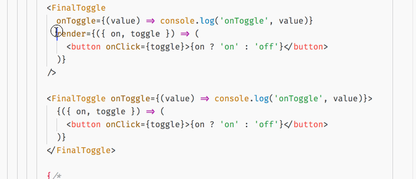

```tsx
<>
  {/* compile errors -> children or render is required */}
  <Toggle onToggle={(value) => console.log('onToggle', value)} />

  {/* works */}
  <Toggle
    onToggle={(value) => console.log('onToggle', value)}
    render={({ on, toggle }) => (
      <button onClick={toggle}>{on ? 'on' : 'off'}</button>
    )}
  />

  {/* works */}
  <Toggle onToggle={(value) => console.log('onToggle', value)}>
    {({ on, toggle }) => <button onClick={toggle}>{on ? 'on' : 'off'}</button>}
  </Toggle>
</>
```

Yup, it works!

> Although intellisense for props defined within union is missing. [There is an open bug for it, so hopefully it will be fixed](https://github.com/Microsoft/TypeScript/issues/25504)
>
> Good thing is that inference still works for function annotation for both children/render props!


Ok let's look on changes that we did within `Toggle` implementation:

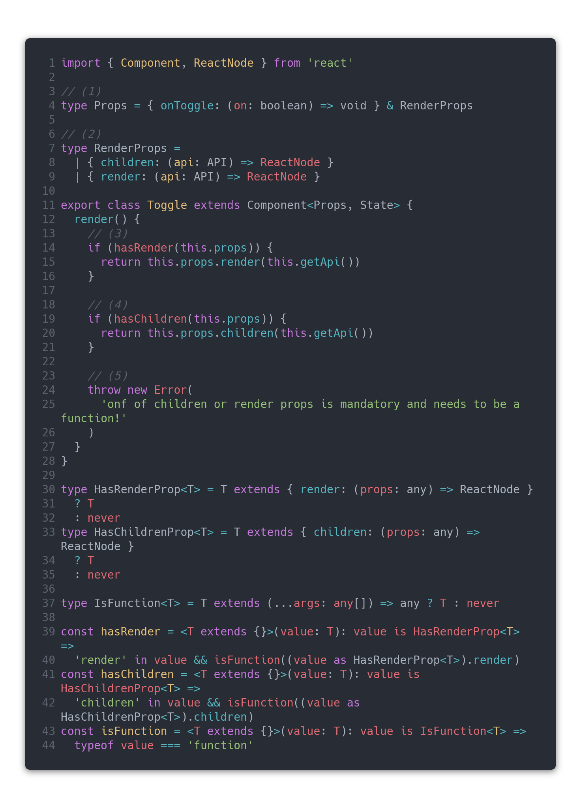

```tsx
import { Component, ReactNode } from 'react'

// (1)
type Props = { onToggle: (on: boolean) => void } & RenderProps

// (2)
type RenderProps =
  | { children: (api: API) => ReactNode }
  | { render: (api: API) => ReactNode }

export class Toggle extends Component<Props, State> {
  render() {
    // (3)
    if (hasRender(this.props)) {
      return this.props.render(this.getApi())
    }

    // (4)
    if (hasChildren(this.props)) {
      return this.props.children(this.getApi())
    }

    // (5)
    throw new Error(
      'onf of children or render props is mandatory and needs to be a function!'
    )
  }
}

type HasRenderProp<T> = T extends { render: (props: any) => ReactNode }
  ? T
  : never
type HasChildrenProp<T> = T extends { children: (props: any) => ReactNode }
  ? T
  : never
type IsFunction<T> = T extends (...args: any[]) => any ? T : never

const hasRender = <T extends {}>(value: T): value is HasRenderProp<T> =>
  'render' in value && isFunction((value as HasRenderProp<T>).render)

const hasChildren = <T extends {}>(value: T): value is HasChildrenProp<T> =>
  'children' in value && isFunction((value as HasChildrenProp<T>).children)

const isFunction = <T extends {}>(value: T): value is IsFunction<T> =>
  typeof value === 'function'
```

1.  We added new `type RenderProps` which intersects with `onToggle` prop and with that defines final `type Props` API
2.  new type definition of `RenderProps` which consist of union of 2 possible objects children/render
3.  we're checking if `render` is defined by consumer, if yes we render via `render prop` and exit early from render. `hasRender` is a type guard which leverages power of conditional types ( we won't explain this as it would be for separate article on it's own)
4.  we're checking if `children` is defined by consumer and if it's a function. If it is, we render via children as a function.
5.  when children nor render are provided, we throw a runtime error 🤖

That's it! LGTM ! 🤙

### 5. EXTRA (render props via both children as a function and render prop)

> **NOTE:**
>
> I don't recommend following pattern as it's highly experimental and breaks guarantees within Toggle component implementation. Just mentioning it here for curious reader 🧐

One more thing. What about preventing consumer to define both render and children at one time? It should be already covered right? By that prop union.

Let's see:

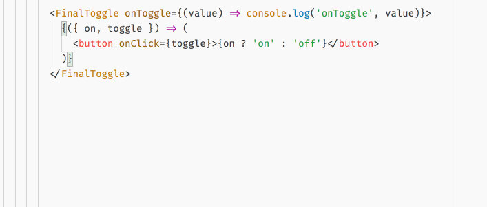

```tsx
<>
  {/* compile errors -> children or render is required */}
  <Toggle onToggle={(value) => console.log('onToggle', value)} />

  {/* works */}
  <Toggle
    onToggle={(value) => console.log('onToggle', value)}
    render={({ on, toggle }) => (
      <button onClick={toggle}>{on ? 'on' : 'off'}</button>
    )}
  >
    {({ on, toggle }) => <button onClick={toggle}>{on ? 'on' : 'off'}</button>}
  </Toggle>
</>
```

Oh No Panic! No Errors 🤯... Why Mister Anderson Why ? Well [TypeScript doesn't allow exclusive union types](https://github.com/Microsoft/TypeScript/issues/10575#issuecomment-242919644). What needs to be done is to provide and [exclusive ( XOR like ) operator to the language](https://github.com/Microsoft/TypeScript/issues/14094), which we can partially implement by conditional types.

```tsx
type XOR<T, U> = (T | U) extends object
  ? (Without<T, U> & U) | (Without<U, T> & T)
  : T | U

type Without<T, U> = { [P in Exclude<keyof T, keyof U>]?: never }

// Redefine RenderProps via XOR instead of Union operator
type RenderProps = XOR<
  { children: (api: API) => ReactNode },
  { render: (api: API) => ReactNode }
>
```

Now we got proper compile errors if both children/render are defined at once, even so we got our intellisense back!

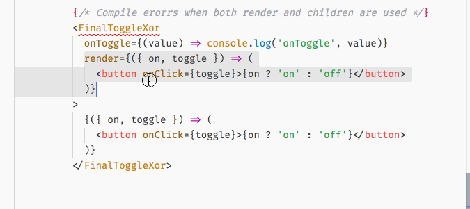

This although broke constraints within Toggle implementation as both render and children are now defined without the need of conditional checks… Which is wrong 😫 ...

# End

Allright we are done here!

We learned how to build highly composable components thanks to `props.children` React API, which are really not that different from what we get from the browser platform ( Shadow DOM ), even so more powerful thanks to JavaScript.

With that said I hope you've learned something new today and that you'll leverage the power of React children composition with TypeScript sooner than later to provide consumers of your components with fantastic developer experience and type-safety ✌.

---

As always, don't hesitate to ping me if you have any questions here or on twitter (my handle [@martin_hotell](https://twitter.com/martin_hotell)) and besides that, happy type checking folks and 'till next time! Cheers!
