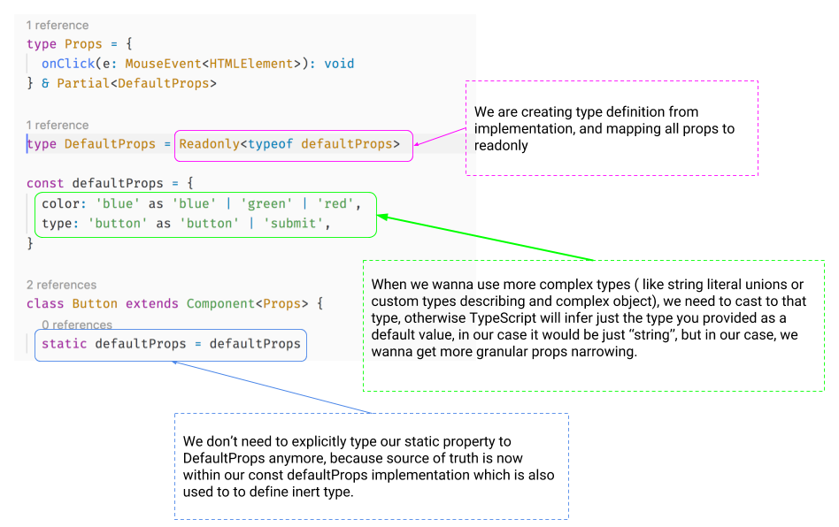

# React,Typescript and defaultProps dilema, aka "Solving a milion dollar problem".

Let's say, you wanna use/are using React, and you made a decision to use a typed JavaScript with it ... and you pick TypeScript for the job. Let me congratulate you for this decision in a first place, as your Dev life is going to be much easier from now on thanks to the type safety and top notch DX in the first place! Anyways, you'll start developing your first pieces of your React app with TypeScript. Everyhing will go flawlessly, until you'll come to this first "huge" issue. Dealing with `defaultProps` in your components...

> This post is based on TypeScript 2.9 and uses a strict mode. If you don't use strict mode, turn it on ASAP because not using strict mode is like cheating on your girlfriend and you don't wanna do that. right? ( if you're in gradual migration phase from js to TS, nonStrict is OK ! )

> In this article I will demonstrate the issue and how to solve it for both type of Components (component as a function/class components).

So let's define a `Button` component, with following API, which will be used across this blogpost.

**Button API**

* onClick ( click handler )
* color ( what color will be used )
* type (button type 'button' or 'submit')

With marking `color` and `type` as optional with defaultProps defined for those.

```tsx
import { SFC, MouseEvent, Component } from 'react'
import React from 'react'

type Props = {
  onClick(e: MouseEvent<HTMLElement>): void
  color?: 'blue' | 'green' | 'red'
  type?: 'button' | 'submit'
}

class Button extends Component<Props> {
  static defaultProps = {
    color: 'blue',
    type: 'button',
  }
  render() {
    const { onClick: handleClick, color, type, children } = props

    return (
      <button type={type} style={{ color }} onClick={handleClick}>
        {children}
      </button>
    )
  }
}
```

Now we can use our component in our app and we got correct optional and required props compile time checking:


```tsx
class App extends Component {
  private handleClick = () => {
    console.log('clicked!')
  }
  render() {
    return (
      <div>
        <Button onClick={this.handleClick}>Click me!</Button>
      </div>
    )
  }
}
```

Nice everything works and it's typed. We can go home now... Well not so fast my friends!

Our `Button` defaultProps are not typed at all, because type checker just cannot infer types from generic class extentions to its static properties.

What does that even mean?

* you can set anything to your `static defaultProps`
* your are defining same things on 2 places ( types and implementation )

Not typed defaultProps:


We can fix this by extracting `color` and `type` type properties to separate type and then use type intersection with mapping our defaults to be optional via `Partial` mapped type helper.
With that we need to explicitly annotate our `static defaultProps: DefaultProps` which will get us proper type safety/DX within our implementation!

```tsx
type Props = {
  onClick(e: MouseEvent<HTMLElement>): void
} & Partial<DefaultProps>

type DefaultProps = {
  color: 'blue' | 'green' | 'red'
  type: 'button' | 'submit'
}

class Button extends Component<Props> {
  static defaultProps: DefaultProps = {
    color: 'blue',
    type: 'button',
  }
  // ...
}
```


Now what I tend to do is to extract `defaultProps` and `initialState`(if state is used) to separate constants, which will give you also another benefit -> getting type definition from implementation, which introduces less boilerplate in your codebase and only one source of truth which is a win win.



```tsx
type Props = {
  onClick(e: MouseEvent<HTMLElement>): void
} & Partial<DefaultProps>
type DefaultProps = Readonly<typeof defaultProps>

const defaultProps = {
  color: 'blue' as 'blue' | 'green' | 'red',
  type: 'button' as 'button' | 'submit',
}

class Button extends Component<Props> {
  static defaultProps = defaultProps
  //...
}
```

So far so good.

Let's introduce some logic to our component. Let's say we don't wanna use just css inline styles ( which is not very good pattern anyway ), and based on `color` prop we wanna generate appropriate css class with some styles.

We'll define some `resolveColorTheme` function which will accept our color prop and as outcome we will get css className.

```tsx
type DefaultProps = Readonly<typeof defaultProps>

const defaultProps = {
  color: 'blue' as 'blue' | 'green' | 'red',
  type: 'button' as 'button' | 'submit',
}

const resolveColorTheme = (color: DefaultProps['color']) => {
  const btnThemes = {
    blue: 'btn-primary',
    green: 'btn-secondary',
    red: 'btn-accent',
  }
  return btnThemes[color] || 'btn-default'
}

class Button extends Component<Props> {
  static defaultProps = defaultProps
  render() {
    const { onClick: handleClick, color, type, children } = this.props

    const cssClass = resolveColorTheme(color)

    return (
      <button type={type} className={cssClass} onClick={handleClick}>
        {children}
      </button>
    )
  }
}
```

With this we will get a compile error! oh no! panic!

```
Type 'undefined' is not assignable to type '"blue" | "green" | "red"'
```


Why do we get an error now? Well `color` is optional, and we are in strict mode, which means, that the type union is extended by an `undefined`/`void` type, but our function doesn't accept `undefined`. This is also compiler at it's best, which tries to protect us to adhere to proper program execution ( remember the times `undefined is not a function` ).

## How to fix this aka solving the milion dollar problem?

As of today _June 2018/TypeScript 2.9_ there are 4 options how to fix this:

* Non-null assertion operator
* Component type casting
* High order function for defining defaultProps
* Props getter function

Let's take a look at those one by one.

### 1. Non-null assertion operator

This solution is a no brainer, all you need to do is tell the type checker explicitly that hey dude, this won't be null or undefined, trust me I'm an human...ehm 🤖... This is achieved by non-null assertion operator `!`

```tsx
const { onClick: handleClick, color, type, children } = this.props
const cssClass = resolveColorTheme(color!)
```

or

```tsx
const color = this.props.color!
const cssClass = resolveColorTheme(color!)
```

This might be ok for simple use cases ( like small props API, accesing particular props only in render method ), but once your component starts to grow, it can get messy and confusing pretty quickly. Also you need to double check all the time which prope is defined as defaultProps -> more cognitive overhead for developer === bad DX / error prone

### 2. Component type casting

So how to solve our problem with mitigating all the pittfals mentioned in first solution?

We can create our component via anonymoys class and assign it to constant which we will cast to final outcome component with proper prop types while keeping all "defaultProps" as NonNullable within our implementation

```tsx
const Button = class extends Component<Props & DefaultProps> {
  static defaultProps = defaultProps
  render() {
    const { onClick: handleClick, color, type, children } = this.props

    const cssClass = resolveColorTheme(color)

    return (...)
  }
} as ComponentClass<Props>
```

This solves our former problem, but I don't know, I have bad feeling about this ( Still feels like a dirty hack to me ).

Can we improve this somehow? Well TypeScript 2.8 introduced a very powerful feature - conditional types. Let's use the new and shinny feature with more functional approach, shall we ?

### 3. High order function for defining defaultProps

We can define a function factory/high order function, for declaring defaultProps and leveraging conditional types to correctly resolve our props API.

```tsx
const Button = withDefaultProps(
  defaultProps,
  class extends Component<Props> {
    render() {
      const { onClick: handleClick, color, type, children } = this.props

      const cssClass = resolveColorTheme(color)

      return (
        <button type={type} className={cssClass} onClick={handleClick}>
          {children}
        </button>
      )
    }
  }
)
```

I like this ! We don't use React API for defining defaultProps, this is handled by our `withDefaultProps` function. Also we don't need any additional `type DefaulProps` in this case. Everything is handled by TypeScript.

Let's take a look at our `withDefaultProps` implementation:

```tsx
export const withDefaultProps = <P extends object, DP extends Partial<P> = Partial<P>>(
  defaultProps: DP,
  Cmp: ComponentType<P>
) => {
  // we are extracting default props from component Props api type
  type PropsExcludingDefaults = Pick<P, Exclude<keyof P, keyof DP>>

  // we are re-creating our props definition by creating an intersection type
  // between Props without Defaults and DefaultProps mapped to optional via Partial mapped types helper
  type RecomposedProps = Partial<DP> & PropsExcludingDefaults

  // Implementation -> here we set our defaultProps
  Cmp.defaultProps = defaultProps

  // we override return type definition by turning type checker off
  // for original props  and setting the correct return type
  return (Cmp as ComponentType<any>) as RecomposedProps
}
```

This is awesome! So are we done here Martin? Of course. Hmm.. but wait... what about Generic Components? Oh no, I completely forgot about that usecase.

> Generic props ?

```tsx
class Button<T> extends Component<Props<T>> {...}


class App extends Component {
  render(){
    return <Button <number>>click me</Button>
  }
}
```

```tsx
const Button = withDefaultProps(
  defaultProps,
  class Button<T> extends Component<Props<T>> {...}
)

// Error. Button is not generic
class App extends Component {
  render(){
    return <Button <number>>click me</Button>
  }
}
```

If we would like to use this pattern with generic props, our generic type would be lost, so if you wanna define a generic component, this solution is not feasible :(, besides that, all good!

So is there some ultimate pattern Martin?

Well I don't know if it's ultimate, but it works and covers all previously mentioned issues.

### 4. Props getter function

Behold! the humble factory/closure pattern with conditional types mapping.

```tsx
export const createPropsGetter = <DP extends object>(defaultProps: DP) => {
  return <P extends Partial<DP>>(props: P) => {
    // we are extracting default props from component Props api type
    type PropsExcludingDefaults = Pick<P, Exclude<keyof P, keyof DP>>

    // we are re-creating our props definition by creating an intersection type
    // between Props without Defaults and NonNullable DefaultProps
    type RecomposedProps = DP & PropsExcludingDefaults

    // pure javascript object spread
    // we need to cast to objects, as there is a bug within TypeScript when spreading generics
    // last but not least we are turning off compiler an casting the type to our new RecomposedProps type
    return ({ ...(defaultProps as object), ...(props as object) } as any) as RecomposedProps
  }
}
```

Our function privately saves defaultProps, and then just returns merged props with default props. With this we are not using React API, rather leveraging pure JavaScript

Let's use this baby!

```tsx
const defaultProps = {
  color: 'blue' as 'blue' | 'green' | 'red',
  type: 'button' as 'button' | 'submit',
}
const props = createPropsGetter(defaultProps)

class Button extends Component<Props> {
  render() {
    const { onClick: handleClick, color, type, children } = props(this.props)

    const cssClass = resolveColorTheme(color)

    return (
      <button type={type} className={cssClass} onClick={handleClick}>
        {children}
      </button>
    )
  }
}
```

This is very slick, don't you think ?

We are done here, this covers all previous issues:

* no need for escape hatches by using non null assertion
* no need to cast our component to other types
* we don't have to re-create component and thus loosing any types in the process
* works with generic components
* easy to reason about and future proof ( TypeScript 3.0 )

## TypeScript 3.0

If you think that TypeScript team didn't noticed this "milion dollar problem", you're completely wrong. Those guys love the community and trying to gives us the best JS type checker on the planet. So yeah, Daniel Rosenwasser created an issue recently about [better support for default props in JSX](https://github.com/Microsoft/TypeScript/issues/23812) which is targeted for TypeScript 3.0

**TL;DR**:

TypeScript will implement generic way how to obtain **default props** and will reflect those within JSX by looking up factory function definition which is responsible for creating VirtualDom objects ( for React - `createElement` , for Preact - `h`).

## With that said, we are at the end of our jorney for solving the milion dollar problem, yay !

As always, don't hesitate to ping me if you have any questions here or on twitter (my handle [@martin_hotell](https://twitter.com/martin_hotell)) and besides that, happy type checking folks and 'till next time! Cheers!
