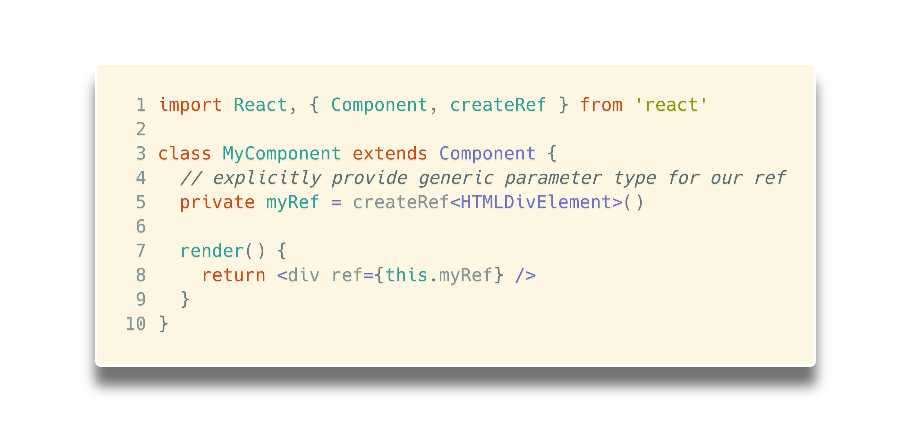
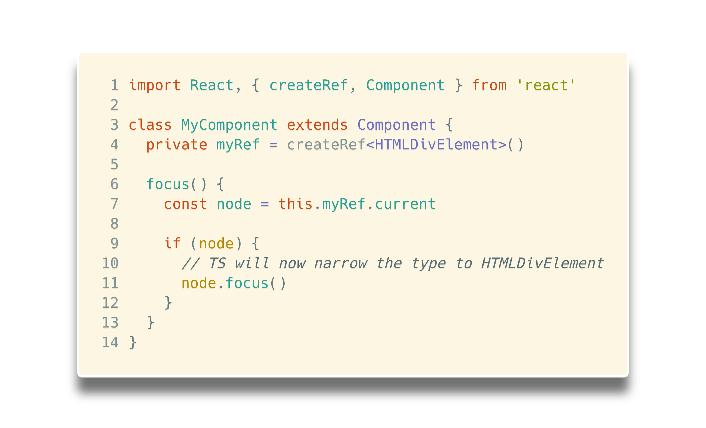
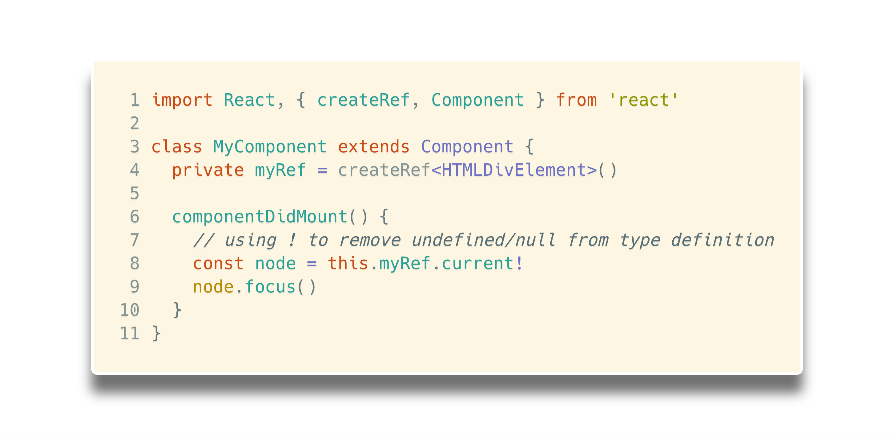
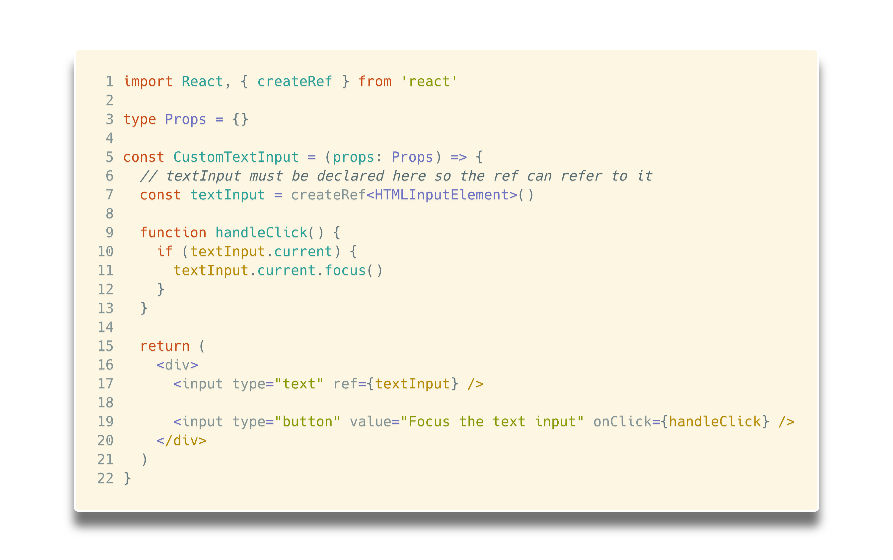
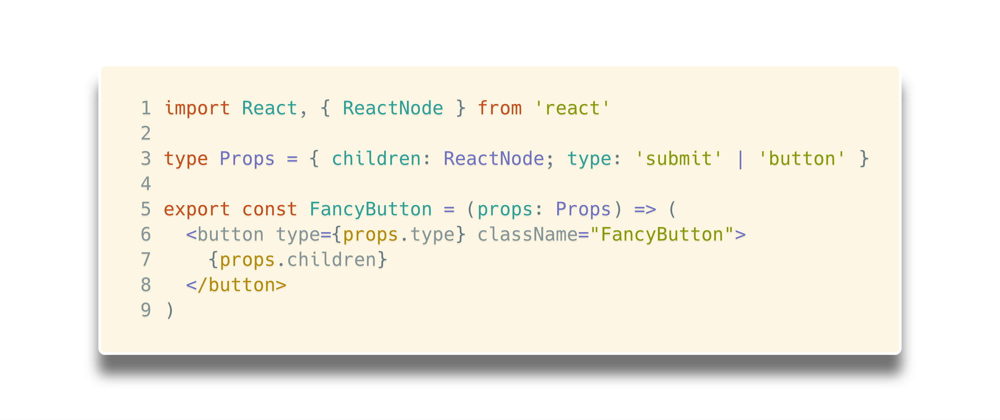
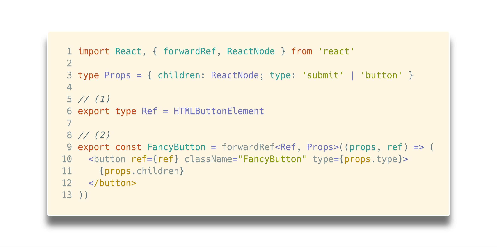

# React Refs with TypeScript

> 🎒 this article uses following library versions:

```json
{
  "@types/react": "16.4.7",
  "@types/react-dom": "16.0.6",
  "typescript": "3.0.1",
  "react": "16.4.2",
  "react-dom": "16.4.2"
}
```

> 🎮 [source code can be found on my github profile](https://github.com/Hotell/blogposts/tree/master/2018-08/ts-react-refs)

---

Recently I've got this message on Twitter

https://twitter.com/code_e_averett/status/1025536674472886272

Instead of replying, I've decided to write down this "short post" about how to handle React DOM refs and ref forwarding with TypeScript for anyone new to React and TypeScript as I didn't found this resource anywhere online.

> **Disclaimer:**
> Don't expect to learn all the why's and how's about React refs within this blogpost ( you can find all that info in excellent [React docs](https://reactjs.org/docs/refs-and-the-dom.html)).
>
> This post will try to mirror those docs a bit for easy context switching.

What are Refs in React ?

> Refs provide a way to access DOM nodes or React elements created in the render method.

Let's create some React refs with TypeScript 👌👀

### Creating Refs

```tsx
class MyComponent extends Component {
  // we create ref on component instance
  private myRef = createRef()
  render() {
    return <div ref={this.myRef} />
  }
}
```

But with that component definition, we get compile error:

```sh
[ts]
Type 'RefObject<{}>' is not assignable to type 'RefObject<HTMLDivElement>'.
```

Uh oh? What's going on here ? TypeScript has very good type inference especially within JSX, and because we are using `ref` on an `<div>` element, it knows that the ref needs to be a type of `HTMLDivElement`. So how to fix this error?

> `React.createRef()` is an generic function

```tsx
// react.d.ts
function createRef<T>(): RefObject<T>
```

What about the return type, the `RefObject<T>` ? Well that's just a `Maybe` type with following interface

```ts
// react.d.ts
interface RefObject<T> {
  // immutable
  readonly current: T | null
}
```

With that covered, you already know how to make our code valid right ? 👀 We need to explicitly set the generic value for `createRef`:

```tsx
import React, { Component, createRef } from 'react'

class MyComponent extends Component {
  // explicitly provide generic parameter type for our ref
  private myRef = createRef<HTMLDivElement>()

  render() {
    return <div ref={this.myRef} />
  }
}
```



### Accessing refs

> When a ref is passed to an element in `render`, a reference to the node becomes accessible at the `current` attribute of the ref.

If we wanna access our previously defined ref value, all we need to do is to get the `current` value from the ref object

```tsx
const node = this.myRef.current
```

Although, our `node` variable is gonna be a Maybe type 👉 `HTMLDivElement` OR `null` ( remember? `RefObject<T>` interface... ).

So if we would like to execute some imperative manipulation with that `node` we just couldn't do:

```tsx
class MyComponent extends Component {
  private myRef = React.createRef<HTMLDivElement>()

  focus() {
    const node = this.myRef.current
    node.focus()
  }
}
```

with that code, we would get an compile error

```sh
[ts] Object is possibly 'null'.
const node: HTMLDivElement | null
```

You may say, this is annoying, TypeScript sucks... Not so fast partner 😎! TypeScripts just prevents you to do a programmatic mistake here which would lead to runtime error, even without reading a line of the docs ❤️.

**What React docs say about `current` value ?**

> React will assign the current property with the DOM element when the component mounts, and assign it back to null when it unmounts. ref updates happen before componentDidMount or componentDidUpdate lifecycle hooks.

That's exactly what TS told you by that compile error! So to fix this, you need to add some safety net, an `if` statement is very appropriate here ( it will prevent runtime errors and also narrow type definition by removing `null` ):

```tsx
import React, { createRef, Component } from 'react'

class MyComponent extends Component {
  private myRef = createRef<HTMLDivElement>()

  focus() {
    const node = this.myRef.current

    if (node) {
      // TS will now narrow the type to HTMLDivElement
      node.focus()
    }
  }
}
```



Also we get autocomplete to whole `HTMLDivElement` DOM api. Lovely!


> **Curious reader may ask:**
>
> What about accessing refs within `componentDidMount` if we don't wanna encapsulate our imperative logic within a method ( because we are messy/bad programmers 😇 ) ?

I hear you... Because we know that our refs `current` value is definitely gonna be available within `componentDidMount`, we can use TypeScript's **Non-null assertion operator** 👉 👉 👉 `!`

```tsx
import React, { createRef, Component } from 'react'

class MyComponent extends Component {
  private myRef = createRef<HTMLDivElement>()

  componentDidMount() {
    // using ! to remove undefined/null from type definition
    const node = this.myRef.current!
    node.focus()
  }
}
```



That's it!

> But hey, I really recommend encapsulating the logic to separate method with descriptive method name. Ya know readable code without comments and stuff 🖖 ...

### Adding a Ref to a Class Component

If we wanted to wrap our **MyComponent** above to simulate it being focused immediately after mounting, we could use a ref to get access to the **MyComponent** instance and call its `focus` method manually:

```tsx
import React, { createRef, Component } from 'react'

class AutoFocusTextInput extends Component {
  // create ref with explicit generic parameter ( this time instance of MyComponent )
  private myCmp = createRef<MyComponent>()

  componentDidMount() {
    // @FIXME
    // non null assertion used, extract this logic to method!
    this.textInput.current!.focus()
  }

  render() {
    return <MyComponent ref={this.textInput} />
  }
}
```

> Note: this only works if `MyComponent` is declared as a class

> Note 2: we get access to all instance methods as well + top notch DX thanks to TypeScript


Beautiful isn't it ? 🔥

### Refs and Functional Components

> You may not use the ref attribute on functional components because they don’t have instances

You can, however, use the ref attribute inside a functional component as long as you refer to a DOM element or a class component:

```tsx
import React, { createRef } from 'react'

type Props = {}

const CustomTextInput = (props: Props) => {
  // textInput must be declared here so the ref can refer to it
  const textInput = createRef<HTMLInputElement>()

  function handleClick() {
    if (textInput.current) {
      textInput.current.focus()
    }
  }

  return (
    <div>
      <input type="text" ref={textInput} />

      <input type="button" value="Focus the text input" onClick={handleClick} />
    </div>
  )
}
```



## Forwarding Refs

> [Ref forwarding is a technique for automatically passing a ref through a component to one of its children.](https://reactjs.org/docs/forwarding-refs.html)

### Forwarding refs to DOM components

Let's define `FancyButton` component that renders the native button DOM element:

```tsx
import React, { ReactNode } from 'react'

type Props = { children: ReactNode; type: 'submit' | 'button' }

export const FancyButton = (props: Props) => (
  <button type={props.type} className="FancyButton">
    {props.children}
  </button>
)
```



> Ref forwarding is an opt-in feature that lets some components take a ref they receive, and pass it further down (in other words, “forward” it) to a child.

Let's add ref forwarding support to this component, so components using it, can get a ref to the underlying button DOM node and access it if necessary—just like if they used a DOM button directly.

```tsx
import React, { forwardRef, ReactNode } from 'react'

type Props = { children: ReactNode; type: 'submit' | 'button' }

// (1)
export type Ref = HTMLButtonElement

// (2)
export const FancyButton = forwardRef<Ref, Props>((props, ref) => (
  <button ref={ref} className="FancyButton" type={props.type}>
    {props.children}
  </button>
))
```



What's happening here?

1. we create and export `Ref` type for consumers of our `FancyButton`
2. we use `forwardRef` to obtain the ref passed to it, and then forward it to the DOM button that it renders. Again this function is a generic function which consists of 2 generic arguments:

```tsx
// react.d.ts
function forwardRef<T, P = {}>(
  Component: RefForwardingComponent<T, P>
): ComponentType<P & ClassAttributes<T>>
```

Where:

- `T` is type of our DOM element
- `P` is type of our props
- return type is the final component definition with proper props and ref types `ComponentType<P & ClassAttributes<T>>`

Now we can use it type-safe way:

```tsx
import { FancyButton, Ref } from './fancy-button'

const App = () => {
  // You can now get a ref directly to the DOM button:
  const ref = React.createRef<Ref>()

  return (
    <>
      <FancyButton ref={ref} type="button">
        Click me!
      </FancyButton>
    </>
  )
}
```


### Forwarding refs in higher-order components

Forwarding refs via HoC is quite tricky as can be seen in [React docs](https://reactjs.org/docs/forwarding-refs.html#forwarding-refs-in-higher-order-components).

**TL;DR:** you need to explicitly return a wrapped render of your HoC via `forwardRef` API

```jsx
return forwardRef((props, ref) => {
  return <LogProps {...props} forwardedRef={ref} />
})
```

Now question is, how to handle this pattern with TypeScript...

Let's cover this shall we ?

Here is our `FancyButton` TypeScript implementation:

```tsx
type Props = {
  label: string
  type: 'submit' | 'button'
  onClick: () => any
}
class FancyButton extends Component<Props> {
  private myRef = createRef<HTMLButtonElement>()

  focus() {
    if (this.myRef.current) {
      this.myRef.current.focus()
    }
  }

  render() {
    const { label, type, onClick } = this.props
    return (
      <button
        className="FancyButton"
        type={type}
        onClick={onClick}
        ref={this.myRef}
      >
        {label}
      </button>
    )
  }
}
```


And this is how we wanna use it within our App:

```tsx
// we create EnhancedFancyButton via HoC
const EnhancedFancyButton = withPropsLogger(FancyButton)

const App = () => {
  // ref is gonna be instance of FancyButton not WithPropsLogger
  const ref = React.createRef<FancyButton>()

  const handleClick = () => {
    if (ref.current) {
      ref.current.focus()
    }
  }

  // The EnhancedFancyButton component we is the WithPropsLogger HOC.
  // Even though the rendered output will be the same,
  // Our ref will now correctly point to FancyButton instead of the inner WithPropsLogger component!
  // This means we can call e.g. ref.current.focus()
  return (
    <EnhancedFancyButton
      label="Click Me"
      type="button"
      onClick={handleClick}
      ref={ref}
    />
  )
}
```


And finally let's implement `withPropsLogger` HoC with ref forwarding support.

```tsx
import React, { forwardRef, ComponentClass, RefObject } from 'react'

// (1)
// our Hoc will consist of 2 Generic arguments that's gonna be need to set imperatively as TS cannot infer those unfortunately
// T - our component instance type that's gonna be set via ref forwarding.
// OriginalProps - Wrapped component props
const withPropsLogger = <T extends Component, OriginalProps extends {}>(
  WrappedComponent: ComponentClass<OriginalProps>
) => {
  // (2)
  // We create PrivateProps type
  type PrivateProps = { forwardedRef: RefObject<T> }
  // (3)
  // Now our HoC component props will consist of both Original and Private
  type Props = OriginalProps & PrivateProps

  // (4)
  // Our HoC implementation
  class WithPropsLogger extends Component<Props> {
    componentDidUpdate(prevProps: Props) {
      console.log('old props:', prevProps)
      console.log('new props:', this.props)
    }

    render() {
      const {
        forwardedRef,
        // we create temp variable to store runtime ...rest values from this.props
        ...restPropsTmp
      } = this.props as PrivateProps
      // now we cast our rest props to proper type
      // 👉 all of this is unfortunately needed because TS issue with spreading Generics https://github.com/Microsoft/TypeScript/issues/15792
      const rest = restPropsTmp as OriginalProps

      // Assign the custom prop "forwardedRef" as a ref
      return <WrappedComponent ref={forwardedRef} {...rest} />
    }
  }

  // (5)
  // We create RefForwardingFactory which will be passed to forwardRef
  // We need to do this because in the end we will need to turn of type checking for the implementation and make source of truth `forwardRef` generic arguments
  const RefForwardingFactory = (props: Props, ref: T) => (
    <WithPropsLogger {...props} forwardedRef={ref} />
  )

  // (6)
  // finally we return our HoC with forwarding refs capabilities
  // type checking needs to be turned on for RefForwardingFactory as our type output is handled by forwardRef<T, OriginalProps>
  return forwardRef<T, OriginalProps>(RefForwardingFactory as any)
}
```


With our forwardRef aware HoC implemented, we need to pass explicitly generic arguments to `withPropsLogger`

```tsx
const EnhancedFancyButton = withPropsLogger<FancyButton, FancyButtonProps>(
  FancyButton
)
```

And finally we can use it in type-safe way! Let's check it out:


And we're at the end. Now go, TypeScript all the React refs things! 💪 💪 💪 ⚛️

---

As always, don't hesitate to ping me if you have any questions here or on Twitter (my handle [@martin_hotell](https://twitter.com/martin_hotell)) and besides that, happy type checking folks and 'till next time! Cheers! 🖖 🌊 🏄
