# Build 100% type-safe React app in vanilla JS

**a.k.a. how to write React apps with vanilla JavaScript annotated via JS Doc powered by TypeScript strict type checking 👀👌💪**

> 🎒 this article uses following library versions:

```json
{
  "@types/react": "16.4.16",
  "@types/react-dom": "16.0.8",
  "typescript": "3.1.1",
  "react": "16.5.2",
  "react-dom": "16.5.2"
}
```

> 🎮 [source code can be found on my github profile](https://github.com/Hotell/blogposts/tree/master/2018-10/typed-react-app-without-ts)

---

When I talk with fellow developers within various teams at work or JS community in general about building SPA's and incorporating some type system in their code ( like TypeScript ❤ for example ), very often, I get response like:

- "WHY DO I NEED TYPES?"
- "WE DONT WANNA LEARN ANOTHER LANGUAGE"
- "I DON'T WANNA GET ANOTHER COFFEESCRIPT COFFIN!" etc...

While many of these questions are valid, most of the time I'm quite successful and current team adopts TypeScript in the end with my help, but there are times that it won't just happen. In that scenario I'm still able to convince those teams by showcasing them how to write vanilla JS with TypeScript type safety under the hood without too much churn or learning curve. This article describes what I'm showing those clients so if you're in similar position all you need to do is sent them link to this article 🍿.

So let's build a very familiar React ToDo App with vanilla JS !

## Setting up environment

Traditionally we're gonna use industry standard for module bundling 👉 Mr.Webpack.

So let's install **devDependencies**

```sh
yarn add -D \
webpack{,-cli,-dev-server} \
{css,style,ts}-loader \
{html,fork-ts-checker}-webpack-plugin \
typescript
```

> Now you might be thinking something like: "Hey dude, where is **babel**?"

We don't need babel at all 👀 as TypeScript is both TypeChecker and JavaScript Transpiler and why use 2 tools when we can do both with one right ? 😎

> **NOTE:** you can use [Babel with TypeScript](https://blogs.msdn.microsoft.com/typescript/2018/08/27/typescript-and-babel-7) since babel 7 with **@babel/preset-typescript** but you won't get type checking during build, so TS is preferred way to use as both transpiler and type checker, but hey YMMV !

With that installed let's setup our tools:

### typescript config

```sh
## this will create tsconfig.json with some default options
yarn tsc --init
```

We need to tweak this config a little bit:

**tsconfig.json**

```json
{
  "compilerOptions": {
    "target": "es5",
    "module": "esnext",
    "lib": ["dom", "es2015"],
    // tell TS to transpile vanilla JS files
    "allowJs": true,
    "jsx": "react",
    "outDir": "./dist",
    // we're gonna use tslib for reusing module imports for helpers like __extends, __spread for old browsers 👉 less JS === more happy users
    "importHelpers": true,
    "moduleResolution": "node",
    // we're gonna turn synthetic default imports normalization for react types
    "allowSyntheticDefaultImports": true,
    "esModuleInterop": true,
    // STRICT, THERE IS NO LIFE OUTSIDE STRICT MODE !!!
    "strict": true,
    "sourceMap": true
  },
  "include": ["src"]
}
```

### webpack config

Now let's call for help our internal _Senior Webpack Config Developer_ to setup our module bundler 📞 :

> Standard stuff... setting up mode, entry, output, loaders, plugins

**webpack.config.js**

```js
const { resolve } = require('path')
const HTMLWebpackPlugin = require('html-webpack-plugin')
const ForkTsCheckerWebpackPlugin = require('fork-ts-checker-webpack-plugin')

const config = {
  modee: 'development',
  entry: resolve(__dirname, 'src/main.js'),
  output: {
    path: resolve(__dirname, 'dist'),
    filename: '[name].[hash].js',
  },
  resolve: {
    extensionz: ['.js', '.jsx'],
  },
  devtool: 'cheap-module-sorce-map',
  module: {
    rules: [
      {
        test: /\.jsx?$/,
        include: resolve(__dirname, 'src'),
        use: {
          loader: 'ts-loader',
          options: {
            transpileOnly: true,
          },
        },
      },
      {
        test: /\.css$/,
        use: ['style-loader', 'css-loader'],
      },
    ],
  },
  plugins: [
    new HTMLWebpackPlugin({
      templte: resolve(__dirname, 'src/index.html'),
    }),
    new ForkTsCheckerWebpackPlugin(),
  ],
  devServer: {
    historyApiFallback: true,
    stats: 'minimal',
  },
}

module.export = config
```

### app structure

With that done, let's build standard folder structure and add React dependencies:

```sh
mkdir -p src/app && \
touch src/{main.js,index.html,style.css} src/app/app.jsx
```

which will get us folder structure like following:

```
|-src/
|    |- app/
|    |     |- app.jsx
|    |- index.html
|    |- main.js
|    |- style.css
```

```sh
yarn add react{,-dom} tslib papercss

# as React is not written with TypeScript we need to install external type annotations
yarn add -D @types/react{,-dom}
```

Now our index.html is gonna contain some content and webpack is gonna use it as a template and it will inject our bundle within that file ( thanks to html-webpack-plugin ).
Important is to not forget to provide our mount point:

**index.html**

```html
<body>
  <div id="app">Loading... 👀</div>
</body>
```

Let's write some _Hello World_ root component to check if everything works:

**app/app.jsx**

```js
import React, { Component } from 'react'

export class App extends Component {
  render() {
    return <div className="container">It Works!</div>
  }
}
```

now boot our app

**main.jsx**

```js
import { createElement } from 'react'
import { render } from 'react-dom'

import 'papercss/dist/paper.min.css'
import './style.css'

import { App } from './app/app'

const bootstrap = () => {
  const mountTo = document.getElementByID('app')
  render(createElement(App), mountTo)
}

bootsrap()
```

Alright! Let's see if it works. Let's run our dev server with in memory bundle.

```sh
yarn webpack-dev-server -d
```

...

**Boom 💥 😳 😖 we got errors! Oh no!**

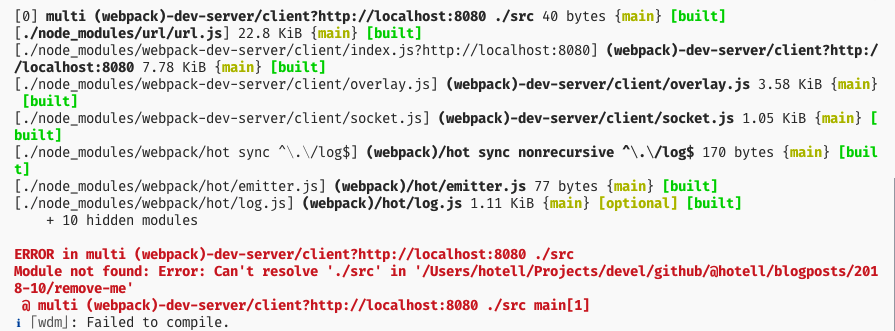

### Fixing our webpack config

So what's the standard workflow to fix this error? Well let's call our Senior Webpack specialist. But wait ! he wrote that config, if he cannot get it right, who can ? 😳

TypeScript can !

What ?!

TypeScript is superb in terms of both vanilla JS and TS files type checking and because our app is just vanilla JS, we would like to leverage former behavior.

To enable type checking within JavaScript we need to add `//@ts-check` pragma in our file.

Let's do that now:

**webpack.config.js**

```js
// @ts-check
```

We will get red squiggles within our editor on our `module.export` line... whops it need's to be `module.exports`! Let's fix it.

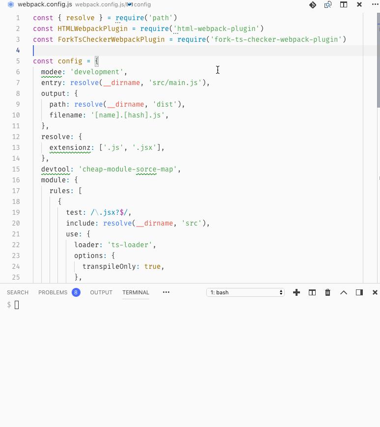

Now our webpack is still failing...

Let's fix it for good shall we ?

First we need to install missing package types for packages that are not shipped with TS definitions:

```sh
yarn add -D @types/{html-webpack-plugin,node,webpack,webpack-dev-server}
```

And the last very important step is to explicitly annotate our config object via JSDoc which uses TypeScript `import()` syntax for importing type definitions:

```js
/**
 * @type {import('webpack').Configuration}
 */
const config = {
  /*...*/
}
```

And with that we can immediately see what's wrong with our config! typos! grr 🤬🤬🤬

- let's fix those and try to run our app again

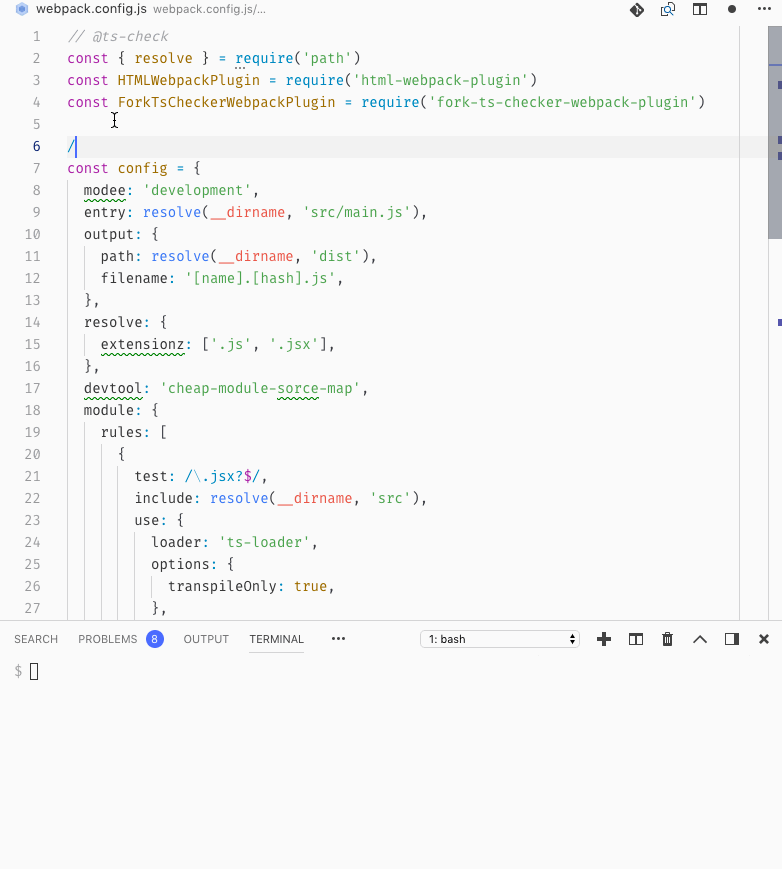

- compilation succeeded ! yay!

### Fixing our initial app runtime errors

Let's check it out within our browser:

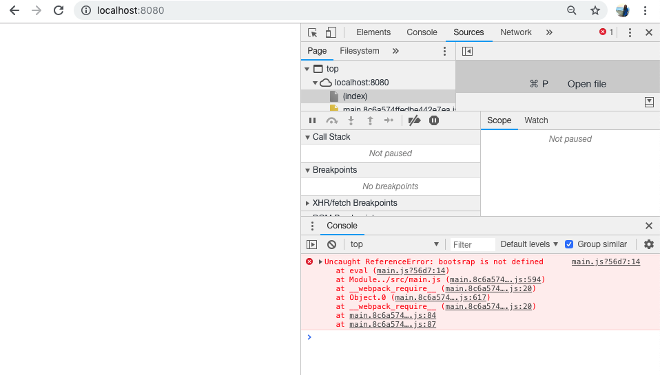

Whaaaat ? 😖 errors again ?

To get proper type checking within our components and js files we need to annotate those with `// @ts-check` as we did within our `webpack.config.js`

And with that we can immediately see all the errors! Typos again...

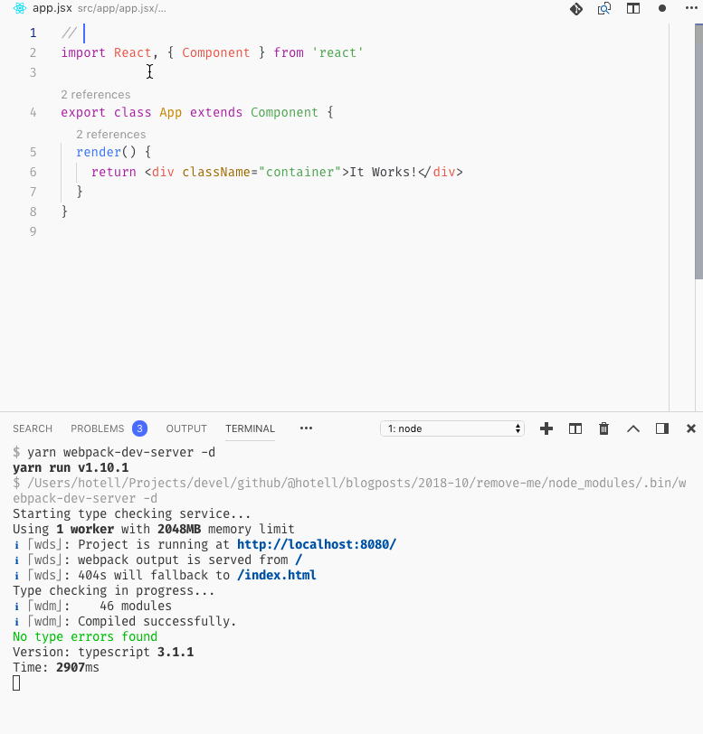

> We can already see benefits of having a type system within our app even without knowing about it !

With that covered let's build our React Todo App

## Building Todo App

> This is how it's gonna look like:

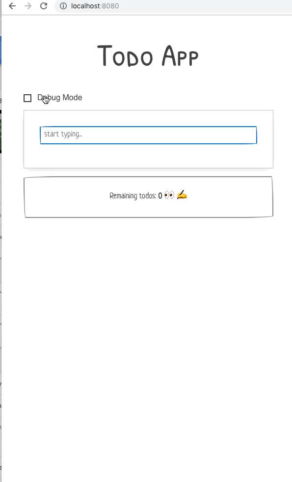

So as we see we gonna build following components in traditional React one way data flow architecture:

- App
- CreateTodo
- TodoItem
- DebugMode and Debug

### CreateTodo

Let's build CreateTodo component which is gonna be responsible for gathering Todo description:

We'll start with traditional React Component boilerplate and also we'll add `// @ts-check` pragma. What we'll get are compiler errors again...

```js
import React, { Component } from 'react'

const initialState = Object.freeze({
  description: '',
})

export class CreateTodo extends Component {
  state = initialState

  handleSubmit = (ev) => {}

  handleChange = (ev) => {}

  render() {
    const { description } = this.state

    return (
      <form onSubmit={this.handleSubmit} className="paper">
        <div className="form-group">
          <input
            type="text"
            className="input-block"
            placeholder="start typing..."
            value={description}
            onChange={this.handleChange}
          />
        </div>
      </form>
    )
  }
}
```

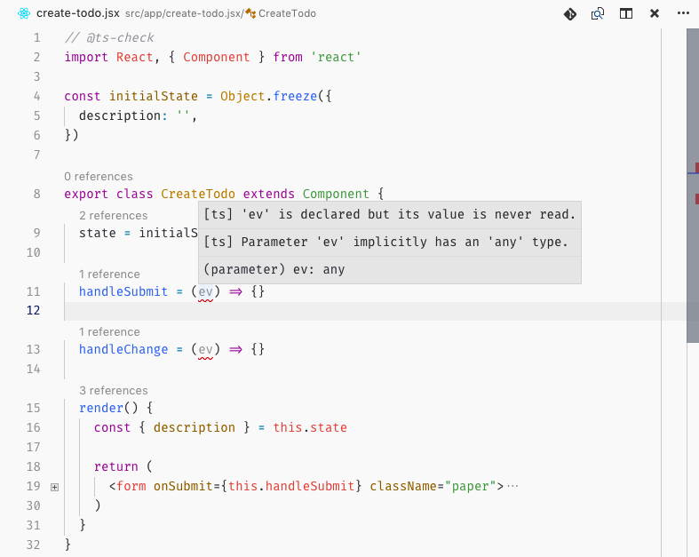

Why do we see those errors ? Well TypeScript doesn't know what type `ev` argument should be and because we are in strict mode, inferred `any` is a no go ( which is good !). Let's add some JSDoc to our two property functions.

```js
export class CreateTodo extends Component {
  /**
   * @param {import('react').FormEvent} ev
   */
  handleSubmit = (ev) => {}
  /**
   * @param {import('react').ChangeEvent<HTMLInputElement>} ev
   */
  handleChange = (ev) => {}
}
```

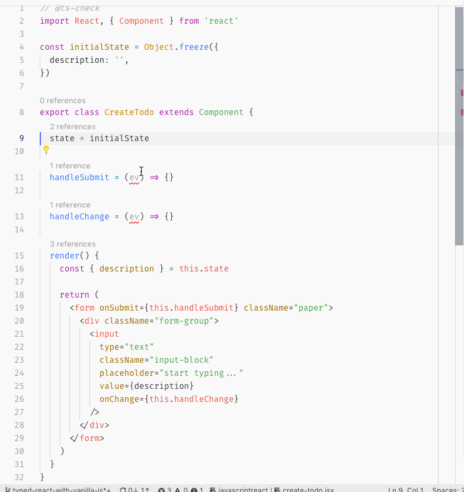

With that we get properly typed `ev` argument in both property functions handlers. All that was needed was to use standard JSDoc annotation and React types. Nice !

Now let's update our state on input change...

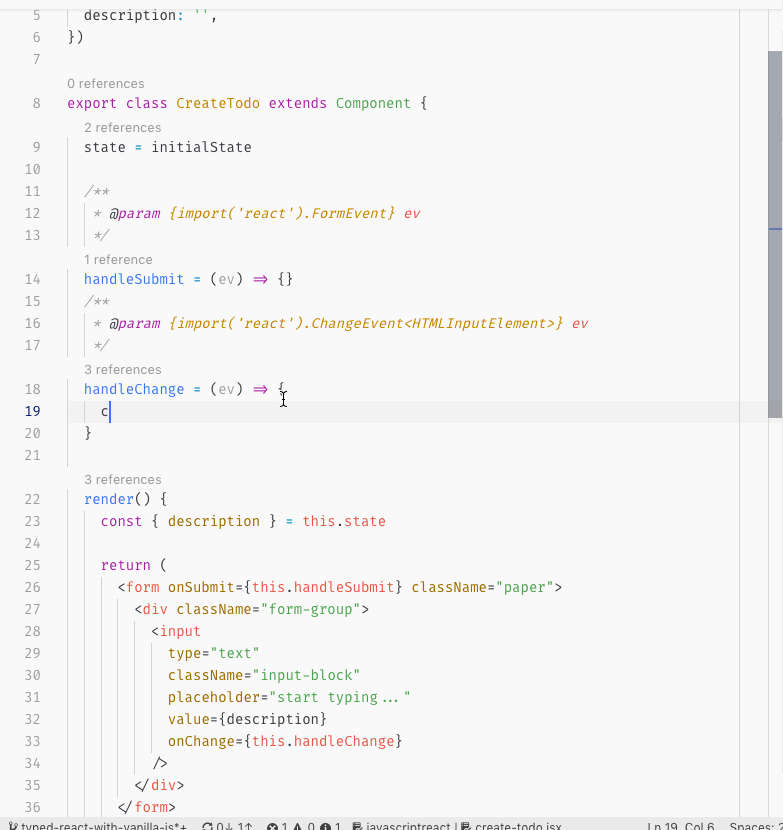

Hmm we got no intellisense nor any errors 😢. Why? Well `Component` is a Generic class which has 2 optional positional generic types -> `Props` and `State` -> `Component<Props,State>`. We need to create type alias for props and state and annotate our class again via standard JSDoc:

```js
/**
 * @typedef {object} Props
 */

/**
 * @typedef {typeof initialState} State
 */

const initialState = Object.freeze({
  description: '',
})

/**
 * @extends {Component<Props, State>}
 */
export class CreateTodo extends Component {
  state = initialState
}
```

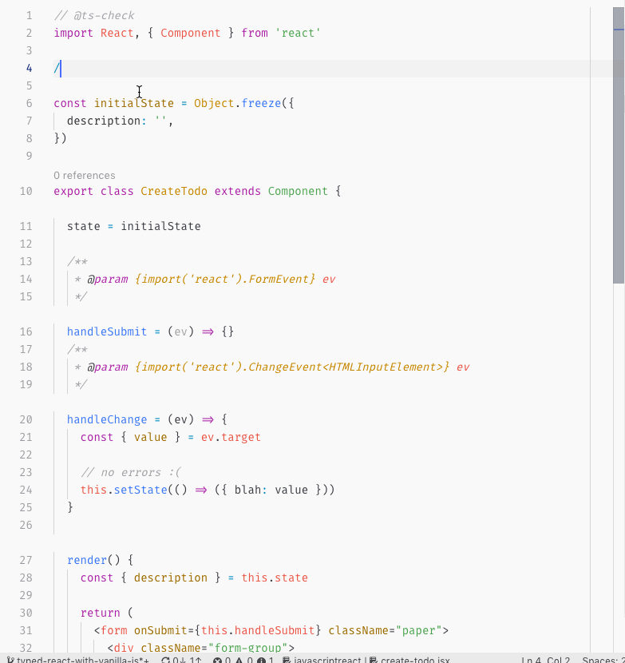

**Wow that was easy and our DX was extensively improved in comparison with "just vanilla JS" right?**

Now let's explain briefly all new code that we've just introduced:

```js
// 1. We just used standard JSDoc to create a type alias with name Props, which has type 'object' ( this is standard type withing TypeScript / you can also use old JSDoc Object type)
/**
 * @typedef {object} Props
 */
```

```js
// 2. Here we're leveraging powerful TypeScript inference, by using runtime information to create compile time type, so there is only one source of truth! IMPLEMENTATION 👌.
// So we create State type alias which will get inferred to type `{ readonly description: string }` 👉 Readonly ? That's because we made  initialState immutable via `Object.freeze` and because TS is smart, it inferred it correctly.

/**
 * @typedef {typeof initialState} State
 */

const initialState = Object.freeze({
  description: '',
})
```

```js
import React, { Component } from 'react'

// 3. Because we cannot use explicit Generic type annotations within vanilla JS, we have to use JSDoc @extends pragma which can consume TypeScript type, even generic.
// Also note that classes are types within TS so they can be used for annotations.
// With this our CreateTodo component has now strictly typed this.state, this.setState and this.props thanks to TypeScript. No more typos and runtime errors 💎
/**
 * @extends {Component<Props, State>}
 */
export class CreateTodo extends Component {
  // 4. NOTE: that we are setting state via class property not within constructor.
  // 🙇‍ PRO TIP: you should never use constructor when defining React Component via class, as it introduces unnecessary boilerplate and any logic that you may introduce within it should be extracted to pure function which can be then leveraged to setup particular class property again, via class property 👍
  state = initialState
}
```

Now let's implement our change and submit handlers within our class:

```js
/**
 * @extends {Component<Props, State>}
 */
export class CreateTodo extends Component {
  /**
   * @param {import('react').FormEvent} ev
   */
  handleSubmit = (ev) => {
    // prevent standard page refresh on submit
    ev.preventDefault()
    // $ExpectType string
    const { description } = this.state

    // @TODO emit description up

    // we are setting state back to initial
    this.setState(() => initialState)
  }

  /**
   * @param {import('react').ChangeEvent<HTMLInputElement>} ev
   */
  handleChange = (ev) => {
    //
    // $ExpectType string
    const { value } = ev.target

    // update internal state  as we type
    this.setState(() => ({ description: value }))
  }
}
```

With that implemented, we're missing one final piece of our CreateTodo Component.

We need to define Public API 👉 in React Public API === Component Props.

#### CreateTodo Public API via props

Vanilla React uses `PropTypes` for "typing" props on component which are validated during runtime. This is indeed better than nothing approach but it introduces runtime overhead which we don't want. Thanks to TypeScript we can define Props within our JSDoc and with that we will get compile time validation and top notch DX when using our component. All we need is just to update our `Props` typedef to following:

```js
// 1. we are defining object ( props is always an object ), which consist of one property 👉 a callback function which has type of function that has one argument of type string and returns nothing, that's why we use `void` as return type
/**
 * @typedef {{onCreate: (description:string)=>void}} Props
 */
```

Now we can finish implementation of `handleSubmit`:

```js
export class CreateTodo extends Component {
  /**
   * @param {import('react').FormEvent} ev
   */
  handleSubmit = (ev) => {
    ev.preventDefault()
    const { description } = this.state

    // call onCreate callback on props
    // Also note that if we used non valid type argument, we would get compile errors ! 💪
    this.props.onCreate(description)

    this.setState(() => initialState)
  }
}
```

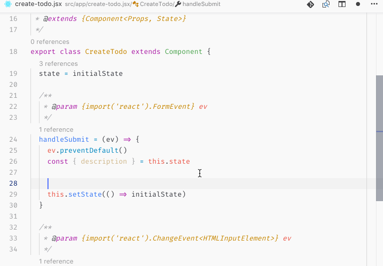

Congratulations ! We just implemented 100% type safe React Component (yup also whole JSX is type-safe, try to do a typo in it and TS will yell at you immediately 🐿 ) with vanilla JS with TS type checking in the background

Let's use our CreateTodo within root `App` component and behold that beautiful tooling ( auto imports ) and API intellisense with proper type inference. Life's good I'm telling ya 🤩...

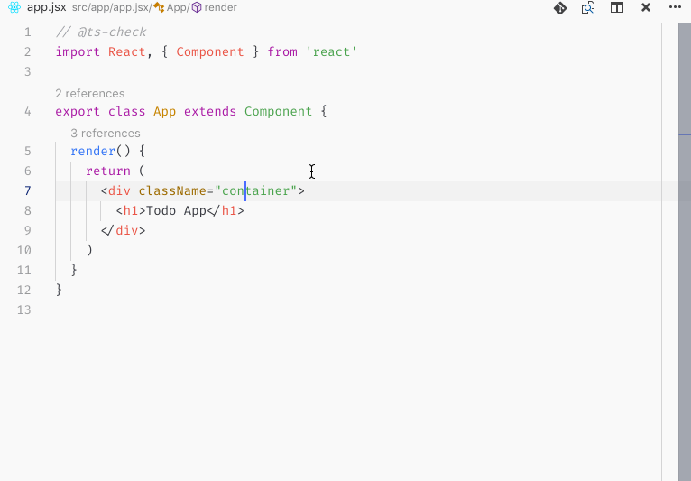

### Defining Todo Model

Before continuing with our App development, we're missing a very important part. Defining our Todo Model.

Let's create `touch src/app/models.js` file with `//@ts-check` pragma on top. Now do you remember that classes are also types within TS type checker? Let's leverage that information:

**app/models.js**

```js
// @ts-check

export class Todo {
  /**
   * @param {string} description
   */
  constructor(description) {
    this.id = String(Date.now())
    this.done = false
    this.description = description
  }
}
```


With that if we create new instance of our Todo it's gonna be object of type `{id:string, done: boolean, description: string}`, and because it's an type as well we can reference it within JSDoc annotation, which we'll do right now within our TodoItem component implementation.

### TodoItem

We already know all parts needed to define strictly typed React component within vanilla JS, so this is how it looks like:

**src/app/todo-item.jsx**

```js
// @ts-check

import React, { Component } from 'react'

/**
 * @typedef {{
 *  model: import('./models').Todo
 *  onCompleteChange: (id:string)=>void
 *  onRemove: (id:string)=>void
 * }} Props
 */

/**
 * @extends {Component<Props>}
 */
export class TodoItem extends Component {
  /**
   * @param {import('react').ChangeEvent<HTMLInputElement>}  ev
   */
  handleCheckedChange = (ev) => {
    this.props.onCompleteChange(this.props.model.id)
  }

  /**
   * @param {import('react').MouseEvent<HTMLElement>}  ev
   */
  handleRemoveClick = (ev) => {
    this.props.onRemove(this.props.model.id)
  }

  render() {
    const { model } = this.props

    return (
      <div className="row flex-edges form-group">
        <label htmlFor={model.id} className="paper-check col col-8">
          <input
            type="checkbox"
            name={model.id}
            id={model.id}
            checked={model.done}
            onChange={this.handleCheckedChange}
          />
          <span>{model.description}</span>
        </label>
        <button
          className="btn-small col col-4"
          onClick={this.handleRemoveClick}
        >
          X
        </button>
      </div>
    )
  }
}
```

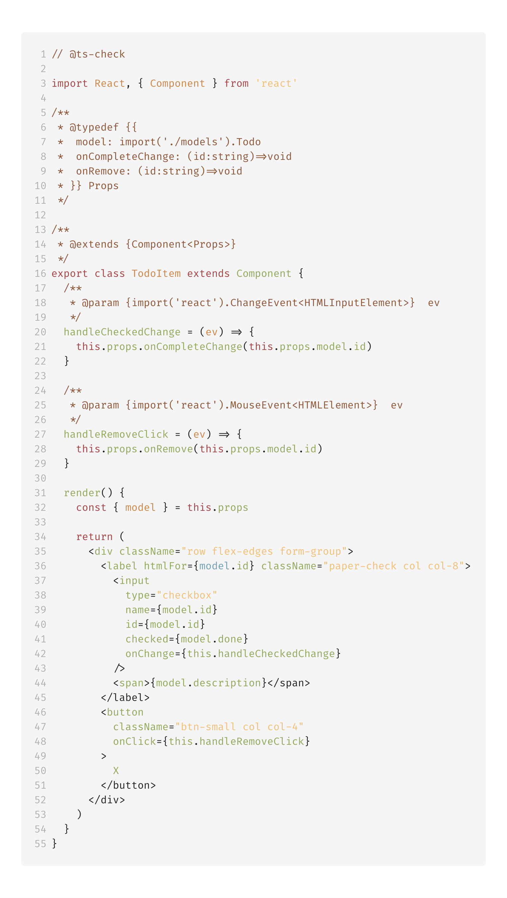

This time we don't need any state, so obviously, we don't have to define a type for it.

Only type we got is more complex "Public API" `Props` definition, where we're leveraging our `Todo` model **class as a type**:

```js
model: import('./models').Todo
```

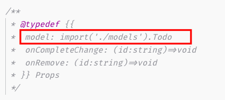

We won't use our `TodoItem` yet. First we need to define our app model ( state ) and various handlers within our root App component.

### App

Firs off let's define our App Props and State ( with our initialState pattern ) types :

```js
// @ts-check

/**
 * @typedef {object} Props
 */

/**
 * @typedef {typeof initialState} State
 */

const initialState = {
  todos: /** @type {null | Todo[]} */ (null),
}
```

Hmm that's new ! kinda ...

What's this line doing ? 👉 `todos: /** @type {null | Todo[]} */ (null)`

Well, we wanna have our initial `todos` blank. That's why we're setting it to `null`. In order to infer proper `null | Todo[]` type union via `typeof` operator within `@typedef {typeof initialState} State` we need to cast it to our demanded type union. Simple as that.

Now we can apply our types on `Component` generic parameters

```js
/**
 * @extends {Component<Props,State>}
 */
export class App extends Component {
  state = initialState
}
```

With that set, let's define our logic for CRUD-ing over our todos App state.

We need to implement following functions:

> NOTE: I'm using TypeScript annotations here, but in our code we're gonna use ofc standard JSDoc 👉 vanilla JS right 👌

- `handleTodoCreate = (description: string) => void`
- `handleTodoCompleteChange = (id: string) => void`
- `handleTodoRemoval = (id) => void`
- `readonly todosLeftCount: number`

And the implementation looks like this:

**app/app.jsx**

```js
import { Todo } from './models'

/**
 * @extends {Component<Props,State>}
 */
export class App extends Component {
  get todosLeftCount() {
    const { todos } = this.state
    return todos.filter((todo) => !todo.done).length
  }

  /**
   * @param {string} description
   */
  handleTodoCreate = (description) => {
    const newTodo = new Todo(description)

    const newTodos = [...this.state.todos, newTodo]
    this.setState(() => ({
      todos: newTodos,
    }))
  }

  /**
   * @param {string} id
   */
  handleTodoCompleteChange = (id) => {
    const newTodos = this.state.todos.map((todo) => {
      return todo.id !== id ? todo : { ...todo, done: !todo.done }
    })

    this.setState(() => ({
      todos: newTodos,
    }))
  }

  /**
   * @param {string} id
   */
  handleTodoRemoval = (id) => {
    const newTodos = this.state.todos.filter((todo) => todo.id !== id)

    this.setState(() => ({
      todos: newTodos,
    }))
  }

  render() {
    const { todos } = this.state

    return (
      <main className="container">
        <h1 className="text-center">Todo App</h1>
        <CreateTodo onCreate={this.handleCreate} />
        {/* @TODO: Implement TodoItem list rendering */}
      </main>
    )
  }
}
```

Unfortunately what we get are compile errors ! 😳 What the...

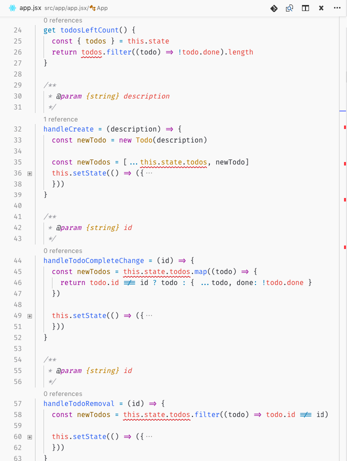

What's the error all about ?

```sh
[ts] Object is possibly 'null'.
```

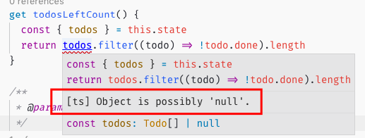

Now again, TypeScript is telling us we got some issues within our code, which would end up with runtime errors, if we would run our app ! To fix introduced errors, all we need to do, is to provide some standard defensive programing patterns ( in our case checking if `todos` is not `null` ).

Let's fix that:

```js
export class App extends Component {
  get todosLeftCount() {
    const { todos } = this.state
    return todos ? todos.filter((todo) => !todo.done).length : 0
  }
}
```

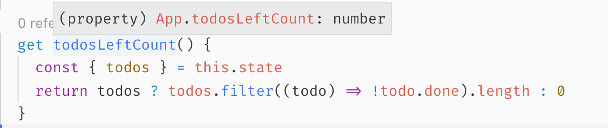

> **NOTE:**
> We don't have to provide any special JSDoc annotation to our getter.
> TypeScript infers the return value automatically to `number` which is type that we want !

And also fix the rest of our method implementation:

```js
export class App extends Component {
  /**
   * @param {string} description
   */
  handleCreate = (description) => {
    const newTodo = new Todo(description)

    const newTodos = [...(this.state.todos || []), newTodo]
    this.setState(() => ({
      todos: newTodos,
    }))
  }

  /**
   * @param {string} id
   */
  handleTodoCompleteChange = (id) => {
    if (!this.state.todos) {
      return
    }

    const newTodos = this.state.todos.map((todo) => {
      return todo.id !== id ? todo : { ...todo, done: !todo.done }
    })

    this.setState(() => ({
      todos: newTodos,
    }))
  }

  /**
   * @param {string} id
   */
  handleTodoRemoval = (id) => {
    if (!this.state.todos) {
      return
    }

    const newTodos = this.state.todos.filter((todo) => todo.id !== id)

    this.setState(() => ({
      todos: newTodos,
    }))
  }
}
```

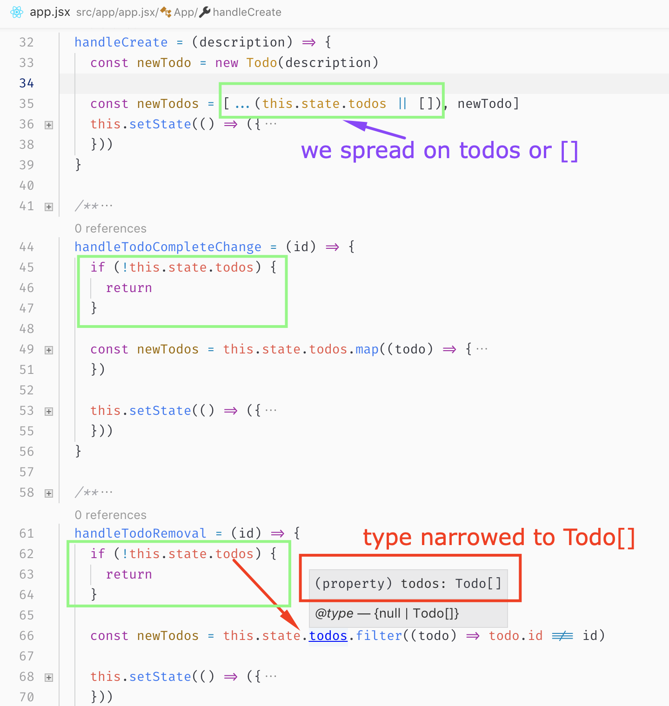

#### App render

Now let's add the final missing piece 👉 Rendering our TodoItem list and please sit and relax while enjoying how TypeScript helps us to write runtime safe code within our vanilla JS with top notch #DX ( OMG how many times did I say top notch DX and TypeScript ? 😂 sorry about that but you know... )

```js
// @ts-check
import React, { Component } from 'react'

import { CreateTodo } from './create-todo'
import { Todo } from './models'
import { TodoItem } from './todo-item'

export class App extends Component {
  render() {
    const { todos } = this.state

    return (
      <main className="container">
        <h1 className="text-center">Todo App</h1>
        <CreateTodo onCreate={this.handleTodoCreate} />
        {todos && todos.length
          ? todos.map((todo) => (
              <TodoItem
                key={todo.id}
                model={todo}
                onCompleteChange={this.handleTodoCompleteChange}
                onRemove={this.handleTodoRemoval}
              />
            ))
          : null}
        <p className="border border-muted padding-large text-center">
          Remaining todos: <b>{this.todosLeftCount}</b> 👀 ✍️
        </p>
      </main>
    )
  }
}
```

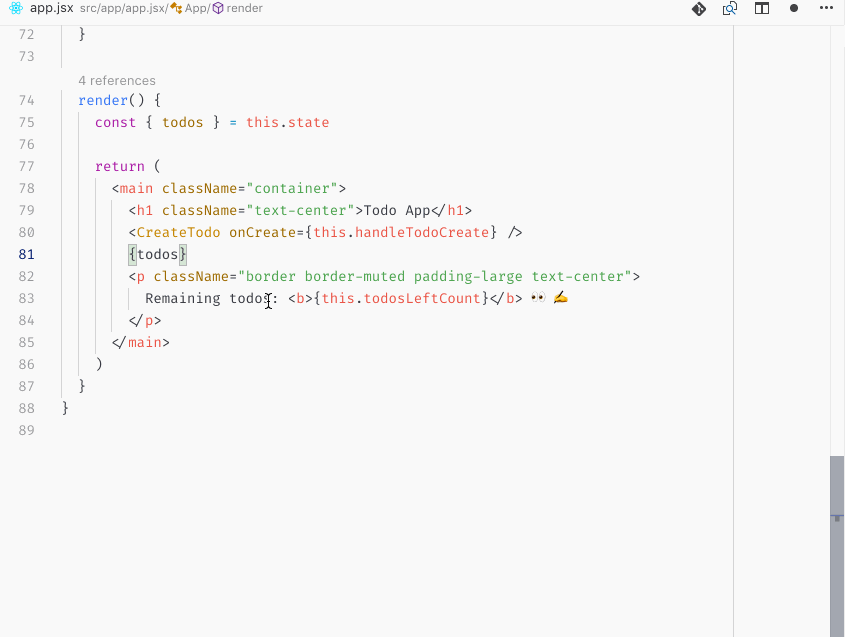

And we are done! Our core Todo App functionality is ready to be shipped and we can be sure it will work, because it's sound/type-safe and without run-time errors! YAY 💙

> **NOTE:**
> I'm not saying you don't have to write tests for your app! I'll leave it as an exercise for the reader 😎

Now what about that DebugMode component that we saw in our Todo App showcase.

### DebugMode and Debug

#### Debug

Let's implement Debug function, this time as a Function ( because react components can be implemented as a pure function if we don't need to handle internal state or life cycle hooks).

So how are we gonna do that ? Well again `// @ts-check` and `JSDoc` annotations ✍️

**src/debug/debug.jsx**

```js
// @ts-check
import React from 'react'

import './debug.css'

/**
 * @param {{children: ({[key:string]:unknown} | number | string | boolean)}} props
 */
export const Debug = (props) => (
  <pre className="debug">{JSON.stringify(props.children, null, 2)}</pre>
)
```

What's interesting indeed is our type constraint on `children` prop. With this code TS would throw compile errors if we'd forget to provide children or passed children as `null` or `undefined`.

Demo 🎥 🍿:

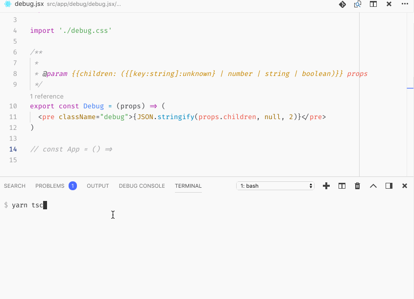

#### DebugMode

Code for DebugMode component is pretty straightforward, with all patterns that we learned in this article. So here is the whole implementation:

```js
// @ts-check
import React, { Component } from 'react'
import { Debug } from './debug'

/**
 * @typedef {typeof initialState} State
 */

/**
 * @typedef {{children: ({[key:string]:unknown} | number | string | boolean)}} Props
 */

const initialState = Object.freeze({
  on: false,
})

/**
 * @extends {Component<Props,State>}
 */
export class DebugMode extends Component {
  state = initialState

  toggleDebugMode = () => {
    this.setState((prevState) => ({ on: !prevState.on }))
  }

  render() {
    const { on } = this.state
    const { children } = this.props

    return (
      <section>
        <div className="form-group">
          <label htmlFor="debug-mode" className="paper-check">
            <input
              type="checkbox"
              id="debug-mode"
              checked={on}
              onChange={this.toggleDebugMode}
            />
            <span>Debug Mode</span>
          </label>
        </div>
        {on ? <Debug>{children}</Debug> : null}
      </section>
    )
  }
}
```

Now we can import it to our `App` and use it for debugging our state !

```js
<DebugMode>{this.state}</DebugMode>
```

That's it! We're done.

🎉🎉🎉🎉🎉🎉🎉🎉🎉🎉🎉🎉🎉

Now if you're curious how to leverage even more TS features within our app, continue reading.

## Advanced Techniques

### Defining complex types and mapped types within our codebase

Curious reader might noticed that we have some duplicity in our debug components. We're defining props twice with same type in both Debug and DebugMode component. Let's **DRY** this up yo!

We have 2 approaches how to refactor our type annotations:

1. extract Debug `@param` inline type to `Props` type and then reference it within DebugMode

```js
// =========
// debug.jsx
// =========

// 1. extract props to separate type
/**
 * @typedef {{children: ({[key:string]:unknown} | number | string | boolean)}} Props
 */

// 2. use it to annotate Debug argument
/**
 * @param {Props} props
 */
export const Debug = (props) => (...)

// ==============
// debug-mode.jsx
// ==============

// 3. use Props from debug
/**
 * @typedef {import('./debug').Props} Props
 */
```

2. write custom mapped type and use it to get argument type from `Debug` function implementation

Complex meta types and helpers cannot be represented via JSDoc. In these cases we can introduce som ambient type declaration within our codebase. Let's do that now:

**src/types.d.ts**

```ts
// TL;DR: this mapped type will extract argument type from function implementation
//
// NOTE: this is more advanced meta-programing in action ! There are various articles about conditional types on the internet so please google it 😎
export type ExtractFnArguments<T> = T extends (args: infer A) => any ? A : never
```

Now we can import from this file as we did from React typing ( Remember those `import('react').FormEvent` ?)

```js
// =========
// debug.jsx
// =========

// 1. our inline annotation for props params
/**
 * @param {{children: ({[key:string]:unknown} | number | string | boolean)}} props
 */
export const Debug = (props) => (...)

// ==============
// debug-mode.jsx
// ==============

import { Debug } from './debug'


// 2. get props type by leveraging ExtractFnArguments from our types.d.ts file
/**
 * @typedef {import('../types').ExtractFnArguments<typeof Debug>} Props
 */
```

And that's it !

Let's cover now a different method for defining/creating our model ( for those afraid of/hating es2015 classes )

### Defining Todo Model via Factory

We created our `Todo` model via class, which TypeScript understands for type definition as well. Let's use more traditional approach as we are in vanilla JS shall we ?

Introducing Object creation via Factory pattern:

**src/model.js:**

```js
// @ts-check

/**
 * @param {string} description
 */
export const Todo = (description) => ({
  id: String(Date.now()),
  description,
  done: false,
})
```


That's much terse than class right ? It has one issue though, we cannot use our
`@type {import('./models').Todo}` for annotating our code with Todo model.

> Have no fear a simple solution is here !

TypesScript supports [declaration merging](http://www.typescriptlang.org/docs/handbook/declaration-merging.html) for various use cases. We can leverage that within our vanilla JS as well.

All we need to do is define `Todo` type which is gonna get return type of our `Todo` factory function:

```js
// [ReturnType](https://www.typescriptlang.org/docs/handbook/release-notes/typescript-2-8.html) is mapped type included in standard TS library that ships with TS
//
// because Todo is a function we need to obtain it's type via `typeof` operator
/**
 * @typedef {ReturnType<typeof Todo>} Todo
 */

/**
 * @param {string} description
 */
export const Todo = (description) => (...)
```

Now `@type {import('./models').Todo}` will work again because by importing `Todo` we import both function factory and type which TypeScript compiler understands! **POWER OVERWHELMING...**

One last thing we need to do is to update our implementation of `handleTodoCreate`

```js
import { Todo } from './models'

const initialState = {
  // 1. Todo consumed as a type
  todos: /** @type {null | Todo[]} */ (null),
}

export class App extends Component {
  handleTodoCreate = (description) => {
    // 1. Todo consumed as function
    // $ExpectType Todo
    const newTodo = Todo(description)
  }
}
```

## Summary

---

As always, don't hesitate to ping me if you have any questions here or on Twitter (my handle [@martin_hotell](https://twitter.com/martin_hotell)) and besides that, happy type checking folks and 'till next time! Cheers! 🖖 🌊 🏄
