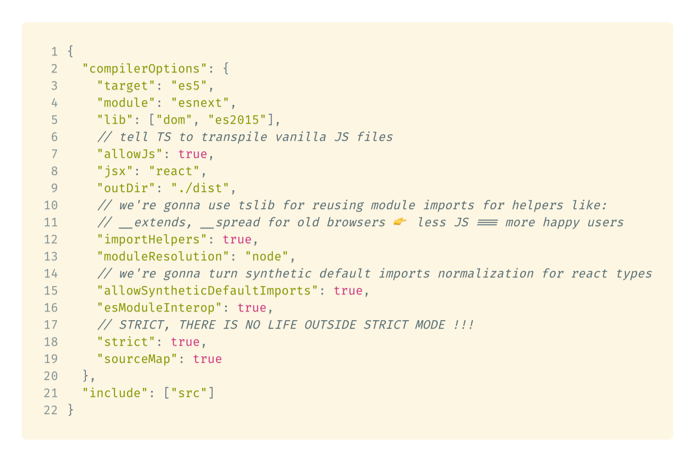
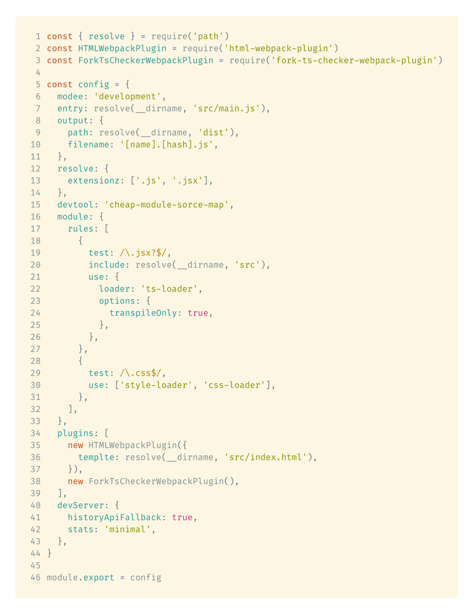
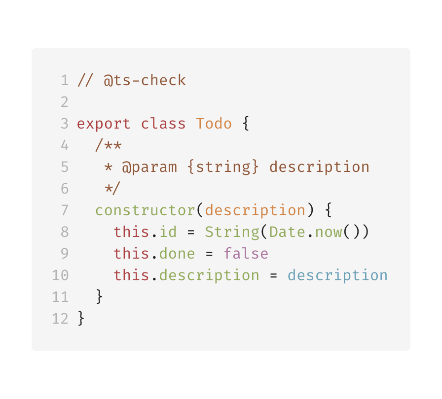
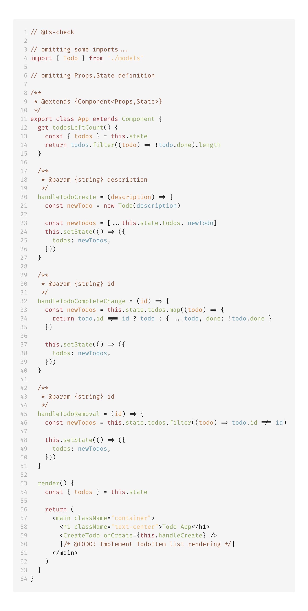
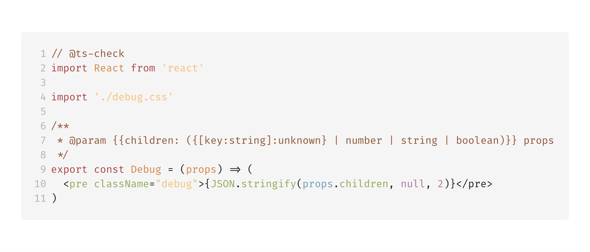
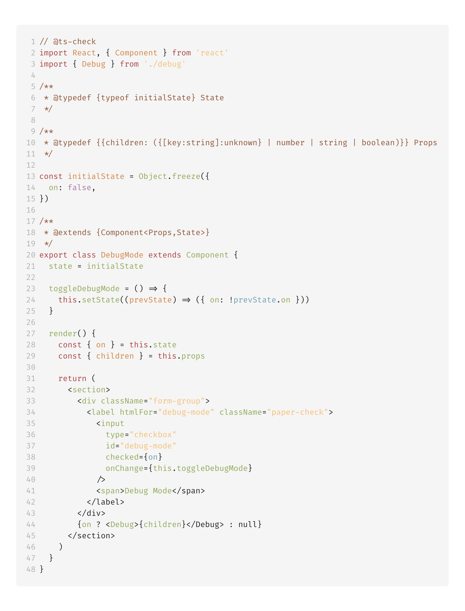
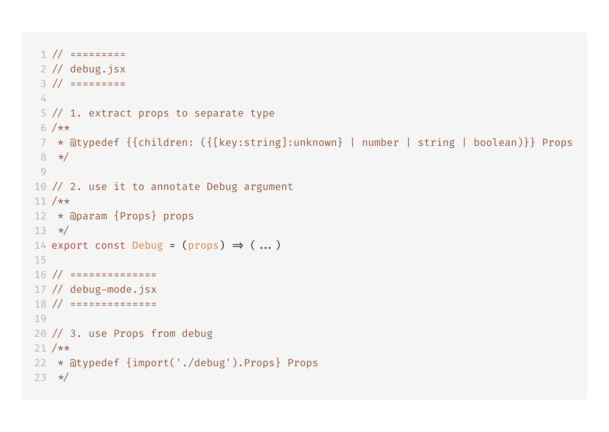
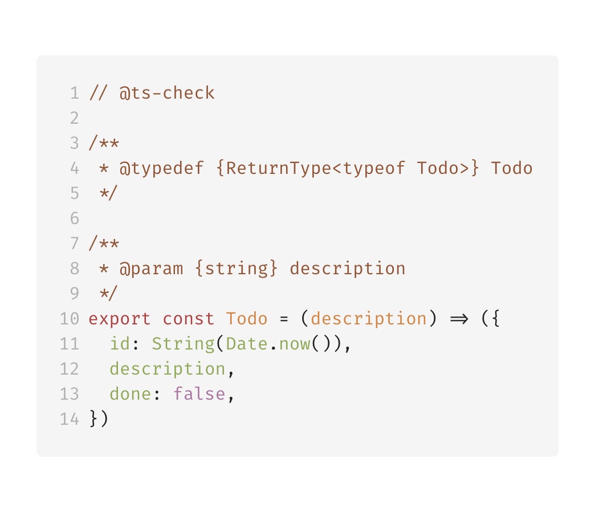
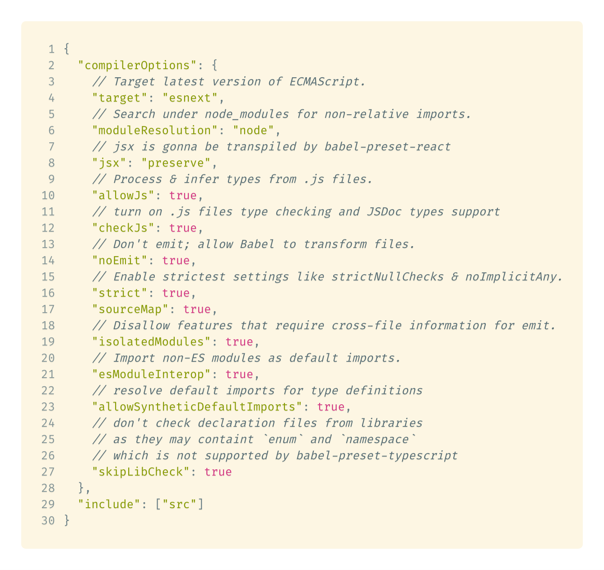
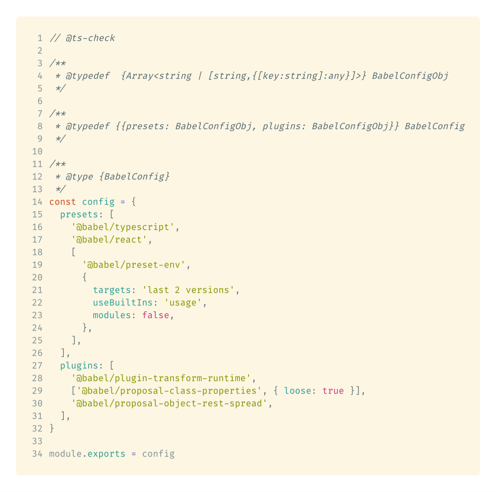

# Build 100% type-safe React apps in vanilla JavaScript

**Or how we can benefit from TypeScript to full extent, without having to write any TS in our codebase, by leveraging standard JSDoc type annotations 👀👌💪**

> 🎒 this article uses following library versions:

```json
{
  "@types/react": "16.4.16",
  "@types/react-dom": "16.0.8",
  "typescript": "3.1.1",
  "react": "16.5.2",
  "react-dom": "16.5.2"
}
```

> 🎮 [source code can be found on my github profile](https://github.com/Hotell/blogposts/tree/master/2018-10/typed-react-app-without-ts)

---

When I talk with fellow developers within various teams at work or JS community in general, about building SPA's and incorporating type system within their code base (like TypeScript 💙), very often I get responses like:

- "WHY DO WE NEED TYPES?" 🤒
- "WE DON'T WANNA LEARN ANOTHER LANGUAGE!" 🤨
- "I DON'T WANNA GET INTO ANOTHER ☕️ ⚰️ CoffeeScript COFFIN!"
- "TYPES ARE FOR JAVA DEVS!" 🤪
- etc...

Ugh 😳...

While many of these questions/statements are valid, in the end I'm quite successful with convincing them to adopts TypeScript with my help, but there are also times that it just ain't gonna happen 🤷‍.

In that case, I'm still able to convince those teams to at least try it in a non-obtrusive way, by showing them, how to write standard vanilla JS with behind the scenes TypeScript help for type checking and much improved DX experience, without almost none additional learning curve.

This article describes what I'm showing those clients, so if you're in similar position, all you need to do is to send them link to this article 🍿. You can thank me later.

So let's build a very familiar React ToDo App with vanilla JS !

## Setting up the environment

Traditionally we're gonna use "the industry standard for module bundling" 👉 Mr.Webpack 🌀🌀🌀.

So let's install our **devDependencies**

```sh
yarn add -D \
webpack{,-cli,-dev-server} \
{css,style,ts}-loader \
{html,fork-ts-checker}-webpack-plugin \
typescript
```

> Now you might be thinking something like: "Hey dude, where is **babel**?"

We don't need babel at all 👀 as TypeScript is both _type checker_ and _transpiler_ so why use 2 tools when we can do both with one, right? 😎😎😎

> **NOTE:**
> You can use [Babel with TypeScript](https://blogs.msdn.microsoft.com/typescript/2018/08/27/typescript-and-babel-7) since babel 7 with **@babel/preset-typescript**,
> but you won't get type checking during build or while building your app as babel only strips away any TS types. With that said TypeScript is preferred way to use for both transpiling and type checking your code, but hey YMMV !

With devDeps installed let's setup our tools:

### TypeScript config

```sh
## this will create tsconfig.json with some default options
yarn tsc --init
```

We need to tweak this config a little bit:

**tsconfig.json**

```json
{
  "compilerOptions": {
    "target": "es5",
    "module": "esnext",
    "lib": ["dom", "es2015"],
    // tell TS to transpile vanilla JS files
    "allowJs": true,
    "jsx": "react",
    "outDir": "./dist",
    // we're gonna use tslib for reusing module imports for helpers like:
    // __extends, __spread for old browsers 👉 less JS === more happy users
    "importHelpers": true,
    "moduleResolution": "node",
    // we're gonna turn synthetic default imports normalization for react types
    "allowSyntheticDefaultImports": true,
    "esModuleInterop": true,
    // STRICT, THERE IS NO LIFE OUTSIDE STRICT MODE !!!
    "strict": true,
    "sourceMap": true
  },
  "include": ["src"]
}
```



### Webpack config

Now let's call for help our internal _Senior Webpack Config Developer_ to setup our module bundler 📞 :

> Standard stuff... setting up entry, output, loaders, plugins, bla bla bla... 😂

**webpack.config.js**

```js
const { resolve } = require('path')
const HTMLWebpackPlugin = require('html-webpack-plugin')
const ForkTsCheckerWebpackPlugin = require('fork-ts-checker-webpack-plugin')

const config = {
  modee: 'development',
  entry: resolve(__dirname, 'src/main.js'),
  output: {
    path: resolve(__dirname, 'dist'),
    filename: '[name].[hash].js',
  },
  resolve: {
    extensionz: ['.js', '.jsx'],
  },
  devtool: 'cheap-module-sorce-map',
  module: {
    rules: [
      {
        test: /\.jsx?$/,
        include: resolve(__dirname, 'src'),
        use: {
          loader: 'ts-loader',
          options: {
            transpileOnly: true,
          },
        },
      },
      {
        test: /\.css$/,
        use: ['style-loader', 'css-loader'],
      },
    ],
  },
  plugins: [
    new HTMLWebpackPlugin({
      templte: resolve(__dirname, 'src/index.html'),
    }),
    new ForkTsCheckerWebpackPlugin(),
  ],
  devServer: {
    historyApiFallback: true,
    stats: 'minimal',
  },
}

module.export = config
```



### Application folder structure

With our environment setup and configured, let's build standard folder structure and add React dependencies:

```sh
mkdir -p src/app && \
touch src/{main.js,index.html,style.css,app/app.jsx}
```

which will get us folder structure like following:

```
|-src/
|    |- app/
|    |     |- app.jsx
|    |- index.html
|    |- main.js
|    |- style.css
```

And at last add React and stuff...

> **PRO TIP:**
> 3r party types (`@types/*`) should be installed as dev dependencies.
> Why ? Well your production code doesn't use them nor runtime as they are striped away 👍

```sh
yarn add react{,-dom} tslib papercss

# as React is not written with TypeScript we need to install external type annotations
yarn add -D @types/react{,-dom}
```

Now our `index.html` is gonna contain some basic boilerplate for booting up a React SPA ( mount point div) and it's gonna be processed by webpack, which will inject our bundle file within it (kudos to `html-webpack-plugin`):

**src/index.html**

```html
<body>
  <div id="app">Loading... 👀</div>
</body>
```

Now let's finally write some JavaScript ! Introducing our root App component:

**src/app/app.jsx**

```js
import React, { Component } from 'react'

export class App extends Component {
  render() {
    return <div className="container">It Works!</div>
  }
}
```

now let's write a tiny bootstrap function to mount our React app to the DOM:

**src/main.js**

```js
import { createElement } from 'react'
import { render } from 'react-dom'

import 'papercss/dist/paper.min.css'
import './style.css'

import { App } from './app/app'

const bootstrap = () => {
  const mountTo = document.getElementByID('app')
  render(createElement(App), mountTo)
}

bootsrap()
```

Alright! Let's see if it works. Execute order 66, bah I meant webpack-dev-server in dev mode:

```sh
yarn webpack-dev-server -d
```

**Boom 💥 😳 😖 we got errors! Oh no!**


### Fixing our webpack config

So what's the standard workflow to fix this error? Well let's call our Senior Webpack specialist. But wait ! he wrote that config, if he cannot get it right, who can ? Maybe Shaun ? He'll be busy for sure ...😳 .. mmm so who again ?

**TypeScript can !**

What ?! Are you kidding ?

TypeScript has superb capabilities in terms of both vanilla JS and TS files type checking and because our app is just vanilla JS, we would like to leverage that former behavior.

**To enable type checking within JavaScript, we need to add `//@ts-check` pragma in our js file.**

Let's do that now:

**webpack.config.js**

```js
// @ts-check
```

We'll get immediate feedback that something's not ok, supported by red squiggles within our editor on our `module.export` line... whops it need's to be `module.exports` Martin, common it's common ... JS ! Let's fix it.


Now our webpack is still failing...

We don't have time for this, let's fix it for good, shall we ?

First we need to install 3rd party type definitions for packages that are not shipped with those (or aren't written in TS):

```sh
yarn add -D @types/{node,html-webpack-plugin,webpack,webpack-dev-server}
```

Now let's annotate our webpack config constant via standard JSDoc which will leverage [TypeScript `import()`](https://www.typescriptlang.org/docs/handbook/release-notes/typescript-2-9.html#import-types) for importing particular type declaration from any file or library:

```js
/**
 * @type {import('webpack').Configuration}
 */
const config = {
  /*...*/
}
```

and with that, we'll immediately see what's wrong with our config! TYPOS! GRR 🤬🤬🤬

Let's fix those and try to run our app again


Compilation succeeded ! YAY!

### Fixing our initial app runtime errors

Let's check it out within our browser:


Whaaaat? 😖 errors again?

To get proper type checking within our components and js files in general, we need to annotate those with `// @ts-check` as we did within our `webpack.config.js`

And with that we can immediately see all the errors! Typos again...


> We can already see benefits of having a type system within our app even without knowing about it !

With that covered let's build our React Todo App

## Building Todo App

> This is how it's gonna look like:


As we see, we're gonna build following component tree in traditional React one way data flow architecture:

```
|- <App/>
| |- <CreateTodo/>
| |- <TodoItem/>
| |- <DebugMode/>
| | |- <Debug/>
```

### CreateTodo

Let's build `CreateTodo` component, which is gonna be responsible for gathering Todo Item text content:

We'll start with traditional React Component boilerplate and also we'll add `// @ts-check` pragma. What we'll get are compiler errors again...

```js
// @ts-check
import React, { Component } from 'react'

const initialState = Object.freeze({
  description: '',
})

export class CreateTodo extends Component {
  state = initialState

  handleSubmit = (ev) => {}

  handleChange = (ev) => {}

  render() {
    const { description } = this.state

    return (
      <form onSubmit={this.handleSubmit} className="paper">
        <div className="form-group">
          <input
            type="text"
            className="input-block"
            placeholder="start typing..."
            value={description}
            onChange={this.handleChange}
          />
        </div>
      </form>
    )
  }
}
```


Why do we get those errors?

Well, TypeScript doesn't know what's the type of `ev` argument. TS infers the type to `any` in this case, which leads to an compile error in strict mode (not using strict mode is like cheating on your girlfriend, you don't wanna do that right?).

Let's add some **standard JSDoc function param annotations** to our two functions to make TS compiler happy:

```js
export class CreateTodo extends Component {
  /**
   * @param {import('react').FormEvent} ev
   */
  handleSubmit = (ev) => {}
  /**
   * @param {import('react').ChangeEvent<HTMLInputElement>} ev
   */
  handleChange = (ev) => {}
}
```


With that additions, we got rid of the type errors! All that was needed was to Leverage existing standard JSDoc annotations and React types to make our code type-safe. I like this!

Now let's update our state on input change...


Hmm we got no intellisense, nor any errors 😢...
Why? Well `Component` is a **generic class** (which has 2 optional positional generic argument types -> `Props` and `State` -> `Component<Props,State>`). We need to create type alias for `Props` and `State` and annotate our class again via standard JSDoc:

```js
/**
 * @typedef {object} Props
 */

/**
 * @typedef {typeof initialState} State
 */

const initialState = Object.freeze({
  description: '',
})

/**
 * @extends {Component<Props, State>}
 */
export class CreateTodo extends Component {
  state = initialState
}
```


**Wow that was easy and our DX was extensively improved in comparison with "just vanilla JS" right?**

Now let's explain briefly all the new code, that we've just introduced:

```js
// 1. We just used standard JSDoc to create a type alias with name `Props`, which has type 'object' ( this is standard type within TypeScript / you can also use old JSDoc `Object` type)
/**
 * @typedef {object} Props
 */
```

```js
// 2. Here we're leveraging TypeScript inference, by using runtime information to create compile time type, so there is only one source of truth! THE IMPLEMENTATION 👌.
// With that said, We create `State` type alias which will get inferred to type `{ readonly description: string }`
// 👉 Readonly ?
// That's because we made initialState immutable via `Object.freeze` and because TS is smart, it inferred it correctly.

/**
 * @typedef {typeof initialState} State
 */

const initialState = Object.freeze({
  description: '',
})
```

```js
import React, { Component } from 'react'

// 3. Because we cannot use explicit Generic type annotations within vanilla JS, we have to use JSDoc `@extends` pragma which can consume TypeScript type, even generic.
// Also note, that classes are types within TS so they can be used for annotations.
// With this our CreateTodo component has now strictly typed `this.state`, `this.setState()` and `this.props` thanks to TypeScript. No more typos and runtime errors 💎
/**
 * @extends {Component<Props, State>}
 */
export class CreateTodo extends Component {
  // 4. NOTE: that we are setting state via class property not within a constructor.
  // 🙇‍ PRO TIP:
  // You should never use constructor when defining React Component via class, as it introduces unnecessary boilerplate and any logic that you may introduce within it should be extracted to pure function which can be then leveraged to setup particular class property again, via class property 👍
  state = initialState
}
```

Now let's implement our change and submit handlers within our class:

```js
/**
 * @extends {Component<Props, State>}
 */
export class CreateTodo extends Component {
  /**
   * @param {import('react').FormEvent} ev
   */
  handleSubmit = (ev) => {
    // prevent standard page refresh on submit
    ev.preventDefault()
    // $ExpectType string
    const { description } = this.state

    // @TODO emit description up

    // we are setting state back to initial
    this.setState(() => initialState)
  }

  /**
   * @param {import('react').ChangeEvent<HTMLInputElement>} ev
   */
  handleChange = (ev) => {
    //
    // $ExpectType string
    const { value } = ev.target

    // update internal state  as we type
    this.setState(() => ({ description: value }))
  }
}
```

With that implemented, we're missing one final piece of our CreateTodo Component.

We need to define Public API of our component (👉 in React Public API === Component Props).

#### CreateTodo Public API via props

Vanilla React uses `PropTypes` for "typing" props of a component, which are validated during runtime. This is indeed "better than nothing", but it introduces runtime overhead which we don't want. Thanks to TypeScript, we can define Props within our JSDoc and with that we will get compile time validation and top notch DX when using our component. All we need is just to update our `Props` typedef to following:

```js
// 1. we are defining object (props in React are always an object),
// which consist of one property:
// 👉 a callback function which has type of a function, that has one argument
// of type string and returns nothing. That's why we use `void` as a return type.
/**
 * @typedef {{onCreate: (description:string)=>void}} Props
 */
```

Now we can finish implementation of `handleSubmit`:

```js
export class CreateTodo extends Component {
  /**
   * @param {import('react').FormEvent} ev
   */
  handleSubmit = (ev) => {
    ev.preventDefault()
    const { description } = this.state

    // call onCreate callback on props
    // Also note that if we used non valid type argument, we would get compile errors ! 💪
    this.props.onCreate(description)

    this.setState(() => initialState)
  }
}
```


Congratulations ! 🍻

**We just implemented 100% type safe React Component with vanilla JS with TS type checking in the background.**

> Also whole JSX is type-safe, try to do a typo in it and TS will yell at you immediately 🐿

Let's use our `CreateTodo` within root `App` component and behold that beautiful tooling ( auto imports ) and API intellisense, with proper type inference. Life's good I'm telling ya 🤩...


### Defining Todo Model

Before we continue to build our remaining app components, let's not forget to implement a very important part of our app 👉 Todo Model.

Let's create `models.js` file with `//@ts-check` pragma on top again.

```sh
touch src/app/models.js
```

Now do you remember that classes are also types within TS type checker? Let's leverage that knowledge/TS feature:

**app/models.js**

```js
// @ts-check

export class Todo {
  /**
   * @param {string} description
   */
  constructor(description) {
    this.id = String(Date.now())
    this.done = false
    this.description = description
  }
}
```



With that if we create new instance of our Todo, it's gonna be an object of type `{id:string, done: boolean, description: string}`, and because it's an type as well we can reference it within JSDoc annotation, which we'll exactly do in next step while implementing `TodoItem` component.

### TodoItem

We already know all steps/techniques needed to write strictly typed React component within vanilla JS. So this is how `TodoItem` is gonna look like:

**src/app/todo-item.jsx**

```js
// @ts-check

import React, { Component } from 'react'

/**
 * @typedef {{
 *  model: import('./models').Todo
 *  onCompleteChange: (id:string)=>void
 *  onRemove: (id:string)=>void
 * }} Props
 */

/**
 * @extends {Component<Props>}
 */
export class TodoItem extends Component {
  /**
   * @param {import('react').ChangeEvent<HTMLInputElement>}  ev
   */
  handleCheckedChange = (ev) => {
    this.props.onCompleteChange(this.props.model.id)
  }

  /**
   * @param {import('react').MouseEvent<HTMLElement>}  ev
   */
  handleRemoveClick = (ev) => {
    this.props.onRemove(this.props.model.id)
  }

  render() {
    const { model } = this.props

    return (
      <div className="row flex-edges form-group">
        <label htmlFor={model.id} className="paper-check col col-8">
          <input
            type="checkbox"
            name={model.id}
            id={model.id}
            checked={model.done}
            onChange={this.handleCheckedChange}
          />
          <span>{model.description}</span>
        </label>
        <button
          className="btn-small col col-4"
          onClick={this.handleRemoveClick}
        >
          X
        </button>
      </div>
    )
  }
}
```


This time we don't need any state, so obviously, we don't have to define a type for it.

Only type we got is more complex "Public API" `Props` definition, where we're leveraging our `Todo` model **class as a type**:

```js
model: import('./models').Todo
```


We won't use our `TodoItem` yet. First we need to define our app model ( state ) and various handlers within our root App component.

### App

First off, let's define our App `Props` and `State` (with our initialState pattern) types :

```js
// @ts-check

/**
 * @typedef {object} Props
 */

/**
 * @typedef {typeof initialState} State
 */

const initialState = {
  todos: /** @type {null | Todo[]} */ (null),
}
```

Hmm that's new! Kinda...

What's this line doing ? 👉 `todos: /** @type {null | Todo[]} */ (null)`

Well, we wanna have our initial `todos` blank. That's why we're setting it to `null`. In order to infer proper `null | Todo[]` type union via `typeof` operator within `@typedef {typeof initialState} State` we need to cast it to our demanded type union. Simple as that.

Now we can apply our types on `Component` generic parameters

```js
/**
 * @extends {Component<Props,State>}
 */
export class App extends Component {
  state = initialState
}
```

With that set, let's define our logic for CRUD-ing over our todos App state.

We need to implement following functions:

> **NOTE:**
> I'm using TypeScript annotations in following bullet pointed list, but in our code we're gonna use standard JSDoc 👉 vanilla JS 👌

- `handleTodoCreate = (description: string) => void`
- `handleTodoCompleteChange = (id: string) => void`
- `handleTodoRemoval = (id) => void`
- `readonly todosLeftCount: number`

And the implementation looks like this:

**app/app.jsx**

```js
// @ts-check

// omitting some imports...
import { Todo } from './models'

// omitting Props,State definition

/**
 * @extends {Component<Props,State>}
 */
export class App extends Component {
  get todosLeftCount() {
    const { todos } = this.state
    return todos.filter((todo) => !todo.done).length
  }

  /**
   * @param {string} description
   */
  handleTodoCreate = (description) => {
    const newTodo = new Todo(description)

    const newTodos = [...this.state.todos, newTodo]
    this.setState(() => ({
      todos: newTodos,
    }))
  }

  /**
   * @param {string} id
   */
  handleTodoCompleteChange = (id) => {
    const newTodos = this.state.todos.map((todo) => {
      return todo.id !== id ? todo : { ...todo, done: !todo.done }
    })

    this.setState(() => ({
      todos: newTodos,
    }))
  }

  /**
   * @param {string} id
   */
  handleTodoRemoval = (id) => {
    const newTodos = this.state.todos.filter((todo) => todo.id !== id)

    this.setState(() => ({
      todos: newTodos,
    }))
  }

  render() {
    const { todos } = this.state

    return (
      <main className="container">
        <h1 className="text-center">Todo App</h1>
        <CreateTodo onCreate={this.handleCreate} />
        {/* @TODO: Implement TodoItem list rendering */}
      </main>
    )
  }
}
```



Unfortunately what we get are type errors ! 😳 What the...


What's the error all about ?

```sh
[ts] Object is possibly 'null'.
```


Now again, TypeScript is telling us we got some issues within our code, which would end up with runtime errors, if we would run our app ! To fix introduced errors, all we need to do, is to provide some standard defensive programing patterns (in our case checking if `todos` is not `null`).

Let's fix that:

```js
export class App extends Component {
  get todosLeftCount() {
    const { todos } = this.state
    return todos ? todos.filter((todo) => !todo.done).length : 0
  }
}
```


> **NOTE:**
> We don't have to provide any special JSDoc annotation to our getter.
> TypeScript infers the return value automatically to `number` which is type that we want !

And also fix the rest of our method implementation:

```js
export class App extends Component {
  /**
   * @param {string} description
   */
  handleCreate = (description) => {
    const newTodo = new Todo(description)

    const newTodos = [...(this.state.todos || []), newTodo]
    this.setState(() => ({
      todos: newTodos,
    }))
  }

  /**
   * @param {string} id
   */
  handleTodoCompleteChange = (id) => {
    if (!this.state.todos) {
      return
    }

    const newTodos = this.state.todos.map((todo) => {
      return todo.id !== id ? todo : { ...todo, done: !todo.done }
    })

    this.setState(() => ({
      todos: newTodos,
    }))
  }

  /**
   * @param {string} id
   */
  handleTodoRemoval = (id) => {
    if (!this.state.todos) {
      return
    }

    const newTodos = this.state.todos.filter((todo) => todo.id !== id)

    this.setState(() => ({
      todos: newTodos,
    }))
  }
}
```


#### App render method

Now let's add the final missing piece 👉 rendering our `TodoItem` component as a list and while we do that, please sit and relax while enjoying how TypeScript helps us to write runtime safe code within our vanilla JS with top notch Developer Experience (OMG how many times did I say top notch DX and TypeScript? 😂 sorry about that but you know...)

```js
// @ts-check
import React, { Component } from 'react'

import { CreateTodo } from './create-todo'
import { Todo } from './models'
import { TodoItem } from './todo-item'

export class App extends Component {
  render() {
    const { todos } = this.state

    return (
      <main className="container">
        <h1 className="text-center">Todo App</h1>
        <CreateTodo onCreate={this.handleTodoCreate} />
        {todos && todos.length
          ? todos.map((todo) => (
              <TodoItem
                key={todo.id}
                model={todo}
                onCompleteChange={this.handleTodoCompleteChange}
                onRemove={this.handleTodoRemoval}
              />
            ))
          : null}
        <p className="border border-muted padding-large text-center">
          Remaining todos: <b>{this.todosLeftCount}</b> 👀 ✍️
        </p>
      </main>
    )
  }
}
```


And we are done! Our core Todo App functionality is ready to be shipped and we can be sure it will work, because it's sound/type-safe and without any run-time errors! YAY 💙

> **NOTE:**
>
> I'm not saying you don't have to write tests for your app! I'll leave it as an exercise for the reader 😎

Now, what about that `DebugMode` component, that we saw in our Todo App showcase in the beginning ?

### DebugMode and Debug

#### Debug

Let's implement `Debug` Component, this time as a Function (because React components can be implemented as a pure functions, if we don't need to handle internal state or life cycle hooks).

So how are we gonna do that ? Well again, `// @ts-check` and `JSDoc` annotations ✍️

**src/debug/debug.jsx**

```js
// @ts-check
import React from 'react'

import './debug.css'

/**
 * @param {{children: ({[key:string]:unknown} | number | string | boolean)}} props
 */
export const Debug = (props) => (
  <pre className="debug">{JSON.stringify(props.children, null, 2)}</pre>
)
```



What's interesting indeed, is our type constraint on `children` prop. With this code TS would throw type errors, if we'd forget to provide children or passed children as `null` or `undefined`.

Demo 🎥 🍿:


#### DebugMode

Code for `DebugMode` component is pretty straightforward. We're gonna use all patterns that we've already learned in this article. Here is the whole implementation:

```js
// @ts-check
import React, { Component } from 'react'
import { Debug } from './debug'

/**
 * @typedef {typeof initialState} State
 */

/**
 * @typedef {{children: ({[key:string]:unknown} | number | string | boolean)}} Props
 */

const initialState = Object.freeze({
  on: false,
})

/**
 * @extends {Component<Props,State>}
 */
export class DebugMode extends Component {
  state = initialState

  toggleDebugMode = () => {
    this.setState((prevState) => ({ on: !prevState.on }))
  }

  render() {
    const { on } = this.state
    const { children } = this.props

    return (
      <section>
        <div className="form-group">
          <label htmlFor="debug-mode" className="paper-check">
            <input
              type="checkbox"
              id="debug-mode"
              checked={on}
              onChange={this.toggleDebugMode}
            />
            <span>Debug Mode</span>
          </label>
        </div>
        {on ? <Debug>{children}</Debug> : null}
      </section>
    )
  }
}
```



Now we can import it to our `App` and use it for debugging our state!

```js
<DebugMode>{this.state}</DebugMode>
```

That's it! We're done.

🎉🎉🎉 🎉🎉🎉 🎉🎉🎉 🎉🎉🎉

Now if you're curious how to leverage even more TS features within our app, please continue reading 👀🙇‍...

## Advanced Techniques

### Defining complex types and mapped types within our codebase

Curious reader might noticed, that we've some duplicity within or Debug and DebugMode component. We're defining props twice with same type in both Debug and DebugMode.

Let's **DRY** it up yo!

We have 2 approaches how to refactor our type annotations:

1. extract Debug `@param` inline type to `Props` type and then reference it within DebugMode

```js
// =========
// debug.jsx
// =========

// 1. extract props to separate type
/**
 * @typedef {{children: ({[key:string]:unknown} | number | string | boolean)}} Props
 */

// 2. use it to annotate Debug argument
/**
 * @param {Props} props
 */
export const Debug = (props) => (...)

// ==============
// debug-mode.jsx
// ==============

// 3. use Props from debug
/**
 * @typedef {import('./debug').Props} Props
 */
```



2. write custom mapped type and use it to get argument type from `Debug` function implementation

Complex meta types and helpers cannot be represented via JSDoc. In these cases we can introduce som ambient type declaration within our codebase. Let's do that now:

**src/types.d.ts**

```ts
// TL;DR: this mapped type will extract argument type from function implementation
//
// NOTE: this is more advanced meta-programing in action ! There are various articles about conditional types on the internet so please google it 😎
export type ExtractFnArguments<T> = T extends (args: infer A) => any ? A : never
```

Now we can import from this file as we did from React typing ( Remember those `import('react').FormEvent` ?)

```js
// =========
// debug.jsx
// =========

// 1. our inline annotation for props params
/**
 * @param {{children: ({[key:string]:unknown} | number | string | boolean)}} props
 */
export const Debug = (props) => (...)

// ==============
// debug-mode.jsx
// ==============

import { Debug } from './debug'


// 2. get props type by leveraging ExtractFnArguments from our types.d.ts file
/**
 * @typedef {import('../types').ExtractFnArguments<typeof Debug>} Props
 */
```


And that's it !

We can introduce also different patterns for creating an business model. Let's cover a different method for defining/creating our `TodoModel` ( for those afraid of/hating es2015 classes )

### Defining Todo Model via Factory

We created our `Todo` model via class, which TypeScript understands for type definition as well. Let's use more traditional/more pure JS approach shall we?

Introducing Object creation via Factory pattern:

**src/model.js:**

```js
// @ts-check

/**
 * @param {string} description
 */
export const Todo = (description) => ({
  id: String(Date.now()),
  description,
  done: false,
})
```

That's much terse code than defining a class right? It has one issue though, we cannot use our `@type {import('./models').Todo}` for annotating our code with Todo model.

> Have no fear a simple solution is here !

TypesScript supports [declaration merging](http://www.typescriptlang.org/docs/handbook/declaration-merging.html) for various use cases. We can leverage that within our vanilla JS as well.

All we need to do is define `Todo` type which is gonna get return type of our `Todo` factory function:

```js
// @ts-check

/**
 * @typedef {ReturnType<typeof Todo>} Todo
 */

/**
 * @param {string} description
 */
export const Todo = (description) => (...)
```

> [ReturnType](https://www.typescriptlang.org/docs/handbook/release-notes/typescript-2-8.html) is mapped type included in standard TS library that ships with TS
>
> because Todo is a function we need to obtain it's type via `typeof` operator



Now `@type {import('./models').Todo}` will work again because by importing `Todo` we import both function factory and type which TypeScript compiler understands! **POWER OVERWHELMING...**

One last thing we need to do is to update our implementation of `handleTodoCreate`

```js
import { Todo } from './models'

const initialState = {
  // 1. Todo consumed as a type
  todos: /** @type {null | Todo[]} */ (null),
}

export class App extends Component {
  handleTodoCreate = (description) => {
    // 1. Todo consumed as function
    // $ExpectType Todo
    const newTodo = Todo(description)
  }
}
```

## Summary

In this article, we've showcased powerful features of type checking powered by TypeScript, within our TODO vanilla JS project written in React, which helps us in a non-obtrusive way, to make us sleep better and in the end write more robust code and make our users/costumers happy.

As you can see, there is absolutely no reason to not use a type system, either for a new or an existing JavaScript application. Benefits are immediate as you saw while building this simple app. What's even more powerful, is that you get complete static analysis of your templates without introducing any custom compiler/mechanism like you have with Angular for example.

**Few closing words/bullet points:**

- To enable type checking by default for every .js file, instead of using `// @ts-check` in every file you can turn it on within tsconfig.json via `"checkJs": true,"`. With that you can also opt out if you don't wanna check particular file via `//@ts-nocheck`
- You don't have to use TypeScript for transpiling. If Babel's your thing for whatever reason, stay with it, just add `tsc` to your `build` script and `tsc -w` to your watch script, so you get errors type checking during development or you can use [_ForkTsCheckerWebpackPlugin_](https://github.com/Realytics/fork-ts-checker-webpack-plugin) for type checking from webpack!
- Are you building a library? Using vanilla JS with TS in the background is definitely a big productivity boost for you and your collaborators, although it doesn't fulfil it's full potential. **Why?** You cannot auto-generate **declaration files** via `"declaration":true`, which could be shipped with your production code and be consumed by your library users. Hopefully TypeScript team will add this "feature in the future" to enable generation of declaration files from vanilla JS, which would be definitely a killer feature don't you think? (FYI: it's already partially possible with [dts-gen](https://github.com/Microsoft/dts-gen#readme) tool).

**To see all type checking possibilities within vanilla JS, make sure to [check TypeScript docs](http://www.typescriptlang.org/docs/handbook/type-checking-javascript-files.html)**

### BONUS: Using Babel for transpilation

While using babel, you'll have to tweak `tsconfig` a little bit, like adding `"noEmit": true"` etc. This is the full config:

```json
{
  "compilerOptions": {
    // Target latest version of ECMAScript.
    "target": "esnext",
    // Search under node_modules for non-relative imports.
    "moduleResolution": "node",
    // jsx is gonna be transpiled by babel-preset-react
    "jsx": "preserve",
    // Process & infer types from .js files.
    "allowJs": true,
    // turn on .js files type checking and JSDoc types support
    "checkJs": true,
    // Don't emit; allow Babel to transform files.
    "noEmit": true,
    // Enable strictest settings like strictNullChecks & noImplicitAny.
    "strict": true,
    "sourceMap": true,
    // Disallow features that require cross-file information for emit.
    "isolatedModules": true,
    // Import non-ES modules as default imports.
    "esModuleInterop": true,
    // resolve default imports for type definitions
    "allowSyntheticDefaultImports": true,
    // don't check declaration files from libraries
    // as they may containt `enum` and `namespace`
    // which is not supported by babel-preset-typescript
    "skipLibCheck": true
  },
  "include": ["src"]
}
```



You'll also need to install `@babel/*` plugins and add babel config like following:

```sh
yarn add -D @babel/{cli,core,preset-env,preset-react,preset-typescript,plugin-proposal-class-properties,plugin-proposal-object-rest-spread}

yarn add @babel/{polyfill,runtime}
```

```js
// @ts-check

/**
 * @typedef  {Array<string | [string,{[key:string]:any}]>} BabelConfigObj
 */

/**
 * @typedef {{presets: BabelConfigObj, plugins: BabelConfigObj}} BabelConfig
 */

/**
 * @type {BabelConfig}
 */
const config = {
  presets: [
    '@babel/typescript',
    '@babel/react',
    [
      '@babel/preset-env',
      {
        targets: 'last 2 versions',
        useBuiltIns: 'usage',
        modules: false,
      },
    ],
  ],
  plugins: [
    '@babel/plugin-transform-runtime',
    ['@babel/proposal-class-properties', { loose: true }],
    '@babel/proposal-object-rest-spread',
  ],
}

module.exports = config
```



And last but not least instead of `ts-loader` use `babel-loader` within your webpack.

Cheers !

---

As always, don't hesitate to ping me if you have any questions here or on Twitter (my handle [@martin_hotell](https://twitter.com/martin_hotell)) and besides that, happy type checking folks and 'till next time! Cheers! 🖖 🌊 🏄
