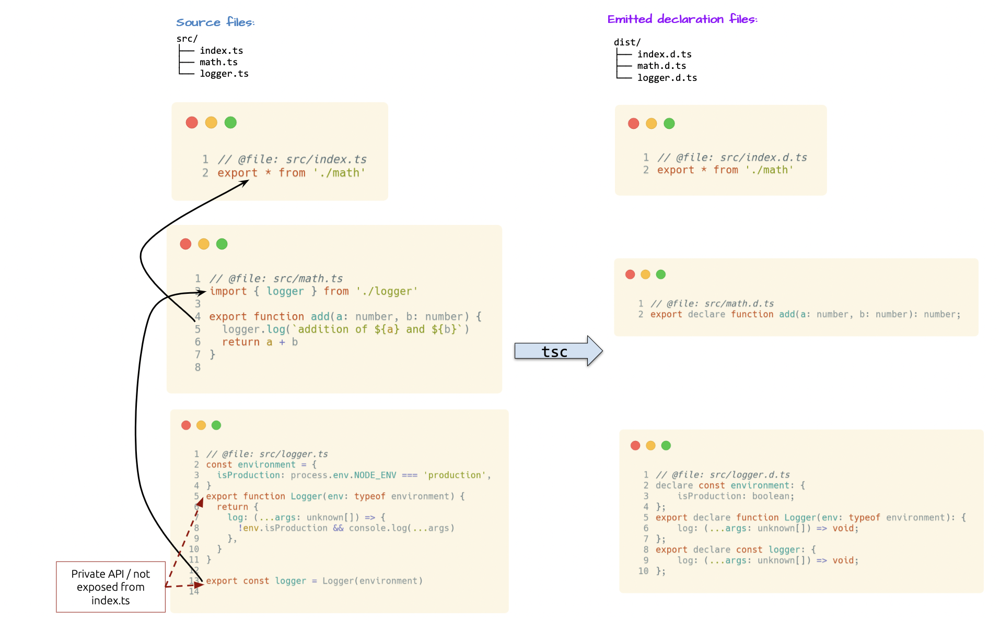
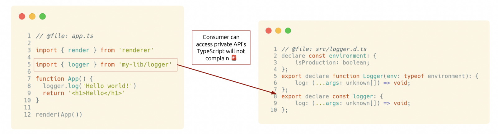
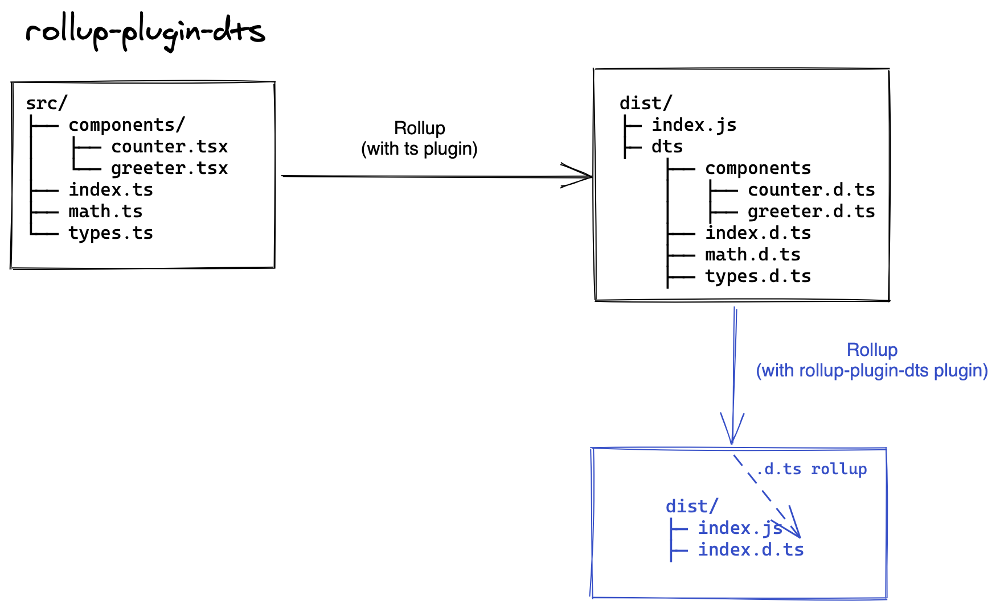
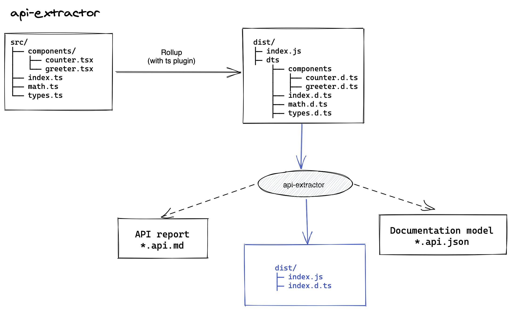

# TypeScript Library tips: Rollup your types!

> 🎒 this article uses following library versions:

```json
{
  "typescript": "4.2.3"
}
```

> 📖 [Original and always free version of this article can be found on my Github](https://github.com/Hotell/blogposts/blob/master/2021/shipping-library-types-series/rollup-your-types/blogpost.md)

---

> This article is a part of **TypeScript library tips** series

> ## TL;DR
>
> When authoring a TypeScript library make sure to follow best industry practices like shipping smallest possible files by rollup-ing your javascript code. As a not very known technique apply this pattern also on your ambient types definitions, that are generated by TypeScript compiler - bundling them into 1 single `.d.ts` file, which will also mitigate misuse of your possible leaking private APIs.

If you wanna go into more deep dive, please continue reading ↓↓↓.

---

If you're writing a JavaScript library or application, you'll definitely need some kind of bundler. There are various options on the market, most familiar are probably webpack and rollup. Webpack is mostly used for apps and rollup for libraries although although both can be used for the opposite thing. Because we're talking about shipping libraries lets focus on Rollup.

> NOTE: this article will not go through how to configure [Rollup](https://rollupjs.org/guide/en/) or how it works in detail

Rollup helps us bundle our library into 1 file!

Which in practice means following transformation:

```
// Raw source:

src/
├── components
│   ├── counter.tsx
│   └── greeter.tsx
├── index.ts
├── math.ts
└── types.ts

↓↓↓

// Bundled via Rollup:

dist/
├── index.js
```

This gives our consumers following benefits ✅:

- less kB transferred via wire
- faster install time
- faster bundling time in apps (webpack/rollup has to process only 1 files instead of N)
- faster test execution (cold starts can be painfully slow especially if you're using jest and your app is massive)
- better tree-shaking

Now, what about types ? You've might noticed that our contrived library is written in TypeScript. So what kind of types are we talking about ?

### Type declaration files (.d.ts)

To to leverage TypeScript to full extent, you definitely wanna ship type declaration files to your consumers, so no matter if they use TypeScript or not, their editor/CI can give them excellent DX thanks to your library type declarations (typings).

> NOTE: declaration files end with `*.d.ts` suffix. That `d` stands for "declaration"

By default, TypeScript wont emit declaration files.

To emit those, you'll need to enable following config within your `tsconfig.json`

```jsonc
{
  "compilerOptions": {
    // enabling declaration (.d.ts) emit
    "declaration": true,
    // optional - in general it's a good practice to decouple declaration files from your actual transpiled JavaScript files
    "declarationDir": "dist/dts",
    // optional if you're using babel to transpile TS - JS
    "emitDeclarationOnly": true
  }
}
```

With our tsconfig set, if we execute `rollup` (which needs to be configured as well via plugins to be able to process TypeScript), or we just run raw `tsc` binary, we'll get following file tree:

```
dist/
├── index.js // (our runtime/source code bundled to 1 file via rollup!)
├─ dts       // (type declaration files)
    ├── components
    │   ├── counter.d.ts
    │   ├── greeter.d.ts
    ├── index.d.ts
    ├── math.d.ts
    ├── types.d.ts
```

What happened here? Our whole library tree structure is mirrored by emitted declaration `.d.ts` files.

While we have optimized runtime by rollup-ing our source code files into 1, we have quite messy `.d.ts` output that might inflict various issues like:

- 🚨 breaks encapsulation, because consumers can use/access parts of our codebase, that are not part of public API surface (which will not work if we rollup-ed our runtime anyways -> thus will throw runtime error 💣)
- 🚨 sending unnecessary baggage (kB) over wire
- 🚨 slower TypeScript type-check/processing time (if you don't use `skipLibCheck:true`)

> **Breaks encapsulation ?**
>
> Let's elaborate more on this one.
>
> Following image is a showcase of our library contrived example:
>
> - On the left side, we have 3 TypeScript files, amongst which `logger.ts` contains private API parts that are not exposed via barrel (`index.ts`). > > - On the right side we can see emitted `.d.ts`files. It's obvious that `math.d.ts` declaration file doesn't contain any private API from logger. Which is all good. but...`
>   
>
> On next image, we have a contrived application code on the left, which consumes our library.
> Now although there is no mention of logger within math.d.ts (as expected), we still ship `logger.d.ts`, thus consumers of our library are free to access it - thus breaks encapsulation. Unfortunately TypeScript is not guarding us from this kind of situation.
> 

How can we fix those ? 👌 Rollup time! ⚡️

## Rollup your type declarations

Where we are right now:

```
dist/
├── index.js // (our runtime/source code bundled to 1 file via rollup!)
├─ dts       // (type declaration files)
    ├── components
    │   ├── counter.d.ts
    │   ├── greeter.d.ts
    ├── index.d.ts
    ├── math.d.ts
    ├── types.d.ts
```

Where we wanna go:

```
dist/
├─ index.js  // (our runtime/source code bundled to 1 file via rollup!)
├─ index.d.ts // (rollup-ed type declaration files)
```

**How we'll get there?**

Unfortunately TypeScript doesn't provide such a functionality so we have following options:

- not use declaration emit at all and maintain that file manually
  - > I don't recommend this solution.
    > Why? Hard to maintain, it will get out of sync rather quickly
- use some OSS tools

Let's use existing tooling shall we? While there is plethora of tooling in the wild, we'll focus on 2 particular libraries:

- rollup-plugin-dts
- api-extractor

### rollup-plugin-dts

> Project link: https://github.com/Swatinem/rollup-plugin-dts

**How does it work:**

After your TypeScript files are transpiled to JavaScript and rollup-ed into 1 file, you'll need to add another processing pipeline, by invoking `dts`


**Configuration:**

```js
// @file: rollup.config.js
import dts from 'rollup-plugin-dts'

const config = [
  // your default rollup config for transpilation and bundling
  // ...
  {
    // path to your declaration files root
    input: './dist/dts/index.d.ts',
    output: [{ file: 'dist/index.d.ts', format: 'es' }],
    plugins: [dts()],
  },
]

export default config
```

**Run it:**

```sh
# do standard JS bundling and creating .d.ts rollup
yarn rollup
```

Done ✅ !

**Pros:**

- if you already use rollup for you library, setting this up takes less than 30 secondes
- blazing fast
- follows similar transformation methods like rollup (unfortunately it doesn't use same technique like mangling files and exporting via alias by its original name to save another kB) -> if you have multiple named exports they are aggregated into single `export {}` instead having multiple `export TokenName` statements.

**Cons:**

- works only with rollup

### api-extractor

> Project link: https://api-extractor.com

**How does it work:**



Api-extractor comes with extended feature set beyond just rollup-ing declaration files to one, like creating nice Markdown API file report and Document Model in JSON format which can be leveraged to generate full blown documentation for your project!

For the brevity sake of this article we gonna focus only on rolluping capabilities.

**Configuration:**

By default, api-extractor will create all 3 things mentioned previously (rollup dts, api.md and .json model), so we'll need to turn off those features explicitly.

```jsonc
// @file api-extractor.json
{
  "mainEntryPointFilePath": "<projectFolder>/dist/dts/index.d.ts",
  "apiReport": {
    // turn off
    "enabled": false
  },
  "docModel": {
    // turn off
    "enabled": false
  },
  "dtsRollup": {
    // Whether to generate the .d.ts rollup file.
    "enabled": true,
    // Where we wanna create our .d.ts rollup
    "untrimmedFilePath": "<projectFolder>/dist/index.d.ts"
  },
  "messages": {
    // turn off various warnings, that might not be useful right now. Check the docs for more!
    "extractorMessageReporting": {
      "default": {
        "logLevel": "none"
      },
      "ae-forgotten-export": {
        "logLevel": "none"
      }
    }
  }
}
```

**Run it:**

Now all we need to do is to invoke `tsc` or rollup and after that's done, we'll execute api-extractor binary:

```sh
yarn rollup # OR yarn tsc

yarn api-extractor run --local
```

Done ✅ !

**Pros:**

- independent CLI
- build in powerful capabilities for generating documentation
- rich set of configuration options for creating dts rollup (shipping declaration types for various release stages of your library like alpha/beta/etc...)

**Cons:**

- no `export` aggregation
- manual plumbing into existing tools needed (I actually prefer that but from perspective of added overhead I mark this one as con)
- heavily relies on [TSDoc](https://github.com/microsoft/tsdoc) (which is not stable), so if you don't wanna follow that specification you need to turn off various things

## Conclusion

We as developers have a responsibility to ship the best possible code to our consumers ideally fast as possible and without unnecessary noise. While this approach is getting good traction in terms of proper bundling your source code into one tree-shaked and minified file, TypeScript type declaration files should not be an exception!

We showcased how this can be done by leveraging existing OSS libraries with brief feature comparison.

Hopefully you'll be able to apply this pattern sooner than later and make ~the world~ (I meant world of type definitions) a better and faster place.

---

As always, don't hesitate to ping me if you have any questions here or on Twitter (my handle [@martin_hotell](https://twitter.com/martin_hotell))

Until next time! Cheers! 🖖 🌊 🏄
